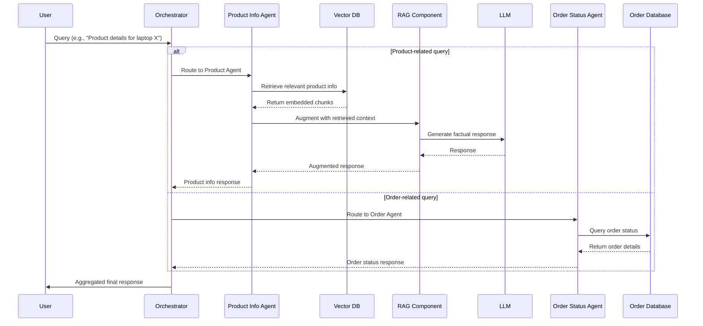
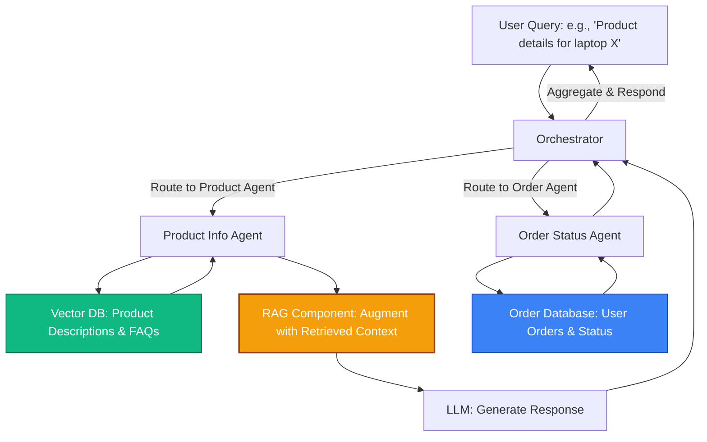

# AI Python Developer Interview Preparation

## Topic: Retrieval-Augmented Generation (RAG) vs. Fine-Tuning

### What is RAG?

RAG (Retrieval-Augmented Generation) is a technique in AI that enhances large language models (LLMs) by combining retrieval from an external knowledge base with generative capabilities. Here's how it works:

1. **Retrieval Step**: When a query is received, the system searches a curated knowledge base (e.g., documents, databases, or web content) to retrieve relevant information or "chunks" of text.

2. **Augmentation Step**: The retrieved information is fed into the LLM as additional context.

3. **Generation Step**: The LLM generates a response based on both its pre-trained knowledge and the retrieved context, producing more accurate, grounded, and up-to-date answers.

RAG is commonly used in applications like chatbots, question-answering systems, and search engines to provide factual, context-aware responses.

#### Clarification on "Augmentation"
While "augmentation" generally means to increase or enhance something, in the RAG context, it specifically refers to enriching the model's input or generation process by adding retrieved external knowledge. This augmentation improves the quality and relevance of the output without necessarily increasing the model's size or parameters—it's about supplementing the LLM's capabilities with factual data.

### Why is RAG Better Than Fine-Tuning for Some Use Cases?

Fine-tuning involves training a pre-trained LLM on a specific dataset to adapt its parameters for a particular task or domain. While effective, it has limitations that make RAG preferable in certain scenarios:

- **Handling Dynamic or Up-to-Date Knowledge**:
  - Fine-tuning requires retraining the model on new data, which is time-consuming and resource-intensive. RAG allows real-time access to external knowledge sources, making it ideal for applications needing current information (e.g., news summarization or live data queries) without model updates.

- **Cost and Computational Efficiency**:
  - Fine-tuning demands significant compute resources (GPUs/TPUs) and large datasets, often costing thousands of dollars. RAG uses lightweight retrieval mechanisms (e.g., vector databases like FAISS or Pinecone) and can work with smaller, frozen LLMs, reducing costs and energy use.

- **Flexibility and Scalability**:
  - With RAG, you can easily update the knowledge base by adding or modifying documents without retraining. Fine-tuning might lead to overfitting on limited data or require periodic retraining as data evolves.

- **Factual Accuracy and Hallucination Reduction**:
  - LLMs can "hallucinate" (generate incorrect information). RAG grounds responses in retrieved facts, improving reliability for tasks like medical advice, legal research, or technical documentation where precision is critical.

- **Domain-Specific Adaptations**:
  - Fine-tuning works well for narrow tasks (e.g., sentiment analysis on a fixed dataset), but RAG excels in open-ended, knowledge-intensive scenarios (e.g., customer support with product manuals) where the model needs to reference external sources.

In summary, choose RAG over fine-tuning when your use case prioritizes up-to-date, factual responses, low maintenance, and scalability. Fine-tuning is better for performance optimization on static, task-specific data. For implementation, tools like LangChain or LlamaIndex can help build RAG systems.

## Additional Study Notes

- Review key differences between supervised fine-tuning, prompt engineering, and RAG.
- Practice explaining RAG architecture with diagrams.
- Be prepared to discuss real-world applications and trade-offs.

### Sample Multi-Agent System Diagram (RAG role)

**Scenario**: An e-commerce customer support chatbot. The system uses multiple agents: a Product Info Agent (retrieves product details via RAG), an Order Status Agent (checks order databases), and an Orchestrator that coordinates responses. The Vector DB stores embedded product descriptions and FAQs for retrieval.



- **Diagram explanation**: This sequence diagram shows the ordered steps in a multi-agent system. For product queries, the flow is: User → Orchestrator → Product Agent → Vector DB (retrieval) → RAG (augmentation) → LLM (generation) → back to Orchestrator → User. For orders, it's simpler: Orchestrator → Order Agent → Database → back. RAG integrates retrieval with generation for accurate, up-to-date info.

  **Orchestrator Role**: The Orchestrator acts as the central coordinator. It analyzes the user query, determines the intent (e.g., product info vs. order status), routes the query to the appropriate agent (Product Info Agent or Order Status Agent), collects and aggregates their responses, and delivers the final answer to the user. It ensures efficient task delegation and response synthesis in the multi-agent setup.

- **Notes**: RAG enables dynamic, up-to-date product info without retraining the LLM. The Vector DB is key for efficient retrieval in knowledge-intensive tasks.

#### Alternative Flowchart View



- **Flowchart explanation**: This top-down view shows the system components and connections. The Orchestrator routes queries; the Product Agent uses Vector DB for retrieval, then RAG augments the LLM. Arrows indicate data flow, though not strictly sequential.

### Python Implementation with LangChain

Below is a sample Python code using LangChain to implement the multi-agent flow. It uses OpenAI's GPT-3.5-turbo (requires API key), FAISS for vector storage, and mock data for demonstration.

```python
import os
from langchain.agents import initialize_agent, Tool
from langchain.llms import OpenAI
from langchain.vectorstores import FAISS
from langchain.embeddings import OpenAIEmbeddings
from langchain.chains import RetrievalQA
from langchain.docstore.document import Document

# Set your OpenAI API key
os.environ["OPENAI_API_KEY"] = "your-openai-api-key-here"

# Initialize LLM
llm = OpenAI(temperature=0.7)

# Mock product data for Vector DB
product_docs = [
    Document(page_content="Laptop X: High-performance laptop with 16GB RAM, 512GB SSD, Intel i7 processor. Price: $1200."),
    Document(page_content="FAQ: How to return a product? Contact support within 30 days with receipt."),
    Document(page_content="Headphones Y: Wireless noise-canceling headphones with 20-hour battery. Price: $150.")
]

# Create Vector DB
embeddings = OpenAIEmbeddings()
vector_db = FAISS.from_documents(product_docs, embeddings)

# RAG Chain for Product Info
product_rag = RetrievalQA.from_chain_type(llm=llm, chain_type="stuff", retriever=vector_db.as_retriever())

# Mock Order Database
orders_db = {
    "12345": "Order status: Shipped on 2025-11-10, expected delivery 2025-11-15.",
    "67890": "Order status: Processing, will ship within 2 days."
}

def check_order_status(order_id: str) -> str:
    return orders_db.get(order_id, "Order not found.")

# Tools for Agents
product_tool = Tool(
    name="ProductInfo",
    description="Retrieve product details or FAQs from knowledge base.",
    func=product_rag.run
)

order_tool = Tool(
    name="OrderStatus",
    description="Check order status by order ID.",
    func=check_order_status
)

# Orchestrator Agent
orchestrator = initialize_agent(
    tools=[product_tool, order_tool],
    llm=llm,
    agent="zero-shot-react-description",
    verbose=True
)

# Example Usage
if __name__ == "__main__":
    query1 = "Tell me about Laptop X."
    print("Query:", query1)
    print("Response:", orchestrator.run(query1))
    
    query2 = "What's the status of order 12345?"
    print("\nQuery:", query2)
    print("Response:", orchestrator.run(query2))
```

- **Code Explanation**: The `orchestrator` agent uses LangChain's tool-based system to route queries. `product_tool` wraps the RAG chain for retrieval-augmented responses. `order_tool` handles order lookups. The agent decides which tool to invoke based on the query. Requires installing `langchain`, `faiss-cpu`, `openai`.

#### Summarization Example for Handling Multiple Chunks

To handle cases where Top-K retrieves more chunks than the LLM can process, use LangChain's summarization chains. Below is an example modifying the RAG setup to use `map_reduce` for summarization:

```python
from langchain.chains.summarize import load_summarize_chain
from langchain.chains import RetrievalQA

# ... (previous setup for llm, vector_db) ...

# Summarization chain for condensing multiple documents
summarize_chain = load_summarize_chain(llm, chain_type="map_reduce")

# RAG with summarization for multiple chunks
product_rag_summarized = RetrievalQA.from_chain_type(
    llm=llm, 
    chain_type="map_reduce",  # Summarizes retrieved docs
    retriever=vector_db.as_retriever(search_kwargs={"k": 10})  # Higher K
)

# Example: Retrieve and summarize top 10 chunks
query = "Summarize product features for laptops."
retrieved_docs = vector_db.similarity_search(query, k=10)
summary = summarize_chain.run(retrieved_docs)
print("Summary:", summary)
```

- **Explanation**: `map_reduce` splits documents, summarizes each, then combines summaries. This allows retrieving more chunks (e.g., K=10) and condensing them into a concise input for the LLM, improving coverage without exceeding context limits.

### Nuances of Creating a RAG System

When building a Retrieval-Augmented Generation (RAG) system, several key aspects require careful attention to ensure effectiveness, accuracy, and scalability. Below are the main nuances and best practices:

#### 1. **Data Quality and Preparation**
   - **Source Selection**: Use high-quality, authoritative sources. Avoid noisy or outdated data, as it can lead to irrelevant retrievals.
   - **Chunking Strategy**: Break documents into optimal chunks (e.g., 500-1000 tokens) to balance context and retrieval precision. Overlap chunks slightly to preserve continuity.
   - **Preprocessing**: Clean text (remove noise, normalize), handle formats (PDFs, HTML), and enrich with metadata (timestamps, categories) for better filtering.

#### 2. **Embedding Model Choice**
   - **Model Selection**: Choose embeddings that match your domain (e.g., sentence-transformers for general text, domain-specific models for technical docs). Consider multilingual if needed.
   - **Dimensionality**: Balance between high-dim (better accuracy) and low-dim (faster search). Test trade-offs.
   - **Fine-Tuning**: Optionally fine-tune embeddings on your data for improved relevance, but this adds complexity.

#### 3. **Vector Database and Indexing**
   - **Database Choice**: Use scalable options like Pinecone, Weaviate, or FAISS. Consider cloud vs. on-prem based on data sensitivity.
   - **Indexing**: Implement efficient indexing (e.g., HNSW, IVF) for fast similarity search. Handle updates/deletions for dynamic knowledge bases.
   - **Hybrid Search**: Combine semantic (embeddings) with keyword-based search (e.g., BM25) for better results.

#### 4. **Retrieval Strategy**
   - **Top-K Selection**: Retrieve the 3-10 most relevant chunks (based on similarity scores) to balance providing sufficient context for accurate answers without overwhelming the LLM. Too few chunks might miss key details (e.g., only retrieving 1 chunk for a complex query); too many can exceed context limits, dilute focus on irrelevant info, increase latency, and raise costs. Experiment with K based on query complexity and LLM capacity. *Alternative*: Increase K and use summarization chains (e.g., LangChain's map-reduce) to condense retrieved chunks before feeding to the LLM, allowing more comprehensive retrieval while staying within limits.
   - **Reranking**: Use cross-encoders or LLM-based reranking to improve initial retrieval results.
   - **Query Expansion**: Enhance queries with synonyms or generated expansions to handle varied user inputs.
   - **Filtering**: Apply metadata filters (e.g., date ranges, categories) to narrow results.

#### 5. **LLM Integration and Prompting**
   - **Context Window**: Ensure retrieved chunks fit within the LLM's context limit. Summarize or truncate if needed.
   - **Prompt Engineering**: Craft prompts that clearly instruct the LLM to use retrieved info (e.g., "Based on the following context, answer..."). Include instructions to avoid hallucinations.
   - **Chain Types**: Use appropriate LangChain chains (e.g., stuff, map-reduce) based on data volume.
   - **Temperature/Settings**: Set low temperature for factual responses; experiment with parameters.

#### 6. **Evaluation and Metrics**
   - **Retrieval Metrics**: Measure precision, recall, NDCG on retrieval quality.
   - **Generation Metrics**: Use ROUGE, BLEU for answer quality; human evaluation for coherence.
   - **End-to-End Testing**: Test with diverse queries, including edge cases (ambiguous, out-of-scope).
   - **A/B Testing**: Compare RAG vs. base LLM performance.

#### 7. **Performance and Scalability**
   - **Latency**: Optimize for real-time responses (e.g., pre-compute embeddings, use GPU acceleration).
   - **Scalability**: Handle growing data with distributed vector stores; implement caching for frequent queries.
   - **Cost**: Monitor API costs for embeddings/LLM calls; use efficient models.

#### 8. **Security, Privacy, and Ethics**
   - **Data Privacy**: Ensure compliance (e.g., GDPR) when storing sensitive info. Use encryption and access controls.
   - **Bias and Fairness**: Audit for biases in data/retrieval; diversify sources.
   - **Hallucination Mitigation**: Ground responses in retrieved facts; add disclaimers for uncertain answers.
   - **Attribution**: Cite sources in responses for transparency.

#### 9. **Maintenance and Updates**
   - **Knowledge Freshness**: Implement pipelines for regular data updates without full re-indexing.
   - **Monitoring**: Track query logs, failure rates, and user feedback for continuous improvement.
   - **Versioning**: Maintain versions of data/models for rollback if issues arise.

#### 10. **Common Pitfalls**
   - **Over-Reliance on Retrieval**: Ensure the system can handle queries with no relevant docs (fallback to base LLM).
   - **Chunk Size Mismatch**: 
     - **Too Small Chunks**: Lose semantic context because related information gets fragmented. For example, in a product manual, the description of a feature might be split from its usage instructions, leading to incomplete or misleading retrievals. Embeddings for small chunks may not capture enough meaning, reducing similarity scores for relevant queries.
     - **Too Large Chunks**: Exceed the LLM's context window (e.g., 4096 tokens for GPT-3.5, 8192 for GPT-4), so the full chunk can't be included in the prompt. This forces truncation, omitting key parts, or wastes tokens on irrelevant sections (e.g., retrieving a 2000-token chapter when only 200 tokens are needed). It also slows processing and increases costs.
     - **Best Practice**: Use 500-1000 tokens per chunk with 10-20% overlap. Test with your LLM's limits and data type (e.g., code chunks might need smaller sizes for precision).
   - **Ignoring User Context**: For multi-turn conversations, maintain session history.
   - **Vendor Lock-In**: Design for portability across embedding/LLM providers.

By addressing these nuances, RAG systems can deliver accurate, up-to-date, and efficient responses. Focus on iterative testing and user feedback during development.

