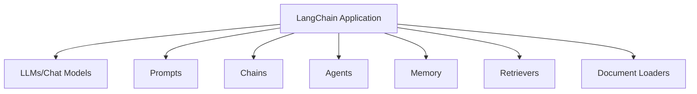
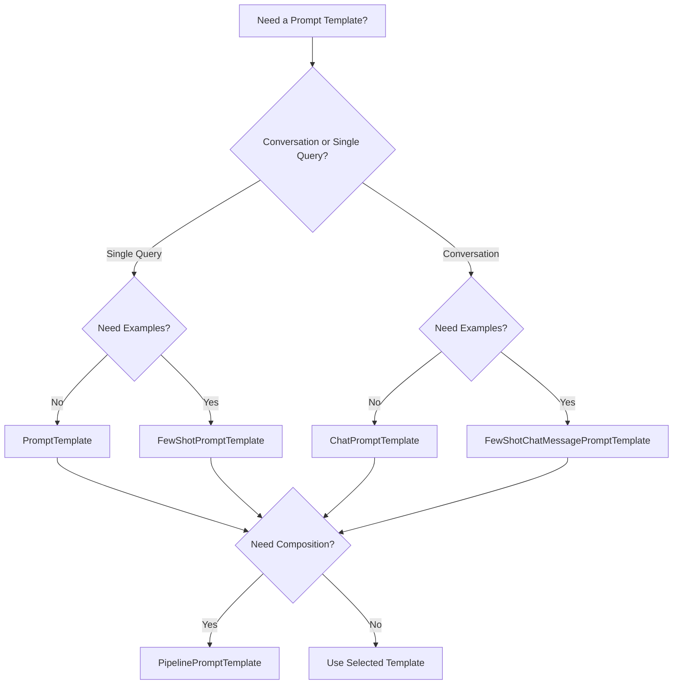
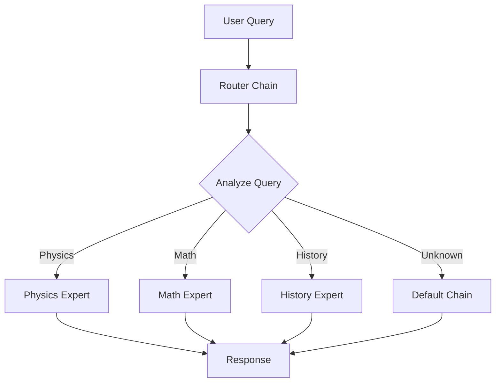
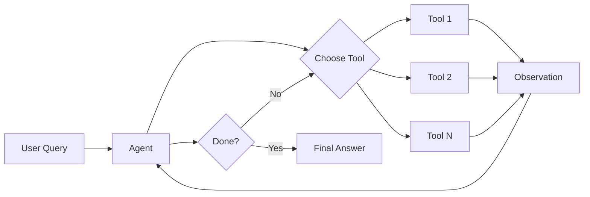

# Key LangChain Concepts

## Table of Contents
1. [Introduction](#introduction)
2. [Core Components](#core-components)
3. [LLMs and Chat Models](#llms-and-chat-models)
4. [Prompts and Prompt Templates](#prompts-and-prompt-templates)
5. [Chains](#chains)
6. [Agents](#agents)
7. [Memory](#memory)
8. [Retrievers and Vector Stores](#retrievers-and-vector-stores)
9. [Document Loaders](#document-loaders)
10. [Output Parsers](#output-parsers)
11. [Callbacks](#callbacks)
12. [LangChain Expression Language (LCEL)](#langchain-expression-language-lcel)

---

## Introduction

**LangChain** is a powerful framework designed to simplify the development of applications powered by Large Language Models (LLMs). It provides a modular architecture that enables developers to build complex, context-aware applications with ease.

### Key Benefits:
- 🔗 **Composability**: Chain multiple components together
- 🧠 **Context-Awareness**: Maintain conversation history and state
- 🛠️ **Modularity**: Reusable components for different use cases
- 🔌 **Integration**: Easy integration with various LLMs and data sources

---

## Core Components

LangChain is built around several core components that work together:



---

## LLMs and Chat Models

### LLMs (Large Language Models)
LLMs are models that take text input and generate text output.

```python
from langchain.llms import OpenAI

# Initialize an LLM
llm = OpenAI(temperature=0.7, model_name="gpt-3.5-turbo-instruct")

# Generate text
response = llm("What is the capital of France?")
print(response)
```

### Chat Models
Chat models are specialized for conversational interfaces, using message-based inputs.

```python
from langchain.chat_models import ChatOpenAI
from langchain.schema import HumanMessage, SystemMessage

# Initialize a chat model
chat = ChatOpenAI(temperature=0.7, model_name="gpt-4")

# Create messages
messages = [
    SystemMessage(content="You are a helpful assistant."),
    HumanMessage(content="What is the capital of France?")
]

# Get response
response = chat(messages)
print(response.content)
```

### Key Differences:
| Feature | LLMs | Chat Models |
|---------|------|-------------|
| Input Format | Plain text | Structured messages |
| Use Case | Text generation | Conversations |
| Context Handling | Limited | Better structured |

---

## Prompts and Prompt Templates

Prompts are the instructions given to LLMs. **Prompt Templates** make prompts reusable and dynamic.

### Simple Prompt Template

```python
from langchain.prompts import PromptTemplate

# Create a template
template = """
You are a {role} assistant.
Question: {question}
Answer:
"""

prompt = PromptTemplate(
    input_variables=["role", "question"],
    template=template
)

# Use the template
formatted_prompt = prompt.format(
    role="helpful",
    question="What is machine learning?"
)
```

### Chat Prompt Template

```python
from langchain.prompts import ChatPromptTemplate

# Create a chat prompt template
chat_template = ChatPromptTemplate.from_messages([
    ("system", "You are a {role} assistant."),
    ("human", "Hello!"),
    ("ai", "Hi! How can I help you today?"),
    ("human", "{user_input}")
])

# Format the template
messages = chat_template.format_messages(
    role="friendly",
    user_input="Tell me about LangChain"
)
```

### Few-Shot Prompts

```python
from langchain.prompts import FewShotPromptTemplate

# Define examples
examples = [
    {"word": "happy", "antonym": "sad"},
    {"word": "tall", "antonym": "short"}
]

# Create example template
example_template = """
Word: {word}
Antonym: {antonym}
"""

# Create few-shot template
few_shot_prompt = FewShotPromptTemplate(
    examples=examples,
    example_prompt=PromptTemplate(
        input_variables=["word", "antonym"],
        template=example_template
    ),
    prefix="Give the antonym of every word:",
    suffix="Word: {input}\nAntonym:",
    input_variables=["input"]
)
```

### Prompt Template Types Comparison

Here's a comprehensive comparison of different prompt template types in LangChain:

| Template Type | Best For | Input Format | Key Features | Complexity | Example Use Case |
|---------------|----------|--------------|--------------|------------|------------------|
| **PromptTemplate** | Simple text prompts | String variables | Basic variable substitution, easy to use | ⭐ Low | Product name generation, simple Q&A |
| **ChatPromptTemplate** | Conversational AI | Message objects (System, Human, AI) | Role-based messages, conversation structure | ⭐⭐ Medium | Chatbots, customer service agents |
| **FewShotPromptTemplate** | Learning from examples | Examples + query | Example-based learning, dynamic example selection | ⭐⭐⭐ Medium-High | Classification, pattern matching, style imitation |
| **FewShotChatMessagePromptTemplate** | Chat with examples | Chat examples + query | Combines few-shot with chat format | ⭐⭐⭐ High | Conversational style training, dialogue systems |
| **MessagesPlaceholder** | Dynamic message insertion | Variable-length message lists | Flexible message insertion, works with memory | ⭐⭐ Medium | Chat history, dynamic conversations |
| **PipelinePromptTemplate** | Multi-stage prompts | Nested templates | Compose multiple prompts, reusable components | ⭐⭐⭐⭐ High | Complex workflows, modular prompt design |
| **SystemMessagePromptTemplate** | System instructions | System-level strings | Defines AI behavior and personality | ⭐ Low | Setting AI role, behavior guidelines |
| **HumanMessagePromptTemplate** | User inputs | User message strings | Represents user queries | ⭐ Low | User questions, requests |
| **AIMessagePromptTemplate** | AI responses | AI message strings | Pre-fill AI responses in conversation | ⭐ Low | Conversation priming, few-shot chat |

### Detailed Template Comparisons

#### 1. **Basic vs Chat Templates**

```python
# PromptTemplate (Basic)
from langchain.prompts import PromptTemplate

basic_prompt = PromptTemplate(
    input_variables=["topic"],
    template="Write a poem about {topic}"
)

# ChatPromptTemplate (Conversational)
from langchain.prompts import ChatPromptTemplate

chat_prompt = ChatPromptTemplate.from_messages([
    ("system", "You are a creative poet."),
    ("human", "Write a poem about {topic}")
])
```

**When to use:**
- **PromptTemplate**: Single-turn tasks, simple generation
- **ChatPromptTemplate**: Multi-turn conversations, role-based interactions

#### 2. **Few-Shot vs Regular Templates**

```python
# Regular Template (Zero-shot)
regular = PromptTemplate(
    template="Translate to French: {text}",
    input_variables=["text"]
)

# Few-Shot Template (With examples)
from langchain.prompts import FewShotPromptTemplate

examples = [
    {"english": "Hello", "french": "Bonjour"},
    {"english": "Goodbye", "french": "Au revoir"}
]

few_shot = FewShotPromptTemplate(
    examples=examples,
    example_prompt=PromptTemplate(
        template="English: {english}\nFrench: {french}",
        input_variables=["english", "french"]
    ),
    prefix="Translate English to French:",
    suffix="English: {text}\nFrench:",
    input_variables=["text"]
)
```

**When to use:**
- **Regular**: Well-known tasks, clear instructions sufficient
- **Few-Shot**: Complex patterns, style matching, domain-specific tasks

#### 3. **Pipeline Templates (Advanced Composition)**

```python
from langchain.prompts.pipeline import PipelinePromptTemplate

# Character template
character_template = PromptTemplate(
    input_variables=["character"],
    template="Character: {character}"
)

# Setting template
setting_template = PromptTemplate(
    input_variables=["setting"],
    template="Setting: {setting}"
)

# Final template combining both
final_template = PromptTemplate(
    input_variables=["character_info", "setting_info", "plot"],
    template="""{character_info}
{setting_info}

Plot: {plot}

Write a story based on the above."""
)

# Pipeline that composes all templates
pipeline = PipelinePromptTemplate(
    final_prompt=final_template,
    pipeline_prompts=[
        ("character_info", character_template),
        ("setting_info", setting_template)
    ]
)

# Use it
result = pipeline.format(
    character="a brave knight",
    setting="medieval castle",
    plot="a dragon appears"
)
```

**When to use:**
- Modular prompt design
- Reusable prompt components
- Complex, multi-part prompts

### Template Selection Decision Tree



### Advanced Template Features Comparison

| Feature | PromptTemplate | ChatPromptTemplate | FewShotPromptTemplate | PipelinePromptTemplate |
|---------|----------------|--------------------|-----------------------|------------------------|
| **Variable Substitution** | ✅ Yes | ✅ Yes | ✅ Yes | ✅ Yes |
| **Partial Variables** | ✅ Yes | ✅ Yes | ✅ Yes | ✅ Yes |
| **Output Parsers** | ✅ Yes | ✅ Yes | ✅ Yes | ✅ Yes |
| **Example Selectors** | ❌ No | ❌ No | ✅ Yes | ❌ No |
| **Message Roles** | ❌ No | ✅ Yes | ❌ No | ⚠️ Depends |
| **Template Composition** | ❌ No | ❌ No | ❌ No | ✅ Yes |
| **Length Control** | ⚠️ Manual | ⚠️ Manual | ✅ Via Selectors | ⚠️ Manual |
| **Streaming Support** | ✅ Yes | ✅ Yes | ✅ Yes | ✅ Yes |

### Example Selectors for Few-Shot Templates

```python
from langchain.prompts.example_selector import LengthBasedExampleSelector

# Define many examples
examples = [
    {"input": "happy", "output": "sad"},
    {"input": "tall", "output": "short"},
    {"input": "hot", "output": "cold"},
    {"input": "light", "output": "dark"},
    {"input": "good", "output": "bad"},
]

# Create selector that limits examples based on length
example_selector = LengthBasedExampleSelector(
    examples=examples,
    example_prompt=PromptTemplate(
        template="Input: {input}\nOutput: {output}",
        input_variables=["input", "output"]
    ),
    max_length=50  # Maximum length of examples in characters
)

# Use selector in few-shot template
few_shot_prompt = FewShotPromptTemplate(
    example_selector=example_selector,
    example_prompt=PromptTemplate(
        template="Input: {input}\nOutput: {output}",
        input_variables=["input", "output"]
    ),
    prefix="Give the antonym:",
    suffix="Input: {input}\nOutput:",
    input_variables=["input"]
)
```

### Performance Considerations

| Aspect | Impact | Recommendation |
|--------|--------|----------------|
| **Token Count** | More examples = more tokens = higher cost | Use example selectors to limit examples |
| **Latency** | Complex templates add minimal overhead | Template complexity is negligible vs LLM latency |
| **Caching** | Repeated prompts can be cached | Cache formatted prompts for identical inputs |
| **Validation** | Template validation happens at creation | Validate templates during development, not runtime |

### Best Practices for Template Selection

1. **Start Simple**: Begin with `PromptTemplate`, upgrade as needed
2. **Use Chat for Conversations**: Always prefer `ChatPromptTemplate` for chatbots
3. **Few-Shot for Complex Tasks**: Use examples when zero-shot fails
4. **Compose with Pipelines**: Break complex prompts into reusable components
5. **Test Different Approaches**: A/B test different template types for your use case
6. **Monitor Token Usage**: Few-shot templates can significantly increase token count
7. **Dynamic Example Selection**: Use example selectors for better control

---

## Chains

**Chains** combine multiple components (LLMs, prompts, other chains) into a single workflow.

### Simple Chain (LLMChain)

```python
from langchain.chains import LLMChain
from langchain.prompts import PromptTemplate
from langchain.llms import OpenAI

# Create prompt template
prompt = PromptTemplate(
    input_variables=["product"],
    template="What is a good name for a company that makes {product}?"
)

# Create chain
llm = OpenAI(temperature=0.9)
chain = LLMChain(llm=llm, prompt=prompt)

# Run chain
result = chain.run("eco-friendly water bottles")
print(result)
```

### Sequential Chain

```python
from langchain.chains import SimpleSequentialChain

# First chain: Generate a synopsis
synopsis_chain = LLMChain(llm=llm, prompt=synopsis_prompt)

# Second chain: Write a review based on synopsis
review_chain = LLMChain(llm=llm, prompt=review_prompt)

# Combine chains
overall_chain = SimpleSequentialChain(
    chains=[synopsis_chain, review_chain],
    verbose=True
)

result = overall_chain.run("tragic love story")
```

### Router Chain - Deep Dive

**Router Chains** intelligently route inputs to specialized chains based on content or query type.

#### Architecture



#### Complete Implementation

```python
from langchain.chains.router import MultiPromptChain
from langchain.chains.router.llm_router import LLMRouterChain, RouterOutputParser
from langchain.chains import LLMChain
from langchain.prompts import PromptTemplate
from langchain.llms import OpenAI

llm = OpenAI(temperature=0)

# 1. Define specialized prompts
physics_template = """You are a physics expert.
Question: {input}
Answer:"""

math_template = """You are a math expert.
Question: {input}
Solution:"""

# 2. Create prompt info
prompt_infos = [
    {
        "name": "physics",
        "description": "Physics, mechanics, quantum, relativity questions",
        "prompt_template": physics_template
    },
    {
        "name": "math",
        "description": "Mathematics, algebra, calculus, geometry questions",
        "prompt_template": math_template
    }
]

# 3. Create destination chains
destination_chains = {}
for p_info in prompt_infos:
    prompt = PromptTemplate(
        template=p_info["prompt_template"],
        input_variables=["input"]
    )
    destination_chains[p_info["name"]] = LLMChain(llm=llm, prompt=prompt)

# 4. Create default chain
default_chain = LLMChain(
    llm=llm,
    prompt=PromptTemplate(template="Answer: {input}", input_variables=["input"])
)

# 5. Create router
router_template = """Select expert for: {{input}}

Experts:
{destinations}

Return JSON with keys 'destination' and 'next_inputs'.
Example: {{"destination": "math", "next_inputs": "solve equation"}}
"""

destinations = "\n".join([f"{p['name']}: {p['description']}" for p in prompt_infos])
router_prompt = PromptTemplate(
    template=router_template.format(destinations=destinations),
    input_variables=["input"],
    output_parser=RouterOutputParser()
)

router_chain = LLMRouterChain.from_llm(llm, router_prompt)

# 6. Create multi-prompt chain
chain = MultiPromptChain(
    router_chain=router_chain,
    destination_chains=destination_chains,
    default_chain=default_chain,
    verbose=True
)

# Use it
chain.run("What is gravity?")  # Routes to physics
chain.run("Solve: 2x + 5 = 15")  # Routes to math
```

#### Key Components

| Component | Purpose | Example |
|-----------|---------|----------|
| **Destination Chains** | Specialized handlers | Physics, Math, History chains |
| **Router Chain** | Decides routing | LLMRouterChain analyzes query |
| **Default Chain** | Fallback handler | Handles unmatched queries |
| **RouterOutputParser** | Parses routing decision | Extracts destination from JSON |

#### Advanced Patterns

**1. Multi-Model Routing** (Cost Optimization)
```python
# Use GPT-4 for complex, GPT-3.5 for simple
complex_chain = LLMChain(llm=ChatOpenAI(model="gpt-4"), prompt=complex_prompt)
simple_chain = LLMChain(llm=OpenAI(model="gpt-3.5-turbo"), prompt=simple_prompt)
```

**2. Semantic Routing** (Embedding-based)
```python
from langchain.chains.router import EmbeddingRouterChain
from langchain.embeddings import OpenAIEmbeddings

# Automatically routes based on similarity
embedding_router = EmbeddingRouterChain.from_names_and_descriptions(
    route_examples={"physics": ["What is gravity?", "Explain quantum mechanics"]},
    destination_chains=destination_chains,
    embeddings=OpenAIEmbeddings()
)
```

**3. Language-Based Routing**
```python
prompt_infos = [
    {"name": "english", "description": "English queries"},
    {"name": "spanish", "description": "Spanish queries (español)"},
    {"name": "french", "description": "French queries (français)"}
]
```

#### Comparison: LLM vs Embedding Router

| Feature | LLM Router | Embedding Router |
|---------|-----------|------------------|
| **Speed** | Slower (LLM call) | Faster (similarity) |
| **Cost** | Higher | Lower |
| **Accuracy** | Better for nuanced | Good for clear categories |
| **Setup** | Complex prompts | Needs example queries |

#### Best Practices

✅ **Clear Descriptions**: Be specific about each chain's expertise
✅ **Non-Overlapping**: Avoid category overlap
✅ **Always Provide Default**: Handle edge cases
✅ **Monitor Routing**: Use verbose=True
✅ **Test Edge Cases**: Empty input, ambiguous queries, gibberish

```python
# Good description
{
    "name": "physics",
    "description": "Physics including mechanics, thermodynamics, quantum mechanics, "
                   "relativity, electromagnetism, optics, and physical laws"
}

# Bad description (too vague)
{
    "name": "science",
    "description": "Science questions"
}
```

#### Real-World Use Cases

**Customer Support**
```python
routes = [
    {"name": "billing", "description": "Billing, payments, refunds"},
    {"name": "technical", "description": "Technical issues, bugs, errors"},
    {"name": "sales", "description": "Product info, pricing, features"}
]
```

**Educational Platform**
```python
routes = [
    {"name": "stem", "description": "Science, Technology, Engineering, Math"},
    {"name": "humanities", "description": "History, Literature, Philosophy"},
    {"name": "languages", "description": "Foreign language learning"}
]
```

#### Debugging Tips

```python
# 1. Use verbose mode
chain = MultiPromptChain(..., verbose=True)

# 2. Test routing decisions
test_queries = [
    "What is 2+2?",  # Should route to math
    "What is gravity?",  # Should route to physics
    "Hello",  # Should route to default
]

for q in test_queries:
    print(f"Query: {q}")
    result = chain.run(q)
```

### Chain Types:
- **LLMChain**: Basic chain with LLM + prompt
- **Sequential Chain**: Multiple chains in sequence
- **Router Chain**: Routes input to specialized chains
- **Transform Chain**: Applies transformations to input/output
- **MapReduce Chain**: Processes documents in parallel then combines

---

## Agents

**Agents** use LLMs to decide which actions to take and in what order. They have access to tools and can reason about which tool to use.

### Basic Agent

```python
from langchain.agents import load_tools, initialize_agent, AgentType
from langchain.llms import OpenAI

# Initialize LLM
llm = OpenAI(temperature=0)

# Load tools
tools = load_tools(["serpapi", "llm-math"], llm=llm)

# Initialize agent
agent = initialize_agent(
    tools,
    llm,
    agent=AgentType.ZERO_SHOT_REACT_DESCRIPTION,
    verbose=True
)

# Run agent
agent.run("What was the high temperature in SF yesterday in Fahrenheit? What is that number raised to the .023 power?")
```

### Custom Tool

```python
from langchain.agents import Tool
from langchain.tools import BaseTool

def get_word_length(word: str) -> int:
    """Returns the length of a word."""
    return len(word)

# Create custom tool
tools = [
    Tool(
        name="Word Length",
        func=get_word_length,
        description="Useful for getting the length of a word"
    )
]

agent = initialize_agent(
    tools,
    llm,
    agent=AgentType.ZERO_SHOT_REACT_DESCRIPTION,
    verbose=True
)
```

### Agent Types:

| Agent Type | Description | Best For |
|------------|-------------|----------|
| **ZERO_SHOT_REACT_DESCRIPTION** | Uses ReAct framework, decides actions based on tool descriptions | General purpose |
| **CONVERSATIONAL_REACT_DESCRIPTION** | Designed for conversational settings with memory | Chatbots |
| **OPENAI_FUNCTIONS** | Uses OpenAI function calling API | OpenAI models |
| **STRUCTURED_INPUT_REACT** | Handles tools with multiple inputs | Complex tool inputs |

### Agent Workflow:



---

## Memory

**Memory** allows chains and agents to remember previous interactions.

### Conversation Buffer Memory

```python
from langchain.memory import ConversationBufferMemory
from langchain.chains import ConversationChain

# Create memory
memory = ConversationBufferMemory()

# Create conversation chain
conversation = ConversationChain(
    llm=llm,
    memory=memory,
    verbose=True
)

# Have a conversation
conversation.predict(input="Hi there!")
conversation.predict(input="What's my name?")  # Will remember context
```

### Conversation Buffer Window Memory

```python
from langchain.memory import ConversationBufferWindowMemory

# Keep only last k interactions
memory = ConversationBufferWindowMemory(k=2)

conversation = ConversationChain(
    llm=llm,
    memory=memory
)
```

### Conversation Summary Memory

```python
from langchain.memory import ConversationSummaryMemory

# Summarizes conversation over time
memory = ConversationSummaryMemory(llm=llm)

conversation = ConversationChain(
    llm=llm,
    memory=memory,
    verbose=True
)
```

### Memory Types Comparison:

| Memory Type | Pros | Cons | Use Case |
|-------------|------|------|----------|
| **Buffer** | Complete history | Token usage grows | Short conversations |
| **Buffer Window** | Controlled size | Loses old context | Fixed-length context |
| **Summary** | Efficient storage | Loses details | Long conversations |
| **Knowledge Graph** | Structured relationships | Complex setup | Entity tracking |

---

## Retrievers and Vector Stores

**Retrievers** fetch relevant documents, while **Vector Stores** store and search embeddings.

### Basic Vector Store Usage

```python
from langchain.vectorstores import Chroma
from langchain.embeddings import OpenAIEmbeddings
from langchain.text_splitter import CharacterTextSplitter

# Sample documents
documents = [
    "LangChain is a framework for LLM applications.",
    "Vector stores help in semantic search.",
    "Embeddings convert text to vectors."
]

# Split documents
text_splitter = CharacterTextSplitter(chunk_size=100, chunk_overlap=0)
texts = text_splitter.create_documents(documents)

# Create embeddings
embeddings = OpenAIEmbeddings()

# Create vector store
vectorstore = Chroma.from_documents(texts, embeddings)

# Search
docs = vectorstore.similarity_search("What is LangChain?", k=2)
```

### Retrieval QA Chain

```python
from langchain.chains import RetrievalQA

# Create retriever
retriever = vectorstore.as_retriever(search_kwargs={"k": 3})

# Create QA chain
qa_chain = RetrievalQA.from_chain_type(
    llm=llm,
    chain_type="stuff",
    retriever=retriever,
    return_source_documents=True
)

# Ask question
result = qa_chain("What is LangChain?")
print(result["result"])
```

### Chain Types for Retrieval:

```python
# 1. Stuff: Put all documents into prompt (simple, limited by context)
qa = RetrievalQA.from_chain_type(llm=llm, chain_type="stuff", retriever=retriever)

# 2. Map-Reduce: Process each document separately, then combine
qa = RetrievalQA.from_chain_type(llm=llm, chain_type="map_reduce", retriever=retriever)

# 3. Refine: Iteratively update answer with each document
qa = RetrievalQA.from_chain_type(llm=llm, chain_type="refine", retriever=retriever)

# 4. Map-Rerank: Score each document, use highest scoring
qa = RetrievalQA.from_chain_type(llm=llm, chain_type="map_rerank", retriever=retriever)
```

### Popular Vector Stores:

- **Chroma**: Easy to use, in-memory option
- **Pinecone**: Managed, scalable
- **FAISS**: Fast, local, by Facebook
- **Weaviate**: Open source, GraphQL API
- **Milvus**: Highly scalable, production-ready

---

## Document Loaders

**Document Loaders** load data from various sources.

### Text File Loader

```python
from langchain.document_loaders import TextLoader

loader = TextLoader('path/to/file.txt')
documents = loader.load()
```

### PDF Loader

```python
from langchain.document_loaders import PyPDFLoader

loader = PyPDFLoader('path/to/file.pdf')
pages = loader.load_and_split()
```

### Web Page Loader

```python
from langchain.document_loaders import WebBaseLoader

loader = WebBaseLoader('https://example.com')
documents = loader.load()
```

### Directory Loader

```python
from langchain.document_loaders import DirectoryLoader

loader = DirectoryLoader('path/to/directory', glob="**/*.txt")
documents = loader.load()
```

### CSV Loader

```python
from langchain.document_loaders import CSVLoader

loader = CSVLoader('path/to/file.csv')
documents = loader.load()
```

### Common Loaders:
- **TextLoader**: Plain text files
- **PyPDFLoader**: PDF documents
- **UnstructuredHTMLLoader**: HTML files
- **WebBaseLoader**: Web pages
- **GoogleDriveLoader**: Google Drive documents
- **NotionDBLoader**: Notion databases
- **GitbookLoader**: Gitbook documentation

---

## Output Parsers

**Output Parsers** structure LLM outputs into usable formats.

### Simple Output Parser

```python
from langchain.output_parsers import CommaSeparatedListOutputParser

# Create parser
output_parser = CommaSeparatedListOutputParser()

# Get format instructions
format_instructions = output_parser.get_format_instructions()

# Use in prompt
prompt = PromptTemplate(
    template="List 5 {subject}.\n{format_instructions}",
    input_variables=["subject"],
    partial_variables={"format_instructions": format_instructions}
)

# Parse output
output = llm(prompt.format(subject="ice cream flavors"))
parsed_output = output_parser.parse(output)
print(parsed_output)  # ['vanilla', 'chocolate', 'strawberry', ...]
```

### Structured Output Parser

```python
from langchain.output_parsers import StructuredOutputParser, ResponseSchema

# Define schema
response_schemas = [
    ResponseSchema(name="name", description="Name of the person"),
    ResponseSchema(name="age", description="Age of the person"),
    ResponseSchema(name="occupation", description="Occupation")
]

# Create parser
output_parser = StructuredOutputParser.from_response_schemas(response_schemas)

# Get format instructions
format_instructions = output_parser.get_format_instructions()

# Parse output
output = llm(prompt_with_format_instructions)
parsed = output_parser.parse(output)
print(parsed)  # {'name': 'John', 'age': '30', 'occupation': 'Engineer'}
```

### Pydantic Output Parser

```python
from langchain.output_parsers import PydanticOutputParser
from pydantic import BaseModel, Field, validator

# Define model
class Person(BaseModel):
    name: str = Field(description="Person's name")
    age: int = Field(description="Person's age")
    occupation: str = Field(description="Person's occupation")
    
    @validator('age')
    def age_must_be_positive(cls, v):
        if v < 0:
            raise ValueError('Age must be positive')
        return v

# Create parser
parser = PydanticOutputParser(pydantic_object=Person)

# Use parser
format_instructions = parser.get_format_instructions()
output = llm(prompt_with_format_instructions)
parsed = parser.parse(output)
print(parsed.name, parsed.age, parsed.occupation)
```

### Parser Types:

| Parser | Output Format | Use Case |
|--------|---------------|----------|
| **CommaSeparatedList** | List | Simple lists |
| **Structured** | Dictionary | Key-value pairs |
| **Pydantic** | Pydantic Model | Type-validated objects |
| **JSON** | JSON | Complex nested data |
| **Datetime** | datetime | Date/time parsing |

---

## Callbacks

**Callbacks** provide hooks into various stages of LLM execution for logging, monitoring, and streaming.

### Basic Callback Handler

```python
from langchain.callbacks import StdOutCallbackHandler
from langchain.chains import LLMChain

# Use callback
handler = StdOutCallbackHandler()

chain = LLMChain(
    llm=llm,
    prompt=prompt,
    callbacks=[handler]
)

chain.run("Hello")
```

### Custom Callback Handler

```python
from langchain.callbacks.base import BaseCallbackHandler
from langchain.schema import LLMResult

class MyCustomHandler(BaseCallbackHandler):
    def on_llm_start(self, serialized, prompts, **kwargs):
        print(f"Starting LLM with prompts: {prompts}")
    
    def on_llm_end(self, response: LLMResult, **kwargs):
        print(f"LLM ended with response: {response}")
    
    def on_llm_error(self, error, **kwargs):
        print(f"LLM error: {error}")
    
    def on_chain_start(self, serialized, inputs, **kwargs):
        print(f"Chain started with inputs: {inputs}")
    
    def on_chain_end(self, outputs, **kwargs):
        print(f"Chain ended with outputs: {outputs}")

# Use custom handler
handler = MyCustomHandler()
chain = LLMChain(llm=llm, prompt=prompt, callbacks=[handler])
```

### Streaming Callback

```python
from langchain.callbacks.streaming_stdout import StreamingStdOutCallbackHandler

# Stream output as it's generated
streaming_llm = ChatOpenAI(
    streaming=True,
    callbacks=[StreamingStdOutCallbackHandler()],
    temperature=0
)

response = streaming_llm("Tell me a long story")
```

### Callback Events:
- `on_llm_start`: When LLM starts
- `on_llm_end`: When LLM ends
- `on_llm_error`: When LLM errors
- `on_chain_start`: When chain starts
- `on_chain_end`: When chain ends
- `on_tool_start`: When tool starts
- `on_agent_action`: When agent takes action

---

## LangChain Expression Language (LCEL)

**LCEL** is a declarative way to compose chains with the `|` operator, providing better streaming and async support.

### Basic LCEL Chain

```python
from langchain.chat_models import ChatOpenAI
from langchain.prompts import ChatPromptTemplate
from langchain.schema.output_parser import StrOutputParser

# Create components
prompt = ChatPromptTemplate.from_template("Tell me a joke about {topic}")
model = ChatOpenAI()
output_parser = StrOutputParser()

# Compose with pipe operator
chain = prompt | model | output_parser

# Run chain
result = chain.invoke({"topic": "cats"})
print(result)
```

### LCEL with Multiple Steps

```python
from langchain.schema.runnable import RunnablePassthrough

# Multi-step chain
chain = (
    {"topic": RunnablePassthrough()}
    | prompt
    | model
    | output_parser
)

result = chain.invoke("programming")
```

### LCEL with Parallel Execution

```python
from langchain.schema.runnable import RunnableParallel

# Execute multiple chains in parallel
parallel_chain = RunnableParallel(
    joke=joke_chain,
    poem=poem_chain
)

result = parallel_chain.invoke({"topic": "cats"})
# Returns: {"joke": "...", "poem": "..."}
```

### LCEL with Routing

```python
from langchain.schema.runnable import RunnableBranch

# Route based on condition
branch = RunnableBranch(
    (lambda x: "python" in x["topic"].lower(), python_chain),
    (lambda x: "javascript" in x["topic"].lower(), javascript_chain),
    default_chain  # Default if no condition matches
)

chain = prompt | model | branch
```

### LCEL Benefits:
- ✅ **Streaming**: Built-in streaming support
- ✅ **Async**: Native async/await support
- ✅ **Parallel**: Easy parallel execution
- ✅ **Retries**: Automatic retry logic
- ✅ **Logging**: Better observability
- ✅ **Composition**: Intuitive pipe syntax

### LCEL vs Traditional Chains:

```python
# Traditional Chain
chain = LLMChain(llm=model, prompt=prompt)
result = chain.run(topic="cats")

# LCEL (preferred)
chain = prompt | model | StrOutputParser()
result = chain.invoke({"topic": "cats"})

# LCEL with streaming
for chunk in chain.stream({"topic": "cats"}):
    print(chunk, end="", flush=True)

# LCEL with async
result = await chain.ainvoke({"topic": "cats"})
```

---

## Best Practices

### 1. **Prompt Engineering**
- Be specific and clear in instructions
- Use examples (few-shot learning)
- Iterate and test prompts

### 2. **Memory Management**
- Choose appropriate memory type for your use case
- Be mindful of token limits
- Clear memory when necessary

### 3. **Error Handling**
```python
from langchain.callbacks import get_openai_callback

try:
    with get_openai_callback() as cb:
        result = chain.run("query")
        print(f"Tokens used: {cb.total_tokens}")
except Exception as e:
    print(f"Error: {e}")
```

### 4. **Cost Optimization**
- Use caching for repeated queries
- Choose appropriate model sizes
- Monitor token usage

```python
from langchain.cache import InMemoryCache
import langchain

# Enable caching
langchain.llm_cache = InMemoryCache()
```

### 5. **Testing**
- Test components individually
- Use verbose mode for debugging
- Validate outputs with parsers

### 6. **Security**
- Never hardcode API keys
- Validate user inputs
- Sanitize outputs

```python
import os
from langchain.llms import OpenAI

# Load from environment variables
llm = OpenAI(api_key=os.getenv("OPENAI_API_KEY"))
```

---

## Common Use Cases

### 1. **Question Answering over Documents**
```python
# Load documents -> Split -> Embed -> Store -> Retrieve -> Answer
docs = loader.load()
texts = text_splitter.split_documents(docs)
vectorstore = Chroma.from_documents(texts, embeddings)
qa = RetrievalQA.from_chain_type(llm, retriever=vectorstore.as_retriever())
```

### 2. **Chatbots**
```python
# Use conversational memory and chat models
memory = ConversationBufferMemory(memory_key="chat_history")
conversation = ConversationChain(llm=chat_model, memory=memory)
```

### 3. **Data Augmentation**
```python
# Generate synthetic data
chain = prompt | model | parser
results = [chain.invoke({"context": ctx}) for ctx in contexts]
```

### 4. **Code Generation**
```python
# Use specialized prompts and models
code_prompt = PromptTemplate(template="Generate {language} code for: {task}")
chain = code_prompt | model | StrOutputParser()
```

### 5. **Summarization**
```python
# Use map-reduce or refine chains
chain = load_summarize_chain(llm, chain_type="map_reduce")
summary = chain.run(documents)
```

---

## Resources

### Official Documentation
- 📚 [LangChain Documentation](https://python.langchain.com/)
- 🐍 [LangChain Python Docs](https://python.langchain.com/docs/get_started/introduction)
- 📦 [LangChain GitHub](https://github.com/langchain-ai/langchain)

### Learning Resources
- 🎓 [LangChain Tutorials](https://python.langchain.com/docs/use_cases)
- 💡 [LangChain Blog](https://blog.langchain.dev/)
- 🎥 [YouTube Tutorials](https://www.youtube.com/@LangChain)

### Community
- 💬 [Discord Community](https://discord.gg/langchain)
- 🐦 [Twitter @LangChainAI](https://twitter.com/LangChainAI)

---

## Conclusion

LangChain provides a comprehensive framework for building LLM-powered applications. By understanding these key concepts:

- **Models**: LLMs and Chat Models for text generation
- **Prompts**: Template-based prompt management
- **Chains**: Composable workflows
- **Agents**: Dynamic tool usage and reasoning
- **Memory**: Conversation context management
- **Retrievers**: Semantic search and document retrieval
- **Parsers**: Structured output handling
- **LCEL**: Modern chain composition

You can build sophisticated, production-ready AI applications efficiently and effectively.

---

**Happy Building with LangChain! 🦜⛓️**
