# Key LangChain Concepts

## Table of Contents
1. [Introduction](#introduction)
2. [Core Components](#core-components)
3. [LLMs and Chat Models](#llms-and-chat-models)
4. [Prompts and Prompt Templates](#prompts-and-prompt-templates)
5. [Chains](#chains)
6. [Agents](#agents)
7. [Chains vs Agents: When to Use Which](#chains-vs-agents-when-to-use-which)
8. [Memory](#memory)
9. [Retrievers and Vector Stores](#retrievers-and-vector-stores)
10. [Document Loaders](#document-loaders)
11. [Output Parsers](#output-parsers)
12. [Callbacks](#callbacks)
13. [LangChain Expression Language (LCEL)](#langchain-expression-language-lcel)

---

## Introduction

**LangChain** is a powerful framework designed to simplify the development of applications powered by Large Language Models (LLMs). It provides a modular architecture that enables developers to build complex, context-aware applications with ease.

### Key Benefits:
- 🔗 **Composability**: Chain multiple components together
- 🧠 **Context-Awareness**: Maintain conversation history and state
- 🛠️ **Modularity**: Reusable components for different use cases
- 🔌 **Integration**: Easy integration with various LLMs and data sources

---

## Core Components

LangChain is built around several core components that work together:


### Core Components: Functions & Aims

Each core component in LangChain serves a specific purpose in building LLM applications:

| Component | Function | Aim | Key Benefits |
|-----------|----------|-----|-------------|
| **Models (LLMs & Chat Models)** | Execute text generation and understanding | Provide AI intelligence and language processing | Natural language understanding, generation, reasoning |
| **Prompts & Templates** | Structure and format inputs to models | Ensure consistent, reusable, and effective model interactions | Maintainability, reusability, better outputs |
| **Chains** | Connect multiple components in sequence | Create complex workflows from simple building blocks | Modularity, composability, workflow automation |
| **Agents & Tools** | Make decisions and take actions dynamically | Enable autonomous reasoning and external interactions | Dynamic behavior, tool usage, complex problem solving |
| **Memory** | Store and retrieve conversation history | Maintain context across interactions | Conversational continuity, personalization |
| **Retrievers & Vector Stores** | Search and fetch relevant information | Enable semantic search and knowledge retrieval | Knowledge grounding, RAG capabilities, accuracy |
| **Document Loaders** | Import data from various sources | Make external data accessible to LLM applications | Data integration, flexibility, multi-format support |
| **Output Parsers** | Structure and validate LLM outputs | Transform free text into usable data formats | Type safety, validation, downstream integration |

---

### Real-World Example: Customer Support AI System

Let's see how **all core components work together** in a real customer support chatbot:

**Scenario**: A customer asks: *"I forgot my password and my last invoice was incorrect"*

```python
from langchain.chat_models import ChatOpenAI
from langchain.prompts import ChatPromptTemplate
from langchain.chains import LLMChain
from langchain.agents import initialize_agent, Tool
from langchain.memory import ConversationBufferMemory
from langchain.vectorstores import Chroma
from langchain.embeddings import OpenAIEmbeddings
from langchain.document_loaders import TextLoader
from langchain.text_splitter import CharacterTextSplitter
from langchain.output_parsers import StructuredOutputParser, ResponseSchema

# 1. DOCUMENT LOADERS - Load knowledge base articles
loader = TextLoader('support_docs/password_reset.txt')
docs = loader.load()

# Split documents for better retrieval
text_splitter = CharacterTextSplitter(chunk_size=1000, chunk_overlap=100)
split_docs = text_splitter.split_documents(docs)

# 2. VECTOR STORES & RETRIEVERS - Store and search documentation
embeddings = OpenAIEmbeddings()
vectorstore = Chroma.from_documents(split_docs, embeddings)
retriever = vectorstore.as_retriever(search_kwargs={"k": 3})

# Retrieve relevant docs for the query
relevant_docs = retriever.get_relevant_documents(
    "password reset procedure"
)

# 3. LLM - The brain of the operation
llm = ChatOpenAI(model="gpt-4", temperature=0.7)

# 4. PROMPTS & TEMPLATES - Structure the interaction
prompt_template = ChatPromptTemplate.from_messages([
    ("system", "You are a helpful customer support agent. "
               "Use the following context to help the customer: {context}"),
    ("human", "{customer_query}")
])

# 5. CHAINS - Connect prompt and LLM
support_chain = LLMChain(
    llm=llm,
    prompt=prompt_template
)

# 6. AGENT & TOOLS - Access external systems
def check_invoice_status(invoice_id: str) -> str:
    """Check the status of an invoice in the billing system."""
    # In reality, this would query a database
    return f"Invoice {invoice_id}: Status - Under Review"

def create_support_ticket(issue: str) -> str:
    """Create a support ticket for the issue."""
    ticket_id = "TICK-12345"
    return f"Created ticket {ticket_id} for: {issue}"

tools = [
    Tool(
        name="Check Invoice",
        func=check_invoice_status,
        description="Check the status of a customer invoice"
    ),
    Tool(
        name="Create Ticket",
        func=create_support_ticket,
        description="Create a support ticket for complex issues"
    )
]

# 7. MEMORY - Remember conversation context
memory = ConversationBufferMemory(
    memory_key="chat_history",
    return_messages=True
)

# Initialize agent with tools and memory
agent = initialize_agent(
    tools=tools,
    llm=llm,
    agent="conversational-react-description",
    memory=memory,
    verbose=True
)

# 8. OUTPUT PARSER - Structure the response
response_schemas = [
    ResponseSchema(
        name="action_taken",
        description="What action was taken to help the customer"
    ),
    ResponseSchema(
        name="next_steps",
        description="What the customer should do next"
    ),
    ResponseSchema(
        name="ticket_id",
        description="Support ticket ID if one was created"
    )
]

output_parser = StructuredOutputParser.from_response_schemas(response_schemas)

# FULL WORKFLOW
customer_query = "I forgot my password and my last invoice was incorrect"

# Agent processes query using all components
response = agent.run(customer_query)

# Parse the structured output
structured_response = output_parser.parse(response)

print("Action Taken:", structured_response["action_taken"])
print("Next Steps:", structured_response["next_steps"])
print("Ticket ID:", structured_response["ticket_id"])
```

### Component Interaction Flow

The diagram below shows **two separate flows**:
1. **📥 Document Ingestion Flow (Blue)**: One-time or periodic process to load and index documents
2. **🔍 Query Flow (Green)**: Runtime process when customers ask questions


### Flow Separation Explained

#### 📥 Document Ingestion Flow (Happens BEFORE queries)
**Trigger**: System administrator/developer action or scheduled job

| Step | Component | Purpose | Frequency |
|------|-----------|---------|----------|
| 1 | **Document Sources** | PDFs, websites, databases, etc. | Initial setup |
| 2 | **Document Loaders** | Load raw documents | One-time or periodic |
| 3 | **Text Splitter** | Split into chunks | One-time or periodic |
| 4 | **Embeddings** | Convert text to vectors | One-time or periodic |
| 5 | **Vector Store** | Store embedded vectors | Persistent |

```python
# This happens ONCE or periodically (e.g., nightly)
from langchain.document_loaders import PyPDFLoader, WebBaseLoader
from langchain.text_splitter import RecursiveCharacterTextSplitter
from langchain.embeddings import OpenAIEmbeddings
from langchain.vectorstores import Chroma

# 1. Load documents (NOT triggered by customer query)
loader = PyPDFLoader('support_docs/all_articles.pdf')
docs = loader.load()

# 2. Split documents
splitter = RecursiveCharacterTextSplitter(chunk_size=1000, chunk_overlap=200)
split_docs = splitter.split_documents(docs)

# 3. Create embeddings and store in vector DB
embeddings = OpenAIEmbeddings()
vectorstore = Chroma.from_documents(
    documents=split_docs,
    embedding=embeddings,
    persist_directory="./chroma_db"  # Persists to disk
)
vectorstore.persist()
print("✅ Documents indexed and ready for queries!")
```

#### 🔍 Customer Query Flow (Happens AT RUNTIME)
**Trigger**: Customer asks a question

| Step | Component | Purpose | Frequency |
|------|-----------|---------|----------|
| 1 | **Customer Query** | User asks question | Every query |
| 2 | **Retriever** | Search vector store | Every query |
| 3 | **Vector Store** | Return relevant docs | Every query |
| 4 | **Prompt Template** | Format query + context | Every query |
| 5 | **LLM** | Generate answer | Every query |
| 6 | **Agent/Tools** | Take actions if needed | When needed |
| 7 | **Memory** | Store conversation | Every query |
| 8 | **Output Parser** | Structure response | Every query |

```python
# This happens EVERY TIME a customer asks a question
from langchain.chains import RetrievalQA
from langchain.chat_models import ChatOpenAI

# Load existing vector store (already populated)
vectorstore = Chroma(
    persist_directory="./chroma_db",
    embedding_function=OpenAIEmbeddings()
)

# Create retriever from existing vector store
retriever = vectorstore.as_retriever(search_kwargs={"k": 3})

# Create QA chain
llm = ChatOpenAI(model="gpt-4", temperature=0)
qa_chain = RetrievalQA.from_chain_type(
    llm=llm,
    chain_type="stuff",
    retriever=retriever
)

# Customer query (happens at runtime)
customer_query = "How do I reset my password?"
answer = qa_chain.run(customer_query)
print(answer)
```

### Key Differences

| Aspect | Document Ingestion | Query Flow |
|--------|-------------------|------------|
| **Trigger** | Manual/scheduled | Customer query |
| **Frequency** | One-time or periodic (daily/weekly) | Every query (real-time) |
| **Purpose** | Prepare data | Answer questions |
| **Performance** | Can be slow (batch) | Must be fast (< 2 sec) |
| **Components** | Loaders → Splitters → Embeddings → Vector Store | Retriever → LLM → Response |
| **Cost** | One-time embedding cost | Per-query LLM cost |

### Real-World Analogy

**Document Ingestion** = 📚 Library organizing books on shelves (happens once)
- Librarian receives new books (Document Loaders)
- Categorizes them (Text Splitter)
- Creates catalog cards (Embeddings)
- Arranges on shelves (Vector Store)

**Query Flow** = 🔍 Library patron finding a book (happens every visit)
- Patron asks question (Customer Query)
- Searches catalog (Retriever)
- Finds relevant books (Vector Store returns results)
- Reads and synthesizes answer (LLM)
- Gets response (Output)

### Why This Separation Matters

✅ **Performance**: Documents are pre-processed, so queries are fast
✅ **Cost Efficiency**: Embeddings computed once, not per query
✅ **Scalability**: Can index millions of docs offline without impacting query latency
✅ **Maintenance**: Update docs independently from query handling
✅ **Accuracy**: Fresh embeddings from latest documents

### Why This Example is Effective

| Component Used | Benefit in This Scenario |
|----------------|-------------------------|
| **Document Loaders** | Loads 100+ support articles about password resets, billing, etc. |
| **Vector Store** | Stores 50,000+ support documents searchable by semantic meaning |
| **Retriever** | Finds the 3 most relevant articles about password reset |
| **LLM** | Understands the customer has TWO issues (password + invoice) |
| **Prompt Template** | Ensures consistent, professional support agent tone |
| **Chain** | Processes query → retrieves context → generates response |
| **Agent** | Decides to check invoice status AND create a ticket |
| **Tools** | Accesses ticketing system and billing database |
| **Memory** | Remembers if customer mentions invoice number later |
| **Output Parser** | Returns structured data for CRM integration |

**Result**: The customer gets a comprehensive answer addressing both issues, with a support ticket automatically created and invoice status checked - all in one interaction!

---

## LLMs and Chat Models

### LLMs (Large Language Models)
LLMs are models that take text input and generate text output.

```python
from langchain.llms import OpenAI

# Initialize an LLM
llm = OpenAI(temperature=0.7, model_name="gpt-3.5-turbo-instruct")

# Generate text
response = llm("What is the capital of France?")
print(response)
```

### Chat Models
Chat models are specialized for conversational interfaces, using message-based inputs.

```python
from langchain.chat_models import ChatOpenAI
from langchain.schema import HumanMessage, SystemMessage

# Initialize a chat model
chat = ChatOpenAI(temperature=0.7, model_name="gpt-4")

# Create messages
messages = [
    SystemMessage(content="You are a helpful assistant."),
    HumanMessage(content="What is the capital of France?")
]

# Get response
response = chat(messages)
print(response.content)
```

### Key Differences:
| Feature | LLMs | Chat Models |
|---------|------|-------------|
| Input Format | Plain text | Structured messages |
| Use Case | Text generation | Conversations |
| Context Handling | Limited | Better structured |

---

## Prompts and Prompt Templates

Prompts are the instructions given to LLMs. **Prompt Templates** make prompts reusable and dynamic.

### Simple Prompt Template

```python
from langchain.prompts import PromptTemplate

# Create a template
template = """
You are a {role} assistant.
Question: {question}
Answer:
"""

prompt = PromptTemplate(
    input_variables=["role", "question"],
    template=template
)

# Use the template
formatted_prompt = prompt.format(
    role="helpful",
    question="What is machine learning?"
)
```

### Chat Prompt Template

```python
from langchain.prompts import ChatPromptTemplate

# Create a chat prompt template
chat_template = ChatPromptTemplate.from_messages([
    ("system", "You are a {role} assistant."),
    ("human", "Hello!"),
    ("ai", "Hi! How can I help you today?"),
    ("human", "{user_input}")
])

# Format the template
messages = chat_template.format_messages(
    role="friendly",
    user_input="Tell me about LangChain"
)
```

### Few-Shot Prompts

```python
from langchain.prompts import FewShotPromptTemplate

# Define examples
examples = [
    {"word": "happy", "antonym": "sad"},
    {"word": "tall", "antonym": "short"}
]

# Create example template
example_template = """
Word: {word}
Antonym: {antonym}
"""

# Create few-shot template
few_shot_prompt = FewShotPromptTemplate(
    examples=examples,
    example_prompt=PromptTemplate(
        input_variables=["word", "antonym"],
        template=example_template
    ),
    prefix="Give the antonym of every word:",
    suffix="Word: {input}\nAntonym:",
    input_variables=["input"]
)
```

### Prompt Template Types Comparison

Here's a comprehensive comparison of different prompt template types in LangChain:

| Template Type | Best For | Input Format | Key Features | Complexity | Example Use Case |
|---------------|----------|--------------|--------------|------------|------------------|
| **PromptTemplate** | Simple text prompts | String variables | Basic variable substitution, easy to use | ⭐ Low | Product name generation, simple Q&A |
| **ChatPromptTemplate** | Conversational AI | Message objects (System, Human, AI) | Role-based messages, conversation structure | ⭐⭐ Medium | Chatbots, customer service agents |
| **FewShotPromptTemplate** | Learning from examples | Examples + query | Example-based learning, dynamic example selection | ⭐⭐⭐ Medium-High | Classification, pattern matching, style imitation |
| **FewShotChatMessagePromptTemplate** | Chat with examples | Chat examples + query | Combines few-shot with chat format | ⭐⭐⭐ High | Conversational style training, dialogue systems |
| **MessagesPlaceholder** | Dynamic message insertion | Variable-length message lists | Flexible message insertion, works with memory | ⭐⭐ Medium | Chat history, dynamic conversations |
| **PipelinePromptTemplate** | Multi-stage prompts | Nested templates | Compose multiple prompts, reusable components | ⭐⭐⭐⭐ High | Complex workflows, modular prompt design |
| **SystemMessagePromptTemplate** | System instructions | System-level strings | Defines AI behavior and personality | ⭐ Low | Setting AI role, behavior guidelines |
| **HumanMessagePromptTemplate** | User inputs | User message strings | Represents user queries | ⭐ Low | User questions, requests |
| **AIMessagePromptTemplate** | AI responses | AI message strings | Pre-fill AI responses in conversation | ⭐ Low | Conversation priming, few-shot chat |

### Detailed Template Comparisons

#### 1. **Basic vs Chat Templates**

```python
# PromptTemplate (Basic)
from langchain.prompts import PromptTemplate

basic_prompt = PromptTemplate(
    input_variables=["topic"],
    template="Write a poem about {topic}"
)

# ChatPromptTemplate (Conversational)
from langchain.prompts import ChatPromptTemplate

chat_prompt = ChatPromptTemplate.from_messages([
    ("system", "You are a creative poet."),
    ("human", "Write a poem about {topic}")
])
```

**When to use:**
- **PromptTemplate**: Single-turn tasks, simple generation
- **ChatPromptTemplate**: Multi-turn conversations, role-based interactions

#### 2. **Few-Shot vs Regular Templates**

```python
# Regular Template (Zero-shot)
regular = PromptTemplate(
    template="Translate to French: {text}",
    input_variables=["text"]
)

# Few-Shot Template (With examples)
from langchain.prompts import FewShotPromptTemplate

examples = [
    {"english": "Hello", "french": "Bonjour"},
    {"english": "Goodbye", "french": "Au revoir"}
]

few_shot = FewShotPromptTemplate(
    examples=examples,
    example_prompt=PromptTemplate(
        template="English: {english}\nFrench: {french}",
        input_variables=["english", "french"]
    ),
    prefix="Translate English to French:",
    suffix="English: {text}\nFrench:",
    input_variables=["text"]
)
```

**When to use:**
- **Regular**: Well-known tasks, clear instructions sufficient
- **Few-Shot**: Complex patterns, style matching, domain-specific tasks

#### 3. **Pipeline Templates (Advanced Composition)**

```python
from langchain.prompts.pipeline import PipelinePromptTemplate

# Character template
character_template = PromptTemplate(
    input_variables=["character"],
    template="Character: {character}"
)

# Setting template
setting_template = PromptTemplate(
    input_variables=["setting"],
    template="Setting: {setting}"
)

# Final template combining both
final_template = PromptTemplate(
    input_variables=["character_info", "setting_info", "plot"],
    template="""{character_info}
{setting_info}

Plot: {plot}

Write a story based on the above."""
)

# Pipeline that composes all templates
pipeline = PipelinePromptTemplate(
    final_prompt=final_template,
    pipeline_prompts=[
        ("character_info", character_template),
        ("setting_info", setting_template)
    ]
)

# Use it
result = pipeline.format(
    character="a brave knight",
    setting="medieval castle",
    plot="a dragon appears"
)
```

**When to use:**
- Modular prompt design
- Reusable prompt components
- Complex, multi-part prompts

### Template Selection Decision Tree


### Advanced Template Features Comparison

| Feature | PromptTemplate | ChatPromptTemplate | FewShotPromptTemplate | PipelinePromptTemplate |
|---------|----------------|--------------------|-----------------------|------------------------|
| **Variable Substitution** | ✅ Yes | ✅ Yes | ✅ Yes | ✅ Yes |
| **Partial Variables** | ✅ Yes | ✅ Yes | ✅ Yes | ✅ Yes |
| **Output Parsers** | ✅ Yes | ✅ Yes | ✅ Yes | ✅ Yes |
| **Example Selectors** | ❌ No | ❌ No | ✅ Yes | ❌ No |
| **Message Roles** | ❌ No | ✅ Yes | ❌ No | ⚠️ Depends |
| **Template Composition** | ❌ No | ❌ No | ❌ No | ✅ Yes |
| **Length Control** | ⚠️ Manual | ⚠️ Manual | ✅ Via Selectors | ⚠️ Manual |
| **Streaming Support** | ✅ Yes | ✅ Yes | ✅ Yes | ✅ Yes |

### Example Selectors for Few-Shot Templates

```python
from langchain.prompts.example_selector import LengthBasedExampleSelector

# Define many examples
examples = [
    {"input": "happy", "output": "sad"},
    {"input": "tall", "output": "short"},
    {"input": "hot", "output": "cold"},
    {"input": "light", "output": "dark"},
    {"input": "good", "output": "bad"},
]

# Create selector that limits examples based on length
example_selector = LengthBasedExampleSelector(
    examples=examples,
    example_prompt=PromptTemplate(
        template="Input: {input}\nOutput: {output}",
        input_variables=["input", "output"]
    ),
    max_length=50  # Maximum length of examples in characters
)

# Use selector in few-shot template
few_shot_prompt = FewShotPromptTemplate(
    example_selector=example_selector,
    example_prompt=PromptTemplate(
        template="Input: {input}\nOutput: {output}",
        input_variables=["input", "output"]
    ),
    prefix="Give the antonym:",
    suffix="Input: {input}\nOutput:",
    input_variables=["input"]
)
```

### Performance Considerations

| Aspect | Impact | Recommendation |
|--------|--------|----------------|
| **Token Count** | More examples = more tokens = higher cost | Use example selectors to limit examples |
| **Latency** | Complex templates add minimal overhead | Template complexity is negligible vs LLM latency |
| **Caching** | Repeated prompts can be cached | Cache formatted prompts for identical inputs |
| **Validation** | Template validation happens at creation | Validate templates during development, not runtime |

### Best Practices for Template Selection

1. **Start Simple**: Begin with `PromptTemplate`, upgrade as needed
2. **Use Chat for Conversations**: Always prefer `ChatPromptTemplate` for chatbots
3. **Few-Shot for Complex Tasks**: Use examples when zero-shot fails
4. **Compose with Pipelines**: Break complex prompts into reusable components
5. **Test Different Approaches**: A/B test different template types for your use case
6. **Monitor Token Usage**: Few-shot templates can significantly increase token count
7. **Dynamic Example Selection**: Use example selectors for better control

---

## Chains

**Chains** combine multiple components (LLMs, prompts, other chains) into a single workflow.

### Simple Chain (LLMChain)

```python
from langchain.chains import LLMChain
from langchain.prompts import PromptTemplate
from langchain.llms import OpenAI

# Create prompt template
prompt = PromptTemplate(
    input_variables=["product"],
    template="What is a good name for a company that makes {product}?"
)

# Create chain
llm = OpenAI(temperature=0.9)
chain = LLMChain(llm=llm, prompt=prompt)

# Run chain
result = chain.run("eco-friendly water bottles")
print(result)
```

### Sequential Chain

```python
from langchain.chains import SimpleSequentialChain

# First chain: Generate a synopsis
synopsis_chain = LLMChain(llm=llm, prompt=synopsis_prompt)

# Second chain: Write a review based on synopsis
review_chain = LLMChain(llm=llm, prompt=review_prompt)

# Combine chains
overall_chain = SimpleSequentialChain(
    chains=[synopsis_chain, review_chain],
    verbose=True
)

result = overall_chain.run("tragic love story")
```

### Router Chain - Deep Dive

**Router Chains** intelligently route inputs to specialized chains based on content or query type.

#### Architecture


#### Complete Implementation

```python
from langchain.chains.router import MultiPromptChain
from langchain.chains.router.llm_router import LLMRouterChain, RouterOutputParser
from langchain.chains import LLMChain
from langchain.prompts import PromptTemplate
from langchain.llms import OpenAI

llm = OpenAI(temperature=0)

# 1. Define specialized prompts
physics_template = """You are a physics expert.
Question: {input}
Answer:"""

math_template = """You are a math expert.
Question: {input}
Solution:"""

# 2. Create prompt info
prompt_infos = [
    {
        "name": "physics",
        "description": "Physics, mechanics, quantum, relativity questions",
        "prompt_template": physics_template
    },
    {
        "name": "math",
        "description": "Mathematics, algebra, calculus, geometry questions",
        "prompt_template": math_template
    }
]

# 3. Create destination chains
destination_chains = {}
for p_info in prompt_infos:
    prompt = PromptTemplate(
        template=p_info["prompt_template"],
        input_variables=["input"]
    )
    destination_chains[p_info["name"]] = LLMChain(llm=llm, prompt=prompt)

# 4. Create default chain
default_chain = LLMChain(
    llm=llm,
    prompt=PromptTemplate(template="Answer: {input}", input_variables=["input"])
)

# 5. Create router
router_template = """Select expert for: {{input}}

Experts:
{destinations}

Return JSON with keys 'destination' and 'next_inputs'.
Example: {{"destination": "math", "next_inputs": "solve equation"}}
"""

destinations = "\n".join([f"{p['name']}: {p['description']}" for p in prompt_infos])
router_prompt = PromptTemplate(
    template=router_template.format(destinations=destinations),
    input_variables=["input"],
    output_parser=RouterOutputParser()
)

router_chain = LLMRouterChain.from_llm(llm, router_prompt)

# 6. Create multi-prompt chain
chain = MultiPromptChain(
    router_chain=router_chain,
    destination_chains=destination_chains,
    default_chain=default_chain,
    verbose=True
)

# Use it
chain.run("What is gravity?")  # Routes to physics
chain.run("Solve: 2x + 5 = 15")  # Routes to math
```

#### Key Components

| Component | Purpose | Example |
|-----------|---------|----------|
| **Destination Chains** | Specialized handlers | Physics, Math, History chains |
| **Router Chain** | Decides routing | LLMRouterChain analyzes query |
| **Default Chain** | Fallback handler | Handles unmatched queries |
| **RouterOutputParser** | Parses routing decision | Extracts destination from JSON |

#### Advanced Patterns

**1. Multi-Model Routing** (Cost Optimization)
```python
# Use GPT-4 for complex, GPT-3.5 for simple
complex_chain = LLMChain(llm=ChatOpenAI(model="gpt-4"), prompt=complex_prompt)
simple_chain = LLMChain(llm=OpenAI(model="gpt-3.5-turbo"), prompt=simple_prompt)
```

**2. Semantic Routing** (Embedding-based)
```python
from langchain.chains.router import EmbeddingRouterChain
from langchain.embeddings import OpenAIEmbeddings

# Automatically routes based on similarity
embedding_router = EmbeddingRouterChain.from_names_and_descriptions(
    route_examples={"physics": ["What is gravity?", "Explain quantum mechanics"]},
    destination_chains=destination_chains,
    embeddings=OpenAIEmbeddings()
)
```

**3. Language-Based Routing**
```python
prompt_infos = [
    {"name": "english", "description": "English queries"},
    {"name": "spanish", "description": "Spanish queries (español)"},
    {"name": "french", "description": "French queries (français)"}
]
```

#### Comparison: LLM vs Embedding Router

| Feature | LLM Router | Embedding Router |
|---------|-----------|------------------|
| **Speed** | Slower (LLM call) | Faster (similarity) |
| **Cost** | Higher | Lower |
| **Accuracy** | Better for nuanced | Good for clear categories |
| **Setup** | Complex prompts | Needs example queries |

#### Best Practices

✅ **Clear Descriptions**: Be specific about each chain's expertise
✅ **Non-Overlapping**: Avoid category overlap
✅ **Always Provide Default**: Handle edge cases
✅ **Monitor Routing**: Use verbose=True
✅ **Test Edge Cases**: Empty input, ambiguous queries, gibberish

```python
# Good description
{
    "name": "physics",
    "description": "Physics including mechanics, thermodynamics, quantum mechanics, "
                   "relativity, electromagnetism, optics, and physical laws"
}

# Bad description (too vague)
{
    "name": "science",
    "description": "Science questions"
}
```

#### Real-World Use Cases

**Customer Support**
```python
routes = [
    {"name": "billing", "description": "Billing, payments, refunds"},
    {"name": "technical", "description": "Technical issues, bugs, errors"},
    {"name": "sales", "description": "Product info, pricing, features"}
]
```

**Educational Platform**
```python
routes = [
    {"name": "stem", "description": "Science, Technology, Engineering, Math"},
    {"name": "humanities", "description": "History, Literature, Philosophy"},
    {"name": "languages", "description": "Foreign language learning"}
]
```

#### Debugging Tips

```python
# 1. Use verbose mode
chain = MultiPromptChain(..., verbose=True)

# 2. Test routing decisions
test_queries = [
    "What is 2+2?",  # Should route to math
    "What is gravity?",  # Should route to physics
    "Hello",  # Should route to default
]

for q in test_queries:
    print(f"Query: {q}")
    result = chain.run(q)
```

### Chain Types:
- **LLMChain**: Basic chain with LLM + prompt
- **Sequential Chain**: Multiple chains in sequence
- **Router Chain**: Routes input to specialized chains
- **Transform Chain**: Applies transformations to input/output
- **MapReduce Chain**: Processes documents in parallel then combines

---

## Agents

**Agents** use LLMs to decide which actions to take and in what order. Unlike chains (which follow a predetermined sequence), agents use the LLM as a reasoning engine to determine which tools to use and when, making them ideal for dynamic, multi-step tasks.

### What Makes Agents Special?

Agents differ from chains in key ways:

| Feature | Chains | Agents |
|---------|--------|--------|
| **Decision Making** | Predefined sequence | LLM decides dynamically |
| **Tool Usage** | Fixed tools in fixed order | Chooses tools based on need |
| **Adaptability** | Static workflow | Adapts to new information |
| **Reasoning** | No reasoning loop | ReAct (Reason + Act) loop |
| **Iterations** | Single pass | Multiple iterations until solution |

### Agent Architecture


### Core Agent Components

#### 1. **Agent (The Brain)**
The LLM that makes decisions about what to do next.

#### 2. **Tools (The Hands)**
Functions the agent can use to interact with the world.

#### 3. **Agent Executor (The Coordinator)**
Orchestrates the agent's reasoning loop.

#### 4. **Memory (The Context)**
Optional component to remember past interactions.

---

## Agent Types Deep Dive

### 1. ZERO_SHOT_REACT_DESCRIPTION

**Most common agent type.** Uses the ReAct (Reasoning + Acting) framework.

```python
from langchain.agents import load_tools, initialize_agent, AgentType
from langchain.llms import OpenAI

# Initialize LLM
llm = OpenAI(temperature=0)

# Load pre-built tools
tools = load_tools(["serpapi", "llm-math"], llm=llm)

# Initialize agent
agent = initialize_agent(
    tools,
    llm,
    agent=AgentType.ZERO_SHOT_REACT_DESCRIPTION,
    verbose=True,
    max_iterations=5,  # Prevent infinite loops
    early_stopping_method="generate"  # Stop when answer is ready
)

# Run agent
result = agent.run(
    "What was the high temperature in SF yesterday in Fahrenheit? "
    "What is that number raised to the .023 power?"
)
print(result)
```

**How it Works:**

```
Thought: I need to find the temperature in SF yesterday.
Action: serpapi
Action Input: "San Francisco temperature yesterday"
Observation: The temperature was 68°F

Thought: Now I need to calculate 68^0.023
Action: llm-math
Action Input: 68^0.023
Observation: 1.1045

Thought: I now know the final answer
Final Answer: The temperature was 68°F, and 68^0.023 = 1.1045
```

**Key Features:**
- ✅ Zero-shot: No examples needed
- ✅ Tool descriptions guide decisions
- ✅ ReAct loop: Thought → Action → Observation → Repeat
- ✅ Best for: General-purpose tasks

---

### 2. CONVERSATIONAL_REACT_DESCRIPTION

**For chatbots and conversational AI.** Maintains conversation history.

```python
from langchain.agents import initialize_agent, AgentType
from langchain.chat_models import ChatOpenAI
from langchain.memory import ConversationBufferMemory
from langchain.agents import Tool

llm = ChatOpenAI(temperature=0)

# Define tools
def get_current_time(query: str) -> str:
    """Get the current time."""
    from datetime import datetime
    return datetime.now().strftime("%I:%M %p")

def search_database(query: str) -> str:
    """Search customer database."""
    # Mock database
    customers = {
        "john": "John Doe, Account #12345, Premium Member",
        "sarah": "Sarah Smith, Account #67890, Basic Member"
    }
    return customers.get(query.lower(), "Customer not found")

tools = [
    Tool(
        name="Time",
        func=get_current_time,
        description="Get the current time"
    ),
    Tool(
        name="CustomerDB",
        func=search_database,
        description="Search for customer information by first name"
    )
]

# Add memory for conversation context
memory = ConversationBufferMemory(
    memory_key="chat_history",
    return_messages=True
)

# Initialize conversational agent
conversational_agent = initialize_agent(
    tools,
    llm,
    agent=AgentType.CONVERSATIONAL_REACT_DESCRIPTION,
    memory=memory,
    verbose=True
)

# Multi-turn conversation
print(conversational_agent.run("Hi, what time is it?"))
print(conversational_agent.run("Can you look up customer John?"))
print(conversational_agent.run("What was the time again?"))  # Remembers context
```

**Key Features:**
- ✅ Memory: Remembers conversation history
- ✅ Context-aware: References previous messages
- ✅ Natural dialogue: Handles follow-up questions
- ✅ Best for: Chatbots, customer service, virtual assistants

---

### 3. OPENAI_FUNCTIONS (Function Calling)

**Uses OpenAI's native function calling API** for more reliable tool usage.

```python
from langchain.agents import initialize_agent, AgentType
from langchain.chat_models import ChatOpenAI
from langchain.tools import tool

# Use @tool decorator for type hints
@tool
def get_weather(location: str) -> str:
    """Get the current weather for a location.

    Args:
        location: City name or location to get weather for
    """
    # Mock weather API
    weather_data = {
        "new york": "Sunny, 75°F",
        "london": "Rainy, 60°F",
        "tokyo": "Cloudy, 68°F"
    }
    return weather_data.get(location.lower(), "Weather data not available")

@tool
def calculate_distance(origin: str, destination: str) -> str:
    """Calculate distance between two cities in miles.

    Args:
        origin: Starting city
        destination: Destination city
    """
    # Mock distance calculator
    return f"Distance from {origin} to {destination}: 2,800 miles"

tools = [get_weather, calculate_distance]

# MUST use ChatOpenAI (not OpenAI) for function calling
llm = ChatOpenAI(model="gpt-3.5-turbo-0613", temperature=0)

agent = initialize_agent(
    tools,
    llm,
    agent=AgentType.OPENAI_FUNCTIONS,
    verbose=True
)

result = agent.run(
    "What's the weather in New York and how far is it from London?"
)
print(result)
```

**Key Features:**
- ✅ Structured function calls: More reliable than text parsing
- ✅ Type safety: Leverages Python type hints
- ✅ Better performance: Native OpenAI function calling
- ✅ Best for: Production systems with OpenAI models

**Function Calling Flow:**

```mermaid
sequenceDiagram
    participant User
    participant Agent
    participant OpenAI
    participant Tool

    User->>Agent: "Weather in NYC?"
    Agent->>OpenAI: Query + Function Definitions
    OpenAI->>Agent: Function Call: get_weather(location="New York")
    Agent->>Tool: Execute get_weather("New York")
    Tool->>Agent: "Sunny, 75°F"
    Agent->>OpenAI: Function Result
    OpenAI->>Agent: Natural Language Response
    Agent->>User: "The weather in NYC is sunny and 75°F"
```



---

### 4. STRUCTURED_INPUT_REACT

**For tools that require multiple input parameters.**

```python
from langchain.agents import initialize_agent, AgentType, Tool
from langchain.llms import OpenAI
from pydantic import BaseModel, Field

# Define structured input
class EmailInput(BaseModel):
    recipient: str = Field(description="Email recipient address")
    subject: str = Field(description="Email subject line")
    body: str = Field(description="Email body content")

def send_email(recipient: str, subject: str, body: str) -> str:
    """Send an email with recipient, subject, and body."""
    return f"Email sent to {recipient} with subject '{subject}'"

# Create structured tool
from langchain.tools import StructuredTool

email_tool = StructuredTool.from_function(
    func=send_email,
    name="SendEmail",
    description="Send an email to a recipient with subject and body",
    args_schema=EmailInput
)

tools = [email_tool]

llm = OpenAI(temperature=0)

agent = initialize_agent(
    tools,
    llm,
    agent=AgentType.STRUCTURED_CHAT_ZERO_SHOT_REACT_DESCRIPTION,
    verbose=True
)

result = agent.run(
    "Send an email to john@example.com with subject 'Meeting Tomorrow' "
    "and body 'Let's meet at 3pm'"
)
print(result)
```

**Key Features:**
- ✅ Multiple inputs: Handles complex tool signatures
- ✅ Validation: Pydantic schema validation
- ✅ Clear structure: Explicit input requirements
- ✅ Best for: Tools with 3+ parameters

---

### 5. SELF_ASK_WITH_SEARCH

**Breaks down complex questions** into simpler sub-questions.

```python
from langchain.agents import initialize_agent, AgentType
from langchain.llms import OpenAI
from langchain.utilities import SerpAPIWrapper
from langchain.agents import Tool

llm = OpenAI(temperature=0)
search = SerpAPIWrapper()

tools = [
    Tool(
        name="Intermediate Answer",
        func=search.run,
        description="Useful for search-based questions"
    )
]

agent = initialize_agent(
    tools,
    llm,
    agent=AgentType.SELF_ASK_WITH_SEARCH,
    verbose=True
)

result = agent.run(
    "Who is the spouse of the person who directed the movie Inception?"
)
# Breaks down:
# 1. Who directed Inception? (Christopher Nolan)
# 2. Who is Christopher Nolan's spouse? (Emma Thomas)
```

**Key Features:**
- ✅ Question decomposition: Breaks complex queries into steps
- ✅ Intermediate reasoning: Shows sub-questions
- ✅ Sequential search: One question at a time
- ✅ Best for: Multi-hop questions requiring multiple lookups

---

### 6. REACT_DOCSTORE

**For document-based question answering** with search and lookup.

```python
from langchain.agents import initialize_agent, AgentType, Tool
from langchain.llms import OpenAI
from langchain.docstore import Wikipedia

llm = OpenAI(temperature=0)
docstore = Wikipedia()

tools = [
    Tool(
        name="Search",
        func=docstore.search,
        description="Search for a Wikipedia page"
    ),
    Tool(
        name="Lookup",
        func=docstore.lookup,
        description="Lookup a term in the current page"
    )
]

agent = initialize_agent(
    tools,
    llm,
    agent=AgentType.REACT_DOCSTORE,
    verbose=True
)

result = agent.run("What year was Python programming language created?")
```

**Key Features:**
- ✅ Document search: Find relevant documents
- ✅ Content lookup: Search within documents
- ✅ Two-stage process: Search then lookup
- ✅ Best for: Knowledge base queries, Wikipedia-style QA

---

## Agent Type Comparison Table

| Agent Type | Reasoning | Memory | Tool Input | Best For | Complexity |
|------------|-----------|--------|------------|----------|------------|
| **ZERO_SHOT_REACT_DESCRIPTION** | ReAct | ❌ | Simple | General tasks | ⭐⭐ |
| **CONVERSATIONAL_REACT_DESCRIPTION** | ReAct | ✅ | Simple | Chatbots | ⭐⭐⭐ |
| **OPENAI_FUNCTIONS** | Function Calling | ❌ | Structured | Production (OpenAI) | ⭐⭐⭐⭐ |
| **STRUCTURED_INPUT_REACT** | ReAct | ❌ | Multi-param | Complex tools | ⭐⭐⭐⭐ |
| **SELF_ASK_WITH_SEARCH** | Decomposition | ❌ | Simple | Multi-hop QA | ⭐⭐⭐ |
| **REACT_DOCSTORE** | ReAct | ❌ | Simple | Document QA | ⭐⭐ |

---

## Creating Custom Tools

### Method 1: Simple Function Tool

```python
from langchain.agents import Tool

def get_word_length(word: str) -> int:
    """Returns the length of a word."""
    return len(word)

# Create tool from function
word_length_tool = Tool(
    name="Word Length Calculator",
    func=get_word_length,
    description="Useful for getting the length of a word. Input should be a single word."
)

tools = [word_length_tool]
```

**Key Points:**
- ✅ Simple: Just wrap a function
- ✅ Description matters: Agent uses this to decide when to use the tool
- ✅ Single parameter: Input is always a string

---

### Method 2: Tool Decorator

```python
from langchain.tools import tool

@tool
def search_api(query: str) -> str:
    """Search the web for information about a query.

    Args:
        query: The search query string

    Returns:
        Search results as a string
    """
    # Implement search logic
    return f"Results for: {query}"

@tool
def get_stock_price(ticker: str) -> str:
    """Get the current stock price for a ticker symbol.

    Args:
        ticker: Stock ticker symbol (e.g., 'AAPL', 'GOOGL')
    """
    # Mock stock price
    prices = {"AAPL": "$150.25", "GOOGL": "$2,800.50"}
    return prices.get(ticker.upper(), "Stock not found")

tools = [search_api, get_stock_price]
```

**Key Points:**
- ✅ Clean syntax: Decorator pattern
- ✅ Docstring becomes description: First line is critical
- ✅ Type hints: Help with validation

---

### Method 3: BaseTool Class (Advanced)

```python
from langchain.tools import BaseTool
from typing import Optional
from pydantic import Field

class WeatherTool(BaseTool):
    name = "weather_tool"
    description = "Get weather information for a city. Input should be a city name."

    # Optional: Add configuration
    api_key: str = Field(default="demo_key")

    def _run(self, query: str) -> str:
        """Synchronous implementation."""
        # Implement weather API call
        return f"Weather in {query}: Sunny, 75°F"

    async def _arun(self, query: str) -> str:
        """Asynchronous implementation."""
        # Implement async weather API call
        return f"Weather in {query}: Sunny, 75°F"

# Instantiate tool
weather_tool = WeatherTool(api_key="real_api_key")
tools = [weather_tool]
```

**Key Points:**
- ✅ Full control: Override behavior completely
- ✅ State management: Can have instance variables
- ✅ Async support: Implement both sync and async
- ✅ Best for: Complex tools with configuration

---

### Method 4: StructuredTool (Multiple Inputs)

```python
from langchain.tools import StructuredTool
from pydantic import BaseModel, Field

class BookFlightInput(BaseModel):
    origin: str = Field(description="Departure city")
    destination: str = Field(description="Arrival city")
    date: str = Field(description="Travel date (YYYY-MM-DD)")
    passengers: int = Field(description="Number of passengers")

def book_flight(origin: str, destination: str, date: str, passengers: int) -> str:
    """Book a flight with specified details."""
    return (
        f"Flight booked: {origin} → {destination} on {date} "
        f"for {passengers} passenger(s)"
    )

flight_tool = StructuredTool.from_function(
    func=book_flight,
    name="BookFlight",
    description="Book a flight with origin, destination, date, and number of passengers",
    args_schema=BookFlightInput
)

tools = [flight_tool]
```

**Key Points:**
- ✅ Multiple parameters: Not limited to single string input
- ✅ Type safety: Pydantic validation
- ✅ Clear interface: Explicit parameter descriptions

---

## Tool Design Best Practices

### 1. **Write Clear Descriptions**

```python
# ❌ BAD: Vague description
Tool(
    name="search",
    func=search_func,
    description="Searches"
)

# ✅ GOOD: Specific description
Tool(
    name="WebSearch",
    func=search_func,
    description="Search the internet for current information, news, and facts. "
                "Use this when you need up-to-date information not in your training data. "
                "Input should be a search query string."
)
```

### 2. **Handle Errors Gracefully**

```python
@tool
def api_call(query: str) -> str:
    """Call external API with query."""
    try:
        # API call
        response = external_api.get(query)
        return response.text
    except ConnectionError:
        return "Error: Unable to connect to API. Please try again."
    except Exception as e:
        return f"Error: {str(e)}"
```

### 3. **Return Useful Information**

```python
# ❌ BAD: Minimal info
def get_user(user_id: str) -> str:
    return "User found"

# ✅ GOOD: Detailed info
def get_user(user_id: str) -> str:
    user = database.get(user_id)
    if user:
        return f"User: {user.name}, Email: {user.email}, Status: {user.status}"
    else:
        return f"User {user_id} not found in database"
```

### 4. **Validate Inputs**

```python
@tool
def calculate_age(birth_year: str) -> str:
    """Calculate age from birth year."""
    try:
        year = int(birth_year)
        if year < 1900 or year > 2024:
            return "Error: Birth year must be between 1900 and 2024"
        age = 2024 - year
        return f"Age: {age} years old"
    except ValueError:
        return "Error: Birth year must be a valid number"
```

---

## Pre-Built Tools in LangChain

LangChain provides many ready-to-use tools:

```python
from langchain.agents import load_tools

# Load multiple tools at once
tools = load_tools(
    ["serpapi", "llm-math", "wikipedia", "python_repl"],
    llm=llm
)
```

### Popular Built-In Tools

| Tool Name | Purpose | API Key Needed |
|-----------|---------|----------------|
| **serpapi** | Google search | ✅ SerpAPI |
| **google-search** | Google search | ✅ Google |
| **llm-math** | Mathematical calculations | ❌ |
| **wikipedia** | Wikipedia search | ❌ |
| **python_repl** | Execute Python code | ❌ (risky) |
| **requests** | HTTP requests | ❌ |
| **terminal** | Execute shell commands | ❌ (risky) |
| **bing-search** | Bing search | ✅ Bing |
| **wolfram-alpha** | Wolfram Alpha | ✅ Wolfram |
| **arxiv** | ArXiv paper search | ❌ |
| **pubmed** | PubMed medical papers | ❌ |
| **human** | Ask human for input | ❌ |

### Tool Safety Considerations

⚠️ **Dangerous Tools:**
- `python_repl`: Can execute arbitrary code
- `terminal`: Can run system commands
- `requests_all`: Can make any HTTP request

**Safe Usage:**
```python
# ❌ Never in production
tools = load_tools(["python_repl"])

# ✅ Sandboxed alternative
from langchain.utilities import PythonREPL

class SafePythonREPL(PythonREPL):
    """Python REPL with restricted operations."""
    def run(self, command: str) -> str:
        # Blacklist dangerous operations
        dangerous = ["import os", "import sys", "__import__", "eval", "exec"]
        if any(d in command for d in dangerous):
            return "Error: Operation not allowed"
        return super().run(command)
```

---

## Agent Execution Deep Dive

### The ReAct Loop

Agents use the **ReAct** (Reasoning + Acting) framework:

```
┌─────────────────────────────────────┐
│ 1. Thought: What do I need to do?  │
└────────────┬────────────────────────┘
             │
             ▼
┌─────────────────────────────────────┐
│ 2. Action: Which tool should I use? │
└────────────┬────────────────────────┘
             │
             ▼
┌─────────────────────────────────────┐
│ 3. Action Input: What parameters?   │
└────────────┬────────────────────────┘
             │
             ▼
┌─────────────────────────────────────┐
│ 4. Observation: Tool returns result │
└────────────┬────────────────────────┘
             │
             ▼
        ┌────┴─────┐
        │  Repeat  │
        │    or    │
        │  Answer? │
        └────┬─────┘
             │
             ▼
┌─────────────────────────────────────┐
│ Final Answer: Return to user        │
└─────────────────────────────────────┘
```

### Example ReAct Execution

**User Query:** "What is the population of the capital of France?"

**Agent Reasoning:**

```
> Entering new AgentExecutor chain...

Thought: I need to find out what the capital of France is first.
Action: wikipedia
Action Input: "capital of France"
Observation: Paris is the capital and most populous city of France.

Thought: Now I know Paris is the capital. I need to find its population.
Action: wikipedia
Action Input: "Paris population"
Observation: As of 2024, Paris has a population of approximately 2.1 million.

Thought: I now know the final answer.
Final Answer: Paris, the capital of France, has a population of approximately 2.1 million.

> Finished chain.
```

---

## Advanced Agent Patterns

### 1. Agent with Multiple Specialized Tools

```python
from langchain.agents import initialize_agent, AgentType
from langchain.llms import OpenAI
from langchain.tools import tool

llm = OpenAI(temperature=0)

# Specialized tools
@tool
def sql_query(query: str) -> str:
    """Execute SQL query on customer database."""
    # Mock SQL execution
    return "Query returned 42 customers"

@tool
def send_email(message: str) -> str:
    """Send email to customer."""
    return f"Email sent: {message}"

@tool
def create_ticket(issue: str) -> str:
    """Create support ticket."""
    return f"Ticket #12345 created for: {issue}"

@tool
def check_inventory(product: str) -> str:
    """Check product inventory levels."""
    return f"{product}: 150 units in stock"

tools = [sql_query, send_email, create_ticket, check_inventory]

customer_service_agent = initialize_agent(
    tools,
    llm,
    agent=AgentType.ZERO_SHOT_REACT_DESCRIPTION,
    verbose=True,
    max_iterations=10
)

# Agent will choose appropriate tools
result = customer_service_agent.run(
    "Customer John Doe wants to know if product XYZ is in stock, "
    "and if so, send him an email with the details."
)
```

**Agent Decision Path:**
1. ✅ Use `check_inventory` to check stock
2. ✅ Use `send_email` to notify customer
3. ✅ Return confirmation

---

### 2. Agent with Memory (Conversational)

```python
from langchain.memory import ConversationBufferMemory

memory = ConversationBufferMemory(
    memory_key="chat_history",
    return_messages=True
)

conversational_agent = initialize_agent(
    tools,
    llm,
    agent=AgentType.CONVERSATIONAL_REACT_DESCRIPTION,
    memory=memory,
    verbose=True
)

# Multi-turn conversation
print("User: What products do we have?")
print(conversational_agent.run("What products do we have?"))

print("\nUser: Check inventory for the first one")
print(conversational_agent.run("Check inventory for the first one"))  # Remembers context!

print("\nUser: Send an email about it to John")
print(conversational_agent.run("Send an email about it to John"))  # Still remembers!
```

**Benefits:**
- ✅ Maintains context across turns
- ✅ Handles pronouns ("it", "that one")
- ✅ More natural conversations

---

### 3. Agent with Custom Prompts

```python
from langchain.agents import ZeroShotAgent, AgentExecutor
from langchain.prompts import PromptTemplate

# Custom prompt template
prefix = """You are a helpful customer service agent for TechCorp.
You have access to the following tools:"""

suffix = """Begin! Remember to be polite and professional.

Question: {input}
{agent_scratchpad}"""

prompt = ZeroShotAgent.create_prompt(
    tools,
    prefix=prefix,
    suffix=suffix,
    input_variables=["input", "agent_scratchpad"]
)

# Create agent with custom prompt
llm_chain = LLMChain(llm=llm, prompt=prompt)
agent = ZeroShotAgent(llm_chain=llm_chain, tools=tools)
agent_executor = AgentExecutor.from_agent_and_tools(
    agent=agent,
    tools=tools,
    verbose=True
)

result = agent_executor.run("I need help with my order")
```

**Customization Options:**
- ✅ System personality
- ✅ Company-specific instructions
- ✅ Response format requirements
- ✅ Safety guardrails

---

### 4. Agent with Callbacks (Monitoring)

```python
from langchain.callbacks.base import BaseCallbackHandler
from typing import Any, Dict

class CustomCallbackHandler(BaseCallbackHandler):
    """Custom handler to log agent actions."""

    def on_agent_action(self, action, **kwargs):
        print(f"\n🤖 Agent Action: {action.tool}")
        print(f"   Input: {action.tool_input}")

    def on_tool_start(self, serialized: Dict[str, Any], input_str: str, **kwargs):
        print(f"\n🔧 Tool Starting: {serialized.get('name')}")

    def on_tool_end(self, output: str, **kwargs):
        print(f"✅ Tool Result: {output[:100]}...")  # First 100 chars

    def on_agent_finish(self, finish, **kwargs):
        print(f"\n🏁 Agent Finished: {finish.return_values}")

callback = CustomCallbackHandler()

agent = initialize_agent(
    tools,
    llm,
    agent=AgentType.ZERO_SHOT_REACT_DESCRIPTION,
    callbacks=[callback],
    verbose=True
)

result = agent.run("What's the weather in Paris?")
```

**Monitoring Benefits:**
- ✅ Track tool usage
- ✅ Measure performance
- ✅ Debug agent decisions
- ✅ Log for analytics

---

### 5. Agent with Timeout and Max Iterations

```python
agent = initialize_agent(
    tools,
    llm,
    agent=AgentType.ZERO_SHOT_REACT_DESCRIPTION,
    verbose=True,
    max_iterations=5,  # Stop after 5 iterations
    max_execution_time=60,  # Stop after 60 seconds
    early_stopping_method="generate",  # How to stop: "force" or "generate"
    handle_parsing_errors=True  # Don't crash on parsing errors
)

try:
    result = agent.run("Complex query here")
except Exception as e:
    print(f"Agent failed: {e}")
```

**Safety Parameters:**

| Parameter | Purpose | Recommended Value |
|-----------|---------|-------------------|
| `max_iterations` | Prevent infinite loops | 5-10 |
| `max_execution_time` | Timeout in seconds | 60-120 |
| `early_stopping_method` | How to stop | "generate" |
| `handle_parsing_errors` | Handle malformed outputs | True |

---

## Real-World Agent Examples

### Example 1: Data Analysis Agent

```python
import pandas as pd
from langchain.agents import create_pandas_dataframe_agent
from langchain.llms import OpenAI

# Load data
df = pd.read_csv("sales_data.csv")

# Create agent that can query dataframe
agent = create_pandas_dataframe_agent(
    OpenAI(temperature=0),
    df,
    verbose=True,
    allow_dangerous_code=True  # Executes Python code - use carefully!
)

# Ask questions about data
print(agent.run("What are the top 5 products by revenue?"))
print(agent.run("What was the average sale price in Q3?"))
print(agent.run("Plot revenue by month"))
```

**Capabilities:**
- ✅ Natural language data queries
- ✅ Automatic data aggregation
- ✅ Plot generation
- ⚠️ Security concern: Executes arbitrary code

---

### Example 2: Research Assistant Agent

```python
from langchain.agents import initialize_agent, AgentType
from langchain.chat_models import ChatOpenAI
from langchain.tools import Tool
from langchain.utilities import SerpAPIWrapper, WikipediaAPIWrapper
from langchain.chains import LLMChain
from langchain.prompts import PromptTemplate

llm = ChatOpenAI(temperature=0)

# Research tools
search = SerpAPIWrapper()
wikipedia = WikipediaAPIWrapper()

# Summarization chain as a tool
summarize_prompt = PromptTemplate(
    template="Summarize the following text in 3 bullet points:\n{text}",
    input_variables=["text"]
)
summarize_chain = LLMChain(llm=llm, prompt=summarize_prompt)

tools = [
    Tool(
        name="Google Search",
        func=search.run,
        description="Search Google for current information and news"
    ),
    Tool(
        name="Wikipedia",
        func=wikipedia.run,
        description="Search Wikipedia for detailed encyclopedic information"
    ),
    Tool(
        name="Summarize",
        func=lambda text: summarize_chain.run(text=text),
        description="Summarize long text into key points"
    )
]

research_agent = initialize_agent(
    tools,
    llm,
    agent=AgentType.ZERO_SHOT_REACT_DESCRIPTION,
    verbose=True
)

# Complex research query
result = research_agent.run(
    "Research the latest developments in quantum computing and "
    "summarize the key breakthroughs from the past year."
)
print(result)
```

**Agent Workflow:**
1. Search Google for "quantum computing 2024 breakthroughs"
2. Search Wikipedia for detailed background
3. Use Summarize tool to create bullet points
4. Synthesize final answer

---

### Example 3: E-commerce Customer Service Agent

```python
from langchain.agents import initialize_agent, Tool, AgentType
from langchain.chat_models import ChatOpenAI
from langchain.memory import ConversationBufferMemory
import sqlite3

llm = ChatOpenAI(temperature=0)

# Mock database functions
def check_order_status(order_id: str) -> str:
    """Check order status in database."""
    # Simulate database query
    statuses = {
        "12345": "Order #12345: Shipped on 2024-01-15, arrives Jan 20",
        "67890": "Order #67890: Processing, ships tomorrow"
    }
    return statuses.get(order_id, f"Order {order_id} not found")

def process_return(order_id: str) -> str:
    """Initiate return process."""
    return f"Return initiated for order {order_id}. Return label sent to email."

def check_inventory(product_name: str) -> str:
    """Check product availability."""
    inventory = {
        "laptop": "In stock: 25 units",
        "mouse": "In stock: 150 units",
        "keyboard": "Out of stock, restocking Jan 25"
    }
    return inventory.get(product_name.lower(), "Product not found")

def apply_discount(order_id: str, code: str) -> str:
    """Apply discount code."""
    if code == "SAVE10":
        return f"10% discount applied to order {order_id}"
    return "Invalid discount code"

tools = [
    Tool(
        name="Check Order Status",
        func=check_order_status,
        description="Check the status of an order by order ID. Input should be the order number."
    ),
    Tool(
        name="Process Return",
        func=process_return,
        description="Initiate a return for an order. Input should be the order number."
    ),
    Tool(
        name="Check Inventory",
        func=check_inventory,
        description="Check if a product is in stock. Input should be the product name."
    ),
    Tool(
        name="Apply Discount",
        func=apply_discount,
        description="Apply a discount code to an order. Input should be 'order_id,discount_code'."
    )
]

memory = ConversationBufferMemory(
    memory_key="chat_history",
    return_messages=True
)

customer_service_agent = initialize_agent(
    tools,
    llm,
    agent=AgentType.CONVERSATIONAL_REACT_DESCRIPTION,
    memory=memory,
    verbose=True
)

# Simulate customer conversation
print("Customer: Hi, I want to check my order status for #12345")
print(customer_service_agent.run("Hi, I want to check my order status for #12345"))

print("\nCustomer: I'd like to return it")
print(customer_service_agent.run("I'd like to return it"))

print("\nCustomer: Is the laptop in stock?")
print(customer_service_agent.run("Is the laptop in stock?"))
```

**Agent Capabilities:**
- ✅ Order tracking
- ✅ Return processing
- ✅ Inventory checks
- ✅ Discount application
- ✅ Remembers conversation context
- ✅ Natural language understanding

---

## Agent Limitations and Challenges

### 1. **Hallucinations**

**Problem:** Agent may fabricate tool outputs or actions.

```python
# Agent might hallucinate:
"Observation: The weather in Paris is 75°F"  # Without actually calling tool!
```

**Solutions:**
- ✅ Use `OPENAI_FUNCTIONS` for structured tool calls
- ✅ Validate tool outputs
- ✅ Add callbacks to monitor execution
- ✅ Set `handle_parsing_errors=True`

---

### 2. **Infinite Loops**

**Problem:** Agent gets stuck in reasoning loop.

```python
# Agent keeps repeating:
Thought: I need more information
Action: search
Observation: ...
Thought: I need more information  # Again!
Action: search
# ... (repeats forever)
```

**Solutions:**
```python
agent = initialize_agent(
    tools,
    llm,
    max_iterations=5,  # Hard limit
    max_execution_time=60,  # Timeout
    early_stopping_method="generate"  # Force stop
)
```

---

### 3. **Tool Selection Errors**

**Problem:** Agent chooses wrong tool or uses tool incorrectly.

**Solutions:**
- ✅ Write detailed tool descriptions
- ✅ Provide examples in descriptions
- ✅ Use structured inputs (Pydantic models)
- ✅ Add input validation in tools

```python
# ❌ BAD: Vague description
Tool(
    name="search",
    func=search_func,
    description="Searches for stuff"
)

# ✅ GOOD: Clear, specific description
Tool(
    name="Customer Search",
    func=search_func,
    description=(
        "Search the customer database by name, email, or customer ID. "
        "Input should be a search term like 'john@email.com' or 'John Doe'. "
        "Returns customer details including order history and contact info."
    )
)
```

---

### 4. **Cost Concerns**

**Problem:** Agents make multiple LLM calls, increasing costs.

**Example Cost Analysis:**
```
Single Chain:  1 LLM call = $0.002
Agent Query:   5-10 LLM calls = $0.01-0.02
100 queries:   $1-2 (vs $0.20 for chains)
```

**Solutions:**
- ✅ Use agents only when necessary
- ✅ Implement caching for repeated queries
- ✅ Set max_iterations to limit calls
- ✅ Monitor costs with callbacks

```python
from langchain.callbacks import get_openai_callback

with get_openai_callback() as cb:
    result = agent.run(query)
    print(f"Total Tokens: {cb.total_tokens}")
    print(f"Total Cost: ${cb.total_cost}")
```

---

### 5. **Unpredictability**

**Problem:** Agent behavior varies between runs.

```python
# Same query, different execution paths:
Run 1: search → wikipedia → answer
Run 2: wikipedia → search → search → answer
Run 3: search → answer (skips wikipedia)
```

**Solutions:**
- ✅ Set `temperature=0` for deterministic behavior
- ✅ Use chains for critical workflows
- ✅ Test extensively with diverse inputs
- ✅ Add validation layers

---

## Agent vs Chain Decision Matrix

| Scenario | Use Agent? | Use Chain? | Reasoning |
|----------|------------|------------|------------|
| Fixed workflow | ❌ | ✅ | Chain is faster, cheaper |
| Unknown tools needed | ✅ | ❌ | Agent decides dynamically |
| Multi-step research | ✅ | ❌ | Requires adaptive tool selection |
| Production pipeline | ❌ | ✅ | Chains are predictable |
| Customer service bot | ✅ | ❌ | Needs tool flexibility |
| Data transformation | ❌ | ✅ | Fixed steps |
| Exploratory analysis | ✅ | ❌ | Unknown path ahead |
| Budget-constrained | ❌ | ✅ | Chains use fewer LLM calls |

---

## Agent Debugging Tips

### 1. Enable Verbose Mode

```python
agent = initialize_agent(
    tools,
    llm,
    verbose=True  # See all agent thoughts and actions
)
```

### 2. Use Callbacks for Monitoring

```python
from langchain.callbacks import StdOutCallbackHandler

callback = StdOutCallbackHandler()
agent = initialize_agent(
    tools,
    llm,
    callbacks=[callback]
)
```

### 3. Test Tools Individually

```python
# Test tool before adding to agent
result = my_tool.run("test input")
print(f"Tool output: {result}")
```

### 4. Validate Tool Descriptions

```python
for tool in tools:
    print(f"Tool: {tool.name}")
    print(f"Description: {tool.description}")
    print("---")
```

### 5. Handle Errors Gracefully

```python
try:
    result = agent.run(query)
except ValueError as e:
    print(f"Parsing error: {e}")
except TimeoutError:
    print("Agent timed out")
except Exception as e:
    print(f"Unexpected error: {e}")
```

---

## Agent Workflow Summary


---

## Key Takeaways

### When to Use Agents:
✅ Dynamic tool selection needed  
✅ Multi-step reasoning required  
✅ Exploratory tasks  
✅ Customer service automation  
✅ Research assistants  
✅ Complex query decomposition  

### When NOT to Use Agents:
❌ Fixed, predictable workflows  
❌ Cost-sensitive applications  
❌ Low-latency requirements  
❌ Production data pipelines  
❌ Simple transformations  

### Best Practices:
1. **Start Simple**: Begin with ZERO_SHOT_REACT_DESCRIPTION
2. **Tool Descriptions Matter**: Be specific and clear
3. **Set Limits**: Use max_iterations and timeouts
4. **Test Thoroughly**: Agents are less predictable than chains
5. **Monitor Costs**: Track LLM calls with callbacks
6. **Handle Errors**: Implement robust error handling
7. **Validate Tools**: Test tools individually first
8. **Use Memory Wisely**: Add memory for conversational agents

---

---

## Chains vs Agents: When to Use Which

### Core Differences

Understanding when to use **Chains** versus **Agents** is crucial for building efficient LangChain applications.


### Comparison Table

| Aspect | Chains | Agents |
|--------|--------|--------|
| **Execution Flow** | Fixed, predefined sequence | Dynamic, decided at runtime |
| **Decision Making** | None - follows script | LLM decides which tools to use |
| **Predictability** | 100% predictable | Variable - depends on LLM reasoning |
| **Complexity** | Simple to moderate | Moderate to high |
| **Cost** | Lower (fewer LLM calls) | Higher (multiple reasoning calls) |
| **Speed** | Faster (direct execution) | Slower (reasoning overhead) |
| **Error Handling** | Straightforward | Requires monitoring |
| **Use Case Fit** | Well-defined workflows | Open-ended tasks |
| **Token Usage** | Minimal | Higher (reasoning tokens) |
| **Debugging** | Easy to trace | Harder to predict |

### When to Use Chains

✅ **Use Chains When:**

1. **Workflow is Well-Defined**
   - You know exactly what steps are needed
   - The process doesn't change based on input
   - Example: Summarize → Translate → Format

2. **Predictability is Important**
   - Need consistent, repeatable outputs
   - Critical business processes
   - Example: Legal document processing

3. **Cost/Speed Optimization Matters**
   - Budget constraints
   - Low-latency requirements
   - Example: High-volume data processing

4. **Simple Transformations**
   - Data formatting
   - Template-based generation
   - Example: Email template generation

#### Chain Use Case Examples

**1. Document Summarization Pipeline**
```python
from langchain.chains import LLMChain, SequentialChain
from langchain.prompts import PromptTemplate
from langchain.llms import OpenAI

llm = OpenAI(temperature=0.3)

# Step 1: Summarize
summarize_prompt = PromptTemplate(
    template="Summarize this document concisely:\n{document}",
    input_variables=["document"]
)
summarize_chain = LLMChain(llm=llm, prompt=summarize_prompt, output_key="summary")

# Step 2: Extract key points
keypoints_prompt = PromptTemplate(
    template="Extract 3 key points from:\n{summary}",
    input_variables=["summary"]
)
keypoints_chain = LLMChain(llm=llm, prompt=keypoints_prompt, output_key="key_points")

# Step 3: Generate action items
actions_prompt = PromptTemplate(
    template="Based on these points, suggest action items:\n{key_points}",
    input_variables=["key_points"]
)
actions_chain = LLMChain(llm=llm, prompt=actions_prompt, output_key="actions")

# Combine into sequential chain
overall_chain = SequentialChain(
    chains=[summarize_chain, keypoints_chain, actions_chain],
    input_variables=["document"],
    output_variables=["summary", "key_points", "actions"],
    verbose=True
)

# Execute - ALWAYS follows same path
result = overall_chain({"document": long_document})
```

**Why Chain? ✅**
- Fixed 3-step process
- Each step builds on previous
- No decision-making needed
- Fast and predictable

**2. Multi-Language Content Generation**
```python
# Chain: Generate content in English, then translate
generate_chain = LLMChain(
    llm=llm,
    prompt=PromptTemplate(
        template="Write a product description for {product}",
        input_variables=["product"]
    ),
    output_key="english_content"
)

translate_chain = LLMChain(
    llm=llm,
    prompt=PromptTemplate(
        template="Translate to {language}:\n{english_content}",
        input_variables=["english_content", "language"]
    ),
    output_key="translated_content"
)

content_chain = SequentialChain(
    chains=[generate_chain, translate_chain],
    input_variables=["product", "language"],
    output_variables=["translated_content"]
)

# Deterministic flow: Generate → Translate
result = content_chain({"product": "smartphone", "language": "Spanish"})
```

### When to Use Agents

✅ **Use Agents When:**

1. **Task Requires Dynamic Decision-Making**
   - Tool selection depends on input
   - Multiple possible approaches
   - Example: Research assistant

2. **Tool Usage is Context-Dependent**
   - Need to choose from multiple tools
   - Tool combination varies by query
   - Example: Multi-source data lookup

3. **Iterative Reasoning Required**
   - May need multiple attempts
   - Can refine approach based on results
   - Example: Debugging code

4. **Open-Ended Tasks**
   - Unknown number of steps
   - Exploratory workflows
   - Example: "Find and compare prices across websites"

#### Agent Use Case Examples

**1. Research Assistant**
```python
from langchain.agents import initialize_agent, Tool, AgentType
from langchain.llms import OpenAI
from langchain.utilities import SerpAPIWrapper, WikipediaAPIWrapper

llm = OpenAI(temperature=0)

# Define multiple tools
search = SerpAPIWrapper()
wikipedia = WikipediaAPIWrapper()

tools = [
    Tool(
        name="Google Search",
        func=search.run,
        description="Search Google for current information, news, and facts"
    ),
    Tool(
        name="Wikipedia",
        func=wikipedia.run,
        description="Search Wikipedia for detailed historical and encyclopedic information"
    ),
    Tool(
        name="Calculator",
        func=lambda x: eval(x),
        description="Perform mathematical calculations"
    )
]

# Agent decides which tool(s) to use
agent = initialize_agent(
    tools,
    llm,
    agent=AgentType.ZERO_SHOT_REACT_DESCRIPTION,
    verbose=True
)

# Agent will dynamically choose tools based on query
result = agent.run(
    "What is the population of Tokyo and how does it compare to New York? "
    "Calculate the percentage difference."
)

# Agent reasoning:
# 1. "I need population data" → Use Wikipedia for Tokyo
# 2. "I need NYC data too" → Use Wikipedia for New York
# 3. "I need to calculate" → Use Calculator
# 4. "I have the answer" → Return result
```

**Why Agent? ✅**
- Doesn't know which data source to use upfront
- Needs to decide: Wikipedia vs Google?
- Requires calculation tool
- Multi-step reasoning with tool selection

**2. Customer Support Automation**
```python
from langchain.agents import Tool

def check_order_status(order_id: str) -> str:
    """Check order status in database"""
    # Database lookup
    return f"Order {order_id}: Shipped on 2024-01-15"

def process_refund(order_id: str) -> str:
    """Process a refund"""
    # Refund logic
    return f"Refund initiated for order {order_id}"

def search_kb(query: str) -> str:
    """Search knowledge base"""
    # Vector search
    return "Refund policy: Returns accepted within 30 days"

tools = [
    Tool(name="Check Order", func=check_order_status, description="Check order status"),
    Tool(name="Process Refund", func=process_refund, description="Process refunds"),
    Tool(name="Search KB", func=search_kb, description="Search help articles")
]

agent = initialize_agent(
    tools,
    llm,
    agent=AgentType.CONVERSATIONAL_REACT_DESCRIPTION,
    verbose=True,
    memory=ConversationBufferMemory(memory_key="chat_history", return_messages=True)
)

# Agent decides what to do based on customer query
query = "I want to return order #12345, what's your policy?"

# Agent reasoning:
# 1. "Customer asks about policy" → Search KB
# 2. "Customer has specific order" → Check Order
# 3. "Within return window" → Process Refund
```

**Why Agent? ✅**
- Unknown customer intent upfront
- May need 0, 1, or multiple tools
- Context-dependent actions
- Cannot predict exact flow

### Decision Tree: Chain or Agent?


### Hybrid Approach: Using Chains AND Agents Together

The most powerful LangChain applications often **combine both chains and agents**.

#### Pattern 1: Agent with Chain Tools

Use **chains as tools** that an agent can call.

```python
from langchain.chains import LLMChain
from langchain.agents import Tool, initialize_agent

# Create specialized chains
summarize_chain = LLMChain(
    llm=llm,
    prompt=PromptTemplate(
        template="Summarize this article:\n{article}",
        input_variables=["article"]
    )
)

translate_chain = LLMChain(
    llm=llm,
    prompt=PromptTemplate(
        template="Translate to {language}:\n{text}",
        input_variables=["text", "language"]
    )
)

# Wrap chains as agent tools
tools = [
    Tool(
        name="Summarize",
        func=lambda x: summarize_chain.run(article=x),
        description="Summarize long articles into key points"
    ),
    Tool(
        name="Translate",
        func=lambda x: translate_chain.run(text=x, language="Spanish"),
        description="Translate text to Spanish"
    )
]

# Agent decides which chain to use
agent = initialize_agent(tools, llm, agent=AgentType.ZERO_SHOT_REACT_DESCRIPTION)

# Agent dynamically chooses: summarize first, then translate? Or just translate?
result = agent.run("Process this French article: [long text]...")
```

**Benefits:**
- Chains provide reliable, tested workflows
- Agent provides intelligent orchestration
- Best of both worlds: reliability + flexibility

#### Pattern 2: Chain with Agent Step

Use an **agent as one step** in a chain.

```python
from langchain.chains import SequentialChain

# Step 1: Extract entities (chain)
extract_chain = LLMChain(
    llm=llm,
    prompt=PromptTemplate(
        template="Extract all company names from: {text}",
        input_variables=["text"]
    ),
    output_key="companies"
)

# Step 2: Research each company (agent)
research_agent = initialize_agent(
    [search_tool, wikipedia_tool],
    llm,
    agent=AgentType.ZERO_SHOT_REACT_DESCRIPTION
)

# Step 3: Synthesize findings (chain)
synthesize_chain = LLMChain(
    llm=llm,
    prompt=PromptTemplate(
        template="Create a report from: {research_results}",
        input_variables=["research_results"]
    ),
    output_key="report"
)

# Hybrid workflow
def process_document(text):
    # Step 1: Extract (deterministic)
    companies = extract_chain.run(text=text)

    # Step 2: Research (dynamic - agent chooses tools)
    research_results = research_agent.run(f"Research these companies: {companies}")

    # Step 3: Synthesize (deterministic)
    report = synthesize_chain.run(research_results=research_results)

    return report

result = process_document("Article mentioning Microsoft, Apple, and Tesla...")
```

**Benefits:**
- Predictable extraction and synthesis
- Flexible research step (agent adapts to findings)
- Controlled costs (agent only where needed)

#### Pattern 3: Parallel Chains with Agent Coordination

```python
from langchain.schema.runnable import RunnableParallel
from langchain.prompts import ChatPromptTemplate

# Multiple specialized chains
sentiment_chain = ChatPromptTemplate.from_template(
    "Analyze sentiment: {text}"
) | llm

entities_chain = ChatPromptTemplate.from_template(
    "Extract entities: {text}"
) | llm

summary_chain = ChatPromptTemplate.from_template(
    "Summarize: {text}"
) | llm

# Run chains in parallel
parallel_analysis = RunnableParallel(
    sentiment=sentiment_chain,
    entities=entities_chain,
    summary=summary_chain
)

# Agent synthesizes parallel results
synthesis_agent = initialize_agent(
    [synthesis_tool, validation_tool],
    llm,
    agent=AgentType.ZERO_SHOT_REACT_DESCRIPTION
)

def analyze_document(text):
    # Parallel chain execution (fast)
    analyses = parallel_analysis.invoke({"text": text})

    # Agent decides how to synthesize (smart)
    final_report = synthesis_agent.run(
        f"Create coherent report from:\n"
        f"Sentiment: {analyses['sentiment']}\n"
        f"Entities: {analyses['entities']}\n"
        f"Summary: {analyses['summary']}"
    )

    return final_report
```

**Benefits:**
- Parallel chains = speed
- Agent synthesis = intelligence
- Optimal resource usage

### Real-World Example: Content Moderation System

Let's build a complete system that uses **both chains and agents**.

```python
from langchain.chains import LLMChain, SequentialChain
from langchain.agents import initialize_agent, Tool
from langchain.prompts import PromptTemplate
from langchain.llms import OpenAI

llm = OpenAI(temperature=0)

# ========== CHAINS (Deterministic Analysis) ==========

# Chain 1: Content classification
classify_chain = LLMChain(
    llm=llm,
    prompt=PromptTemplate(
        template="Classify this content as: appropriate, flagged, or severe:\n{content}",
        input_variables=["content"]
    ),
    output_key="classification"
)

# Chain 2: Extract violations
violations_chain = LLMChain(
    llm=llm,
    prompt=PromptTemplate(
        template="List policy violations in:\n{content}\nClassification: {classification}",
        input_variables=["content", "classification"]
    ),
    output_key="violations"
)

# Combine classification chains
analysis_chain = SequentialChain(
    chains=[classify_chain, violations_chain],
    input_variables=["content"],
    output_variables=["classification", "violations"]
)

# ========== AGENT (Dynamic Response) ==========

def check_user_history(user_id: str) -> str:
    """Check if user has prior violations"""
    # Database lookup
    return "User has 2 prior warnings"

def escalate_to_human(case_details: str) -> str:
    """Escalate to human moderator"""
    # Create ticket
    return "Case #12345 created for human review"

def send_warning(user_id: str, reason: str) -> str:
    """Send warning to user"""
    # Send notification
    return f"Warning sent to user {user_id}"

def ban_user(user_id: str, reason: str) -> str:
    """Ban user account"""
    # Ban account
    return f"User {user_id} banned: {reason}"

tools = [
    Tool(name="Check History", func=check_user_history, description="Check user violation history"),
    Tool(name="Escalate", func=escalate_to_human, description="Escalate to human moderator"),
    Tool(name="Warn User", func=send_warning, description="Send warning to user"),
    Tool(name="Ban User", func=ban_user, description="Ban user account")
]

moderation_agent = initialize_agent(
    tools,
    llm,
    agent=AgentType.ZERO_SHOT_REACT_DESCRIPTION,
    verbose=True
)

# ========== COMPLETE WORKFLOW ==========

def moderate_content(content: str, user_id: str):
    # STEP 1: Chains analyze content (deterministic, fast)
    analysis = analysis_chain({"content": content})
    classification = analysis["classification"]
    violations = analysis["violations"]

    print(f"Classification: {classification}")
    print(f"Violations: {violations}")

    # STEP 2: Agent decides action (dynamic, context-aware)
    if classification == "appropriate":
        return "Content approved"

    # Agent decides: warn, ban, or escalate?
    action_decision = moderation_agent.run(
        f"Content classified as: {classification}\n"
        f"Violations: {violations}\n"
        f"User ID: {user_id}\n"
        f"Decide appropriate action: check history, warn, ban, or escalate."
    )

    return action_decision

# Test the system
test_content = "This post contains hate speech and threats"
result = moderate_content(test_content, user_id="user_789")
print(result)
```

**Why This Hybrid Approach Works:**

| Component | Type | Why? |
|-----------|------|------|
| Content Classification | Chain | Same 2-step process every time |
| Violation Extraction | Chain | Deterministic analysis |
| Action Decision | Agent | Depends on context (user history, severity) |
| Tool Execution | Agent Tools | Agent picks: warn, ban, or escalate |

**Agent Reasoning Flow:**
```
1. Checks user history (uses Check History tool)
2. Sees user has 2 prior warnings
3. Content is "severe" + repeat offender
4. Decides to ban (uses Ban User tool)
5. Returns result
```

If different context:
```
1. Checks user history
2. First-time offender
3. Content is "flagged" (not severe)
4. Decides to warn (uses Warn User tool)
5. Returns result
```

### Cost and Performance Comparison

#### Scenario: Process 1000 documents

**Pure Chain Approach:**
```python
# Fixed 3-step chain
chain = step1_chain | step2_chain | step3_chain

# Cost calculation:
# - 3 LLM calls per document
# - 3,000 total LLM calls
# - $0.002 per call = $6.00
# - Processing time: ~30 seconds (parallel possible)
```

**Pure Agent Approach:**
```python
# Agent with 5 tools
agent = initialize_agent(tools, llm, agent=AgentType.ZERO_SHOT_REACT_DESCRIPTION)

# Cost calculation:
# - Average 5-7 LLM calls per document (reasoning + tool calls)
# - 6,000 total LLM calls
# - $0.002 per call = $12.00
# - Processing time: ~60 seconds (sequential reasoning)
```

**Hybrid Approach:**
```python
# Chain for fixed steps, agent for decisions
def process(doc):
    analysis = chain.run(doc)  # 2 LLM calls
    if needs_decision(analysis):
        result = agent.run(analysis)  # 3 LLM calls (on average)
    else:
        result = default_action
    return result

# Cost calculation:
# - 30% need agent (300 docs)
# - 700 × 2 = 1,400 calls (chain only)
# - 300 × 5 = 1,500 calls (chain + agent)
# - 2,900 total LLM calls
# - $0.002 per call = $5.80
# - Processing time: ~35 seconds
```

**Savings: 52% vs pure agent, faster than pure agent, nearly as cheap as pure chain!**

### Best Practices Summary

#### ✅ Use Chains For:
- ETL pipelines
- Document processing workflows
- Content generation pipelines
- Data transformation sequences
- Template-based tasks

#### ✅ Use Agents For:
- Research tasks
- Customer support automation
- Multi-tool orchestration
- Open-ended queries
- Exploratory analysis

#### ✅ Use Hybrid (Chains + Agents) For:
- Complex business processes
- Multi-stage pipelines with decision points
- Systems requiring both efficiency and intelligence
- Production applications with cost constraints

### Quick Reference: Chain vs Agent Selection

```python
# If you can write this pseudo-code, use a CHAIN:
"""
1. Always do X
2. Then always do Y
3. Then always do Z
"""

# If you need this pseudo-code, use an AGENT:
"""
1. Do X
2. Depending on X's result, choose between Y, Z, or W
3. If needed, repeat step 2
4. Decide when to stop
"""

# If you need this, use HYBRID:
"""
1. Always do X (chain)
2. Always do Y (chain)
3. Decide next action based on Y (agent)
4. Always do Z (chain)
"""
```

### Common Mistakes to Avoid

❌ **Using Agents for Simple Tasks**
```python
# DON'T: Agent for simple transformation
agent = initialize_agent([summarize_tool], llm, ...)
result = agent.run("Summarize this document")

# DO: Use a simple chain
chain = prompt | llm
result = chain.invoke({"document": doc})
```

❌ **Using Chains for Dynamic Tasks**
```python
# DON'T: Hardcode all tool paths
if user_query.contains("weather"):
    result = weather_chain.run(query)
elif user_query.contains("news"):
    result = news_chain.run(query)
# ... 50 more conditions

# DO: Let agent decide
agent = initialize_agent([weather_tool, news_tool, ...], llm)
result = agent.run(user_query)
```

❌ **Not Combining Approaches**
```python
# DON'T: Pure agent for everything
agent.run("Extract data, transform it, validate it, and save it")

# DO: Chain for pipeline, agent for decisions
data = extract_chain.run(source)
if validation_agent.run(data) == "needs_review":
    escalate()
else:
    save_chain.run(data)
```

---

## Memory

**Memory** allows chains and agents to remember previous interactions.

### Conversation Buffer Memory

```python
from langchain.memory import ConversationBufferMemory
from langchain.chains import ConversationChain

# Create memory
memory = ConversationBufferMemory()

# Create conversation chain
conversation = ConversationChain(
    llm=llm,
    memory=memory,
    verbose=True
)

# Have a conversation
conversation.predict(input="Hi there!")
conversation.predict(input="What's my name?")  # Will remember context
```

### Conversation Buffer Window Memory

```python
from langchain.memory import ConversationBufferWindowMemory

# Keep only last k interactions
memory = ConversationBufferWindowMemory(k=2)

conversation = ConversationChain(
    llm=llm,
    memory=memory
)
```

### Conversation Summary Memory

```python
from langchain.memory import ConversationSummaryMemory

# Summarizes conversation over time
memory = ConversationSummaryMemory(llm=llm)

conversation = ConversationChain(
    llm=llm,
    memory=memory,
    verbose=True
)
```

### Memory Types Comparison:

| Memory Type | Pros | Cons | Use Case |
|-------------|------|------|----------|
| **Buffer** | Complete history | Token usage grows | Short conversations |
| **Buffer Window** | Controlled size | Loses old context | Fixed-length context |
| **Summary** | Efficient storage | Loses details | Long conversations |
| **Knowledge Graph** | Structured relationships | Complex setup | Entity tracking |

---

## Retrievers and Vector Stores

**Retrievers** fetch relevant documents, while **Vector Stores** store and search embeddings.

### Basic Vector Store Usage

```python
from langchain.vectorstores import Chroma
from langchain.embeddings import OpenAIEmbeddings
from langchain.text_splitter import CharacterTextSplitter

# Sample documents
documents = [
    "LangChain is a framework for LLM applications.",
    "Vector stores help in semantic search.",
    "Embeddings convert text to vectors."
]

# Split documents
text_splitter = CharacterTextSplitter(chunk_size=100, chunk_overlap=0)
texts = text_splitter.create_documents(documents)

# Create embeddings
embeddings = OpenAIEmbeddings()

# Create vector store
vectorstore = Chroma.from_documents(texts, embeddings)

# Search
docs = vectorstore.similarity_search("What is LangChain?", k=2)
```

### Retrieval QA Chain

```python
from langchain.chains import RetrievalQA

# Create retriever
retriever = vectorstore.as_retriever(search_kwargs={"k": 3})

# Create QA chain
qa_chain = RetrievalQA.from_chain_type(
    llm=llm,
    chain_type="stuff",
    retriever=retriever,
    return_source_documents=True
)

# Ask question
result = qa_chain("What is LangChain?")
print(result["result"])
```

### Chain Types for Retrieval:

```python
# 1. Stuff: Put all documents into prompt (simple, limited by context)
qa = RetrievalQA.from_chain_type(llm=llm, chain_type="stuff", retriever=retriever)

# 2. Map-Reduce: Process each document separately, then combine
qa = RetrievalQA.from_chain_type(llm=llm, chain_type="map_reduce", retriever=retriever)

# 3. Refine: Iteratively update answer with each document
qa = RetrievalQA.from_chain_type(llm=llm, chain_type="refine", retriever=retriever)

# 4. Map-Rerank: Score each document, use highest scoring
qa = RetrievalQA.from_chain_type(llm=llm, chain_type="map_rerank", retriever=retriever)
```

### Popular Vector Stores:

- **Chroma**: Easy to use, in-memory option
- **Pinecone**: Managed, scalable
- **FAISS**: Fast, local, by Facebook
- **Weaviate**: Open source, GraphQL API
- **Milvus**: Highly scalable, production-ready

---

## Document Loaders

**Document Loaders** load data from various sources.

### Text File Loader

```python
from langchain.document_loaders import TextLoader

loader = TextLoader('path/to/file.txt')
documents = loader.load()
```

### PDF Loader

```python
from langchain.document_loaders import PyPDFLoader

loader = PyPDFLoader('path/to/file.pdf')
pages = loader.load_and_split()
```

### Web Page Loader

```python
from langchain.document_loaders import WebBaseLoader

loader = WebBaseLoader('https://example.com')
documents = loader.load()
```

### Directory Loader

```python
from langchain.document_loaders import DirectoryLoader

loader = DirectoryLoader('path/to/directory', glob="**/*.txt")
documents = loader.load()
```

### CSV Loader

```python
from langchain.document_loaders import CSVLoader

loader = CSVLoader('path/to/file.csv')
documents = loader.load()
```

### Common Loaders:
- **TextLoader**: Plain text files
- **PyPDFLoader**: PDF documents
- **UnstructuredHTMLLoader**: HTML files
- **WebBaseLoader**: Web pages
- **GoogleDriveLoader**: Google Drive documents
- **NotionDBLoader**: Notion databases
- **GitbookLoader**: Gitbook documentation

---

## Output Parsers

**Output Parsers** structure LLM outputs into usable formats.

### Simple Output Parser

```python
from langchain.output_parsers import CommaSeparatedListOutputParser

# Create parser
output_parser = CommaSeparatedListOutputParser()

# Get format instructions
format_instructions = output_parser.get_format_instructions()

# Use in prompt
prompt = PromptTemplate(
    template="List 5 {subject}.\n{format_instructions}",
    input_variables=["subject"],
    partial_variables={"format_instructions": format_instructions}
)

# Parse output
output = llm(prompt.format(subject="ice cream flavors"))
parsed_output = output_parser.parse(output)
print(parsed_output)  # ['vanilla', 'chocolate', 'strawberry', ...]
```

### Structured Output Parser

```python
from langchain.output_parsers import StructuredOutputParser, ResponseSchema

# Define schema
response_schemas = [
    ResponseSchema(name="name", description="Name of the person"),
    ResponseSchema(name="age", description="Age of the person"),
    ResponseSchema(name="occupation", description="Occupation")
]

# Create parser
output_parser = StructuredOutputParser.from_response_schemas(response_schemas)

# Get format instructions
format_instructions = output_parser.get_format_instructions()

# Parse output
output = llm(prompt_with_format_instructions)
parsed = output_parser.parse(output)
print(parsed)  # {'name': 'John', 'age': '30', 'occupation': 'Engineer'}
```

### Pydantic Output Parser

```python
from langchain.output_parsers import PydanticOutputParser
from pydantic import BaseModel, Field, validator

# Define model
class Person(BaseModel):
    name: str = Field(description="Person's name")
    age: int = Field(description="Person's age")
    occupation: str = Field(description="Person's occupation")
    
    @validator('age')
    def age_must_be_positive(cls, v):
        if v < 0:
            raise ValueError('Age must be positive')
        return v

# Create parser
parser = PydanticOutputParser(pydantic_object=Person)

# Use parser
format_instructions = parser.get_format_instructions()
output = llm(prompt_with_format_instructions)
parsed = parser.parse(output)
print(parsed.name, parsed.age, parsed.occupation)
```

### Parser Types:

| Parser | Output Format | Use Case |
|--------|---------------|----------|
| **CommaSeparatedList** | List | Simple lists |
| **Structured** | Dictionary | Key-value pairs |
| **Pydantic** | Pydantic Model | Type-validated objects |
| **JSON** | JSON | Complex nested data |
| **Datetime** | datetime | Date/time parsing |

---

## Callbacks

**Callbacks** provide hooks into various stages of LLM execution for logging, monitoring, and streaming.

### Basic Callback Handler

```python
from langchain.callbacks import StdOutCallbackHandler
from langchain.chains import LLMChain

# Use callback
handler = StdOutCallbackHandler()

chain = LLMChain(
    llm=llm,
    prompt=prompt,
    callbacks=[handler]
)

chain.run("Hello")
```

### Custom Callback Handler

```python
from langchain.callbacks.base import BaseCallbackHandler
from langchain.schema import LLMResult

class MyCustomHandler(BaseCallbackHandler):
    def on_llm_start(self, serialized, prompts, **kwargs):
        print(f"Starting LLM with prompts: {prompts}")
    
    def on_llm_end(self, response: LLMResult, **kwargs):
        print(f"LLM ended with response: {response}")
    
    def on_llm_error(self, error, **kwargs):
        print(f"LLM error: {error}")
    
    def on_chain_start(self, serialized, inputs, **kwargs):
        print(f"Chain started with inputs: {inputs}")
    
    def on_chain_end(self, outputs, **kwargs):
        print(f"Chain ended with outputs: {outputs}")

# Use custom handler
handler = MyCustomHandler()
chain = LLMChain(llm=llm, prompt=prompt, callbacks=[handler])
```

### Streaming Callback

```python
from langchain.callbacks.streaming_stdout import StreamingStdOutCallbackHandler

# Stream output as it's generated
streaming_llm = ChatOpenAI(
    streaming=True,
    callbacks=[StreamingStdOutCallbackHandler()],
    temperature=0
)

response = streaming_llm("Tell me a long story")
```

### Callback Events:
- `on_llm_start`: When LLM starts
- `on_llm_end`: When LLM ends
- `on_llm_error`: When LLM errors
- `on_chain_start`: When chain starts
- `on_chain_end`: When chain ends
- `on_tool_start`: When tool starts
- `on_agent_action`: When agent takes action

---

## LangChain Expression Language (LCEL)

**LCEL** is a declarative way to compose chains with the `|` operator, providing better streaming and async support.

### Basic LCEL Chain

```python
from langchain.chat_models import ChatOpenAI
from langchain.prompts import ChatPromptTemplate
from langchain.schema.output_parser import StrOutputParser

# Create components
prompt = ChatPromptTemplate.from_template("Tell me a joke about {topic}")
model = ChatOpenAI()
output_parser = StrOutputParser()

# Compose with pipe operator
chain = prompt | model | output_parser

# Run chain
result = chain.invoke({"topic": "cats"})
print(result)
```

### LCEL with Multiple Steps

```python
from langchain.schema.runnable import RunnablePassthrough

# Multi-step chain
chain = (
    {"topic": RunnablePassthrough()}
    | prompt
    | model
    | output_parser
)

result = chain.invoke("programming")
```

### LCEL with Parallel Execution

```python
from langchain.schema.runnable import RunnableParallel

# Execute multiple chains in parallel
parallel_chain = RunnableParallel(
    joke=joke_chain,
    poem=poem_chain
)

result = parallel_chain.invoke({"topic": "cats"})
# Returns: {"joke": "...", "poem": "..."}
```

### LCEL with Routing

```python
from langchain.schema.runnable import RunnableBranch

# Route based on condition
branch = RunnableBranch(
    (lambda x: "python" in x["topic"].lower(), python_chain),
    (lambda x: "javascript" in x["topic"].lower(), javascript_chain),
    default_chain  # Default if no condition matches
)

chain = prompt | model | branch
```

### LCEL Benefits:
- ✅ **Streaming**: Built-in streaming support
- ✅ **Async**: Native async/await support
- ✅ **Parallel**: Easy parallel execution
- ✅ **Retries**: Automatic retry logic
- ✅ **Logging**: Better observability
- ✅ **Composition**: Intuitive pipe syntax

### LCEL vs Traditional Chains:

```python
# Traditional Chain
chain = LLMChain(llm=model, prompt=prompt)
result = chain.run(topic="cats")

# LCEL (preferred)
chain = prompt | model | StrOutputParser()
result = chain.invoke({"topic": "cats"})

# LCEL with streaming
for chunk in chain.stream({"topic": "cats"}):
    print(chunk, end="", flush=True)

# LCEL with async
result = await chain.ainvoke({"topic": "cats"})
```

---

## Best Practices

### 1. **Prompt Engineering**
- Be specific and clear in instructions
- Use examples (few-shot learning)
- Iterate and test prompts

### 2. **Memory Management**
- Choose appropriate memory type for your use case
- Be mindful of token limits
- Clear memory when necessary

### 3. **Error Handling**
```python
from langchain.callbacks import get_openai_callback

try:
    with get_openai_callback() as cb:
        result = chain.run("query")
        print(f"Tokens used: {cb.total_tokens}")
except Exception as e:
    print(f"Error: {e}")
```

### 4. **Cost Optimization**
- Use caching for repeated queries
- Choose appropriate model sizes
- Monitor token usage

**Useful Cache Usages:**
- **Chatbot Responses**: Cache answers to frequently asked questions in customer support systems
- **Embeddings**: Cache document embeddings to avoid recomputing for similar content
- **Chain Outputs**: Cache results from chains with identical inputs in data processing pipelines
- **Vector Searches**: Cache similarity search results for common queries in RAG applications
- **Prompt Responses**: Cache LLM responses for static or rarely changing prompts

```python
from langchain.cache import InMemoryCache
import langchain

# Enable caching
langchain.llm_cache = InMemoryCache()
```

**Advanced Caching Options:**
```python
# For production: Use Redis for distributed caching
from langchain.cache import RedisCache
import redis

# Connect to Redis
redis_client = redis.Redis(host='localhost', port=6379, db=0)
langchain.llm_cache = RedisCache(redis_client)

# Cache embeddings to avoid recomputation
from langchain.embeddings import CacheBackedEmbeddings
from langchain.storage import LocalFileStore

# Store embeddings on disk
store = LocalFileStore("./cache/")
cached_embedder = CacheBackedEmbeddings.from_bytes_store(
    underlying_embeddings, store, namespace="embeddings"
)
```

**How Caching Works:**
- **LLM Cache**: Stores responses based on exact prompt strings. The same prompt must be sent again for cache hits
- **Cache Conditions**: Prompts must be identical (same text, spacing, formatting). Even minor differences bypass cache
- **Embeddings Cache**: Caches vector representations of text to avoid recomputation for identical inputs
- **Best For**: Static prompts, repeated questions, batch processing with identical inputs

```python
# Example: Cache hit vs miss
response1 = llm("What is the capital of France?")  # API call + cache
response2 = llm("What is the capital of France?")  # Cache hit - no API call
response3 = llm("What is the capital of france?")  # Cache miss - different prompt
```

### 5. **Testing**
- Test components individually
- Use verbose mode for debugging
- Validate outputs with parsers

### 6. **Security**
- Never hardcode API keys
- Validate user inputs
- Sanitize outputs

```python
import os
from langchain.llms import OpenAI

# Load from environment variables
llm = OpenAI(api_key=os.getenv("OPENAI_API_KEY"))
```

---

## Common Use Cases

### 1. **Question Answering over Documents**
```python
# Load documents -> Split -> Embed -> Store -> Retrieve -> Answer
docs = loader.load()
texts = text_splitter.split_documents(docs)
vectorstore = Chroma.from_documents(texts, embeddings)
qa = RetrievalQA.from_chain_type(llm, retriever=vectorstore.as_retriever())
```

### 2. **Chatbots**
```python
# Use conversational memory and chat models
memory = ConversationBufferMemory(memory_key="chat_history")
conversation = ConversationChain(llm=chat_model, memory=memory)
```

### 3. **Data Augmentation**
```python
# Generate synthetic data
chain = prompt | model | parser
results = [chain.invoke({"context": ctx}) for ctx in contexts]
```

### 4. **Code Generation**
```python
# Use specialized prompts and models
code_prompt = PromptTemplate(template="Generate {language} code for: {task}")
chain = code_prompt | model | StrOutputParser()
```

### 5. **Summarization**
```python
# Use map-reduce or refine chains
chain = load_summarize_chain(llm, chain_type="map_reduce")
summary = chain.run(documents)
```

---

## Resources

### Official Documentation
- 📚 [LangChain Documentation](https://python.langchain.com/)
- 🐍 [LangChain Python Docs](https://python.langchain.com/docs/get_started/introduction)
- 📦 [LangChain GitHub](https://github.com/langchain-ai/langchain)

### Learning Resources
- 🎓 [LangChain Tutorials](https://python.langchain.com/docs/use_cases)
- 💡 [LangChain Blog](https://blog.langchain.dev/)
- 🎥 [YouTube Tutorials](https://www.youtube.com/@LangChain)

### Community
- 💬 [Discord Community](https://discord.gg/langchain)
- 🐦 [Twitter @LangChainAI](https://twitter.com/LangChainAI)

---

## Conclusion

LangChain provides a comprehensive framework for building LLM-powered applications. By understanding these key concepts:

- **Models**: LLMs and Chat Models for text generation
- **Prompts**: Template-based prompt management
- **Chains**: Composable workflows
- **Agents**: Dynamic tool usage and reasoning
- **Memory**: Conversation context management
- **Retrievers**: Semantic search and document retrieval
- **Parsers**: Structured output handling
- **LCEL**: Modern chain composition

You can build sophisticated, production-ready AI applications efficiently and effectively.

---

**Happy Building with LangChain! 🦜⛓️**
