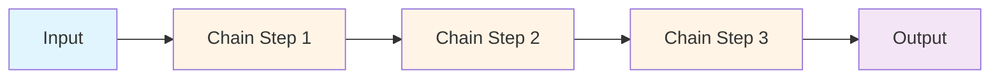

# LangChain Chains

## Table of Contents
1. [Introduction to Chains](#introduction-to-chains)
2. [Basic Chain Types](#basic-chain-types)
3. [Sequential Chains](#sequential-chains)
4. [Router Chains](#router-chains)
5. [Transform Chains](#transform-chains)
6. [MapReduce Chains](#mapreduce-chains)
7. [Chain Composition Patterns](#chain-composition-patterns)
8. [Performance Optimization](#performance-optimization)

---

## Introduction to Chains

**Chains** combine multiple components (LLMs, prompts, other chains) into a single workflow. They follow a predetermined sequence of operations, making them ideal for well-defined processes.



### Core Chain Characteristics

| Feature | Description | Benefit |
|---------|-------------|---------|
| **Deterministic** | Same input = same execution path | Predictable behavior |
| **Sequential** | Steps execute in fixed order | Easy to debug |
| **Composable** | Chains can be combined | Reusable components |
| **Fast** | Direct execution, no reasoning overhead | Lower latency |
| **Cost-effective** | Fewer LLM calls | Lower token usage |

---

## Basic Chain Types

### 1. LLMChain - The Foundation

The most basic chain combines an LLM with a prompt template.

```python
from langchain.chains import LLMChain
from langchain.prompts import PromptTemplate
from langchain.llms import OpenAI

# Create prompt template
prompt = PromptTemplate(
    input_variables=["product"],
    template="What is a good name for a company that makes {product}?"
)

# Create chain
llm = OpenAI(temperature=0.9)
chain = LLMChain(llm=llm, prompt=prompt)

# Run chain
result = chain.run("eco-friendly water bottles")
print(result)
# Output: "EcoFlow Bottles" or similar
```

**When to use LLMChain:**
- ✅ Simple prompt + LLM operations
- ✅ Single-step transformations
- ✅ Template-based generation

### 2. ConversationChain - With Memory

Maintains conversation history for context-aware responses.

```python
from langchain.chains import ConversationChain
from langchain.memory import ConversationBufferMemory

# Create memory
memory = ConversationBufferMemory()

# Create conversation chain
conversation = ConversationChain(
    llm=llm,
    memory=memory,
    verbose=True
)

# Have a conversation
print(conversation.predict(input="Hi, my name is Andrew"))
print(conversation.predict(input="What is 1+1?"))
print(conversation.predict(input="What is my name?"))  # Remembers "Andrew"
```

**Conversation Flow:**
```
Human: Hi, my name is Andrew
AI: Hello Andrew! Nice to meet you.

Human: What is 1+1?
AI: 1+1 equals 2.

Human: What is my name?
AI: Your name is Andrew, as you told me at the beginning of our conversation.
```

**When to use ConversationChain:**
- ✅ Chatbots and virtual assistants
- ✅ Multi-turn conversations
- ✅ Context-dependent responses