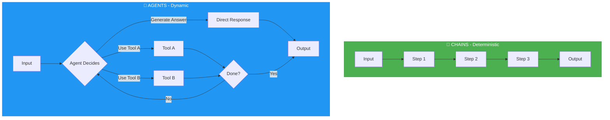
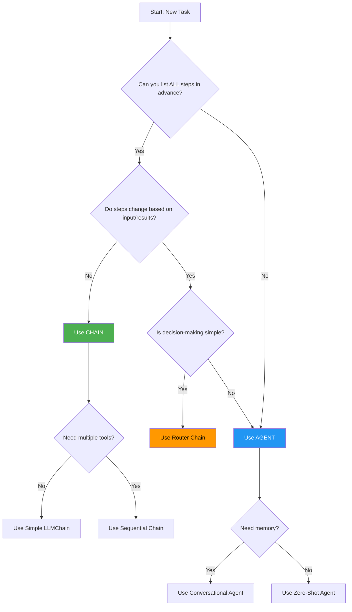

# Chains vs Agents: When to Use Which

## Core Differences

Understanding when to use **Chains** versus **Agents** is crucial for building efficient LangChain applications.



## Comparison Table

| Aspect | Chains | Agents |
|--------|--------|--------|
| **Execution Flow** | Fixed, predefined sequence | Dynamic, decided at runtime |
| **Decision Making** | None - follows script | LLM decides which tools to use |
| **Predictability** | 100% predictable | Variable - depends on LLM reasoning |
| **Complexity** | Simple to moderate | Moderate to high |
| **Cost** | Lower (fewer LLM calls) | Higher (multiple reasoning calls) |
| **Speed** | Faster (direct execution) | Slower (reasoning overhead) |
| **Error Handling** | Straightforward | Requires monitoring |
| **Use Case Fit** | Well-defined workflows | Open-ended tasks |
| **Token Usage** | Minimal | Higher (reasoning tokens) |
| **Debugging** | Easy to trace | Harder to predict |

## When to Use Chains

✅ **Use Chains When:**

1. **Workflow is Well-Defined**
   - You know exactly what steps are needed
   - The process doesn't change based on input
   - Example: Summarize → Translate → Format

2. **Predictability is Important**
   - Need consistent, repeatable outputs
   - Critical business processes
   - Example: Legal document processing

3. **Cost/Speed Optimization Matters**
   - Budget constraints
   - Low-latency requirements
   - Example: High-volume data processing

4. **Simple Transformations**
   - Data formatting
   - Template-based generation
   - Example: Email template generation

### Chain Use Case Examples

**1. Document Summarization Pipeline**
```python
from langchain.chains import LLMChain, SequentialChain
from langchain.prompts import PromptTemplate
from langchain.llms import OpenAI

llm = OpenAI(temperature=0.3)

# Step 1: Summarize
summarize_prompt = PromptTemplate(
    template="Summarize this document concisely:\n{document}",
    input_variables=["document"]
)
summarize_chain = LLMChain(llm=llm, prompt=summarize_prompt, output_key="summary")

# Step 2: Extract key points
keypoints_prompt = PromptTemplate(
    template="Extract 3 key points from:\n{summary}",
    input_variables=["summary"]
)
keypoints_chain = LLMChain(llm=llm, prompt=keypoints_prompt, output_key="key_points")

# Step 3: Generate action items
actions_prompt = PromptTemplate(
    template="Based on these points, suggest action items:\n{key_points}",
    input_variables=["key_points"]
)
actions_chain = LLMChain(llm=llm, prompt=actions_prompt, output_key="actions")

# Combine into sequential chain
overall_chain = SequentialChain(
    chains=[summarize_chain, keypoints_chain, actions_chain],
    input_variables=["document"],
    output_variables=["summary", "key_points", "actions"],
    verbose=True
)

# Execute - ALWAYS follows same path
result = overall_chain({"document": long_document})
```

**Why Chain? ✅**
- Fixed 3-step process
- Each step builds on previous
- No decision-making needed
- Fast and predictable

## When to Use Agents

✅ **Use Agents When:**

1. **Task Requires Dynamic Decision-Making**
   - Tool selection depends on input
   - Multiple possible approaches
   - Example: Research assistant

2. **Tool Usage is Context-Dependent**
   - Need to choose from multiple tools
   - Tool combination varies by query
   - Example: Multi-source data lookup

3. **Iterative Reasoning Required**
   - May need multiple attempts
   - Can refine approach based on results
   - Example: Debugging code

4. **Open-Ended Tasks**
   - Unknown number of steps
   - Exploratory workflows
   - Example: "Find and compare prices across websites"

### Agent Use Case Examples

**1. Research Assistant**
```python
from langchain.agents import initialize_agent, Tool, AgentType
from langchain.llms import OpenAI
from langchain.utilities import SerpAPIWrapper, WikipediaAPIWrapper

llm = OpenAI(temperature=0)

# Define multiple tools
search = SerpAPIWrapper()
wikipedia = WikipediaAPIWrapper()

tools = [
    Tool(
        name="Google Search",
        func=search.run,
        description="Search Google for current information, news, and facts"
    ),
    Tool(
        name="Wikipedia",
        func=wikipedia.run,
        description="Search Wikipedia for detailed historical and encyclopedic information"
    ),
    Tool(
        name="Calculator",
        func=lambda x: eval(x),
        description="Perform mathematical calculations"
    )
]

# Agent decides which tool(s) to use
agent = initialize_agent(
    tools,
    llm,
    agent=AgentType.ZERO_SHOT_REACT_DESCRIPTION,
    verbose=True
)

# Agent will dynamically choose tools based on query
result = agent.run(
    "What is the population of Tokyo and how does it compare to New York? "
    "Calculate the percentage difference."
)

# Agent reasoning:
# 1. "I need population data" → Use Wikipedia for Tokyo
# 2. "I need NYC data too" → Use Wikipedia for New York
# 3. "I need to calculate" → Use Calculator
# 4. "I have the answer" → Return result
```

**Why Agent? ✅**
- Doesn't know which data source to use upfront
- Needs to decide: Wikipedia vs Google?
- Requires calculation tool
- Multi-step reasoning with tool selection

## Decision Tree: Chain or Agent?



## Hybrid Approach: Using Chains AND Agents Together

The most powerful LangChain applications often **combine both chains and agents**.

### Pattern 1: Agent with Chain Tools

Use **chains as tools** that an agent can call.

```python
from langchain.chains import LLMChain
from langchain.agents import Tool, initialize_agent

# Create specialized chains
summarize_chain = LLMChain(
    llm=llm,
    prompt=PromptTemplate(
        template="Summarize this article:\n{article}",
        input_variables=["article"]
    )
)

translate_chain = LLMChain(
    llm=llm,
    prompt=PromptTemplate(
        template="Translate to {language}:\n{text}",
        input_variables=["text", "language"]
    )
)

# Wrap chains as agent tools
tools = [
    Tool(
        name="Summarize",
        func=lambda x: summarize_chain.run(article=x),
        description="Summarize long articles into key points"
    ),
    Tool(
        name="Translate",
        func=lambda x: translate_chain.run(text=x, language="Spanish"),
        description="Translate text to Spanish"
    )
]

# Agent decides which chain to use
agent = initialize_agent(tools, llm, agent=AgentType.ZERO_SHOT_REACT_DESCRIPTION)

# Agent dynamically chooses: summarize first, then translate? Or just translate?
result = agent.run("Process this French article: [long text]...")
```

**Benefits:**
- Chains provide reliable, tested workflows
- Agent provides intelligent orchestration
- Best of both worlds: reliability + flexibility

### Pattern 2: Chain with Agent Step

Use an **agent as one step** in a chain.

```python
from langchain.chains import SequentialChain

# Step 1: Extract entities (chain)
extract_chain = LLMChain(
    llm=llm,
    prompt=PromptTemplate(
        template="Extract all company names from: {text}",
        input_variables=["text"]
    ),
    output_key="companies"
)

# Step 2: Research each company (agent)
research_agent = initialize_agent(
    [search_tool, wikipedia_tool],
    llm,
    agent=AgentType.ZERO_SHOT_REACT_DESCRIPTION
)

# Step 3: Synthesize findings (chain)
synthesize_chain = LLMChain(
    llm=llm,
    prompt=PromptTemplate(
        template="Create a report from: {research_results}",
        input_variables=["research_results"]
    ),
    output_key="report"
)

# Hybrid workflow
def process_document(text):
    # Step 1: Extract (deterministic)
    companies = extract_chain.run(text=text)

    # Step 2: Research (dynamic - agent chooses tools)
    research_results = research_agent.run(f"Research these companies: {companies}")

    # Step 3: Synthesize (deterministic)
    report = synthesize_chain.run(research_results=research_results)

    return report

result = process_document("Article mentioning Microsoft, Apple, and Tesla...")
```

**Benefits:**
- Predictable extraction and synthesis
- Flexible research step (agent adapts to findings)
- Controlled costs (agent only where needed)

## Real-World Example: Content Moderation System

Let's build a complete system that uses **both chains and agents**.

```python
from langchain.chains import LLMChain, SequentialChain
from langchain.agents import initialize_agent, Tool
from langchain.prompts import PromptTemplate
from langchain.llms import OpenAI

llm = OpenAI(temperature=0)

# ========== CHAINS (Deterministic Analysis) ==========

# Chain 1: Content classification
classify_chain = LLMChain(
    llm=llm,
    prompt=PromptTemplate(
        template="Classify this content as: appropriate, flagged, or severe:\n{content}",
        input_variables=["content"]
    ),
    output_key="classification"
)

# Chain 2: Extract violations
violations_chain = LLMChain(
    llm=llm,
    prompt=PromptTemplate(
        template="List policy violations in:\n{content}\nClassification: {classification}",
        input_variables=["content", "classification"]
    ),
    output_key="violations"
)

# Combine classification chains
analysis_chain = SequentialChain(
    chains=[classify_chain, violations_chain],
    input_variables=["content"],
    output_variables=["classification", "violations"]
)

# ========== AGENT (Dynamic Response) ==========

def check_user_history(user_id: str) -> str:
    """Check if user has prior violations"""
    # Database lookup
    return "User has 2 prior warnings"

def escalate_to_human(case_details: str) -> str:
    """Escalate to human moderator"""
    # Create ticket
    return "Case #12345 created for human review"

def send_warning(user_id: str, reason: str) -> str:
    """Send warning to user"""
    # Send notification
    return f"Warning sent to user {user_id}"

def ban_user(user_id: str, reason: str) -> str:
    """Ban user account"""
    # Ban account
    return f"User {user_id} banned: {reason}"

tools = [
    Tool(name="Check History", func=check_user_history, description="Check user violation history"),
    Tool(name="Escalate", func=escalate_to_human, description="Escalate to human moderator"),
    Tool(name="Warn User", func=send_warning, description="Send warning to user"),
    Tool(name="Ban User", func=ban_user, description="Ban user account")
]

moderation_agent = initialize_agent(
    tools,
    llm,
    agent=AgentType.ZERO_SHOT_REACT_DESCRIPTION,
    verbose=True
)

# ========== COMPLETE WORKFLOW ==========

def moderate_content(content: str, user_id: str):
    # STEP 1: Chains analyze content (deterministic, fast)
    analysis = analysis_chain({"content": content})
    classification = analysis["classification"]
    violations = analysis["violations"]

    print(f"Classification: {classification}")
    print(f"Violations: {violations}")

    # STEP 2: Agent decides action (dynamic, context-aware)
    if classification == "appropriate":
        return "Content approved"

    # Agent decides: warn, ban, or escalate?
    action_decision = moderation_agent.run(
        f"Content classified as: {classification}\n"
        f"Violations: {violations}\n"
        f"User ID: {user_id}\n"
        f"Decide appropriate action: check history, warn, ban, or escalate."
    )

    return action_decision

# Test the system
test_content = "This post contains hate speech and threats"
result = moderate_content(test_content, user_id="user_789")
print(result)
```

**Why This Hybrid Approach Works:**

| Component | Type | Why? |
|-----------|------|------|
| Content Classification | Chain | Same 2-step process every time |
| Violation Extraction | Chain | Deterministic analysis |
| Action Decision | Agent | Depends on context (user history, severity) |
| Tool Execution | Agent Tools | Agent picks: warn, ban, or escalate |

## Cost and Performance Comparison

### Scenario: Process 1000 documents

**Pure Chain Approach:**
```python
# Fixed 3-step chain
chain = step1_chain | step2_chain | step3_chain

# Cost calculation:
# - 3 LLM calls per document
# - 3,000 total LLM calls
# - $0.002 per call = $6.00
# - Processing time: ~30 seconds (parallel possible)
```

**Pure Agent Approach:**
```python
# Agent with 5 tools
agent = initialize_agent(tools, llm, agent=AgentType.ZERO_SHOT_REACT_DESCRIPTION)

# Cost calculation:
# - Average 5-7 LLM calls per document (reasoning + tool calls)
# - 6,000 total LLM calls
# - $0.002 per call = $12.00
# - Processing time: ~60 seconds (sequential reasoning)
```

**Hybrid Approach:**
```python
# Chain for fixed steps, agent for decisions
def process(doc):
    analysis = chain.run(doc)  # 2 LLM calls
    if needs_decision(analysis):
        result = agent.run(analysis)  # 3 LLM calls (on average)
    else:
        result = default_action
    return result

# Cost calculation:
# - 30% need agent (300 docs)
# - 700 × 2 = 1,400 calls (chain only)
# - 300 × 5 = 1,500 calls (chain + agent)
# - 2,900 total LLM calls
# - $0.002 per call = $5.80
# - Processing time: ~35 seconds
```

**Savings: 52% vs pure agent, faster than pure agent, nearly as cheap as pure chain!**

## Best Practices Summary

### ✅ Use Chains For:
- ETL pipelines
- Document processing workflows
- Content generation pipelines
- Data transformation sequences
- Template-based tasks

### ✅ Use Agents For:
- Research tasks
- Customer support automation
- Multi-tool orchestration
- Open-ended queries
- Exploratory analysis

### ✅ Use Hybrid (Chains + Agents) For:
- Complex business processes
- Multi-stage pipelines with decision points
- Systems requiring both efficiency and intelligence
- Production applications with cost constraints

## Quick Reference: Chain vs Agent Selection

```python
# If you can write this pseudo-code, use a CHAIN:
"""
1. Always do X
2. Then always do Y
3. Then always do Z
"""

# If you need this pseudo-code, use an AGENT:
"""
1. Do X
2. Depending on X's result, choose between Y, Z, or W
3. If needed, repeat step 2
4. Decide when to stop
"""

# If you need this, use HYBRID:
"""
1. Always do X (chain)
2. Always do Y (chain)
3. Decide next action based on Y (agent)
4. Always do Z (chain)
"""
```

## Common Mistakes to Avoid

❌ **Using Agents for Simple Tasks**
```python
# DON'T: Agent for simple transformation
agent = initialize_agent([summarize_tool], llm, ...)
result = agent.run("Summarize this document")

# DO: Use a simple chain
chain = prompt | llm
result = chain.invoke({"document": doc})
```

❌ **Using Chains for Dynamic Tasks**
```python
# DON'T: Hardcode all tool paths
if user_query.contains("weather"):
    result = weather_chain.run(query)
elif user_query.contains("news"):
    result = news_chain.run(query)
# ... 50 more conditions

# DO: Let agent decide
agent = initialize_agent([weather_tool, news_tool, ...], llm)
result = agent.run(user_query)
```

❌ **Not Combining Approaches**
```python
# DON'T: Pure agent for everything
agent.run("Extract data, transform it, validate it, and save it")

# DO: Chain for pipeline, agent for decisions
data = extract_chain.run(source)
if validation_agent.run(data) == "needs_review":
    escalate()
else:
    save_chain.run(data)
```

## Agent vs Chain Decision Matrix

| Scenario | Use Agent? | Use Chain? | Reasoning |
|----------|------------|------------|------------|
| Fixed workflow | ❌ | ✅ | Chain is faster, cheaper |
| Unknown tools needed | ✅ | ❌ | Agent decides dynamically |
| Multi-step research | ✅ | ❌ | Requires adaptive tool selection |
| Production pipeline | ❌ | ✅ | Chains are predictable |
| Customer service bot | ✅ | ❌ | Needs tool flexibility |
| Data transformation | ❌ | ✅ | Fixed steps |
| Exploratory analysis | ✅ | ❌ | Unknown path ahead |
| Budget-constrained | ❌ | ✅ | Chains use fewer LLM calls |

---

*This comparison guide helps you choose the right LangChain component for your specific use case, optimizing for performance, cost, and functionality.*