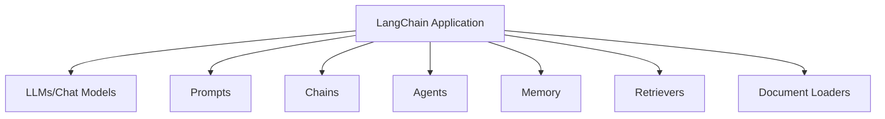
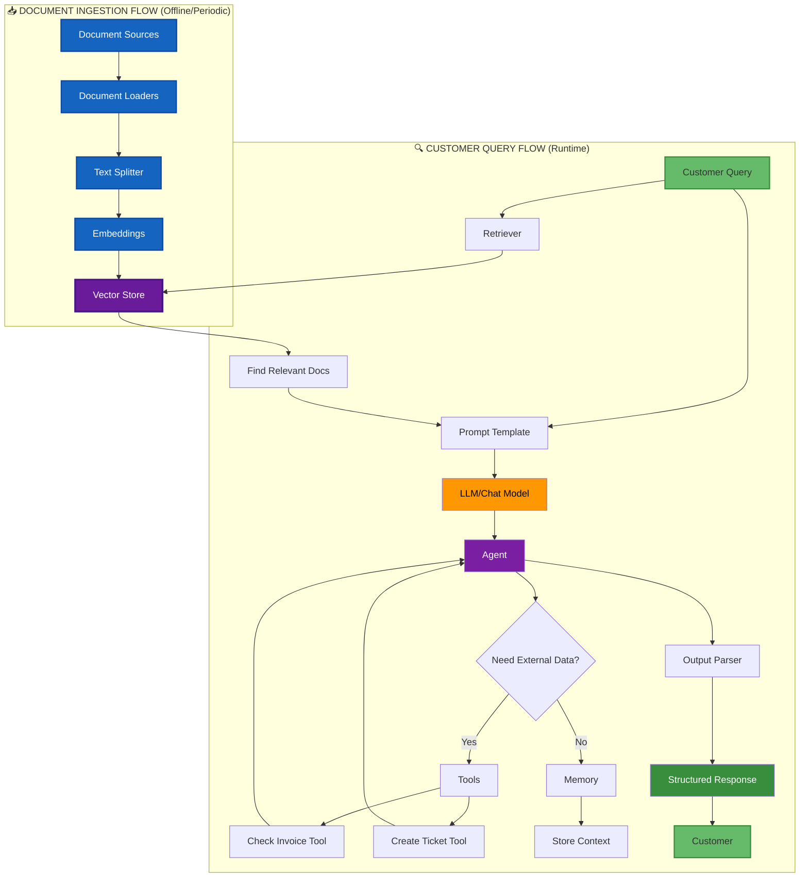

# LangChain Introduction and Core Components

## What is LangChain?

**LangChain** is a powerful framework designed to simplify the development of applications powered by Large Language Models (LLMs). It provides a modular architecture that enables developers to build complex, context-aware applications with ease.

### Key Benefits

- 🔗 **Composability**: Chain multiple components together
- 🧠 **Context-Awareness**: Maintain conversation history and state
- 🛠️ **Modularity**: Reusable components for different use cases
- 🔌 **Integration**: Easy integration with various LLMs and data sources

---

## Core Components Overview

LangChain is built around several core components that work together:



## Core Components: Functions & Aims

Each core component in LangChain serves a specific purpose in building LLM applications:

| Component | Function | Aim | Key Benefits |
|-----------|----------|-----|-------------|
| **Models (LLMs & Chat Models)** | Execute text generation and understanding | Provide AI intelligence and language processing | Natural language understanding, generation, reasoning |
| **Prompts & Templates** | Structure and format inputs to models | Ensure consistent, reusable, and effective model interactions | Maintainability, reusability, better outputs |
| **Chains** | Connect multiple components in sequence | Create complex workflows from simple building blocks | Modularity, composability, workflow automation |
| **Agents & Tools** | Make decisions and take actions dynamically | Enable autonomous reasoning and external interactions | Dynamic behavior, tool usage, complex problem solving |
| **Memory** | Store and retrieve conversation history | Maintain context across interactions | Conversational continuity, personalization |
| **Retrievers & Vector Stores** | Search and fetch relevant information | Enable semantic search and knowledge retrieval | Knowledge grounding, RAG capabilities, accuracy |
| **Document Loaders** | Import data from various sources | Make external data accessible to LLM applications | Data integration, flexibility, multi-format support |
| **Output Parsers** | Structure and validate LLM outputs | Transform free text into usable data formats | Type safety, validation, downstream integration |

---

## Real-World Complete Example: Customer Support AI System

This comprehensive example demonstrates how **all core components work together** in a production-ready customer support chatbot.

**Scenario**: A customer asks: *"I forgot my password and my last invoice was incorrect"*

### Complete Implementation

```python
from langchain.chat_models import ChatOpenAI
from langchain.prompts import ChatPromptTemplate
from langchain.chains import LLMChain
from langchain.agents import initialize_agent, Tool
from langchain.memory import ConversationBufferMemory
from langchain.vectorstores import Chroma
from langchain.embeddings import OpenAIEmbeddings
from langchain.document_loaders import TextLoader
from langchain.text_splitter import CharacterTextSplitter
from langchain.output_parsers import StructuredOutputParser, ResponseSchema

# 1. DOCUMENT LOADERS - Load knowledge base articles
loader = TextLoader('support_docs/password_reset.txt')
docs = loader.load()

# Split documents for better retrieval
text_splitter = CharacterTextSplitter(chunk_size=1000, chunk_overlap=100)
split_docs = text_splitter.split_documents(docs)

# 2. VECTOR STORES & RETRIEVERS - Store and search documentation
embeddings = OpenAIEmbeddings()
vectorstore = Chroma.from_documents(split_docs, embeddings)
retriever = vectorstore.as_retriever(search_kwargs={"k": 3})

# Retrieve relevant docs for the query
relevant_docs = retriever.get_relevant_documents(
    "password reset procedure"
)

# 3. LLM - The brain of the operation
llm = ChatOpenAI(model="gpt-4", temperature=0.7)

# 4. PROMPTS & TEMPLATES - Structure the interaction
prompt_template = ChatPromptTemplate.from_messages([
    ("system", "You are a helpful customer support agent. "
               "Use the following context to help the customer: {context}"),
    ("human", "{customer_query}")
])

# 5. CHAINS - Connect prompt and LLM
support_chain = LLMChain(
    llm=llm,
    prompt=prompt_template
)

# 6. AGENT & TOOLS - Access external systems
def check_invoice_status(invoice_id: str) -> str:
    """Check the status of an invoice in the billing system."""
    # In reality, this would query a database
    return f"Invoice {invoice_id}: Status - Under Review"

def create_support_ticket(issue: str) -> str:
    """Create a support ticket for the issue."""
    ticket_id = "TICK-12345"
    return f"Created ticket {ticket_id} for: {issue}"

tools = [
    Tool(
        name="Check Invoice",
        func=check_invoice_status,
        description="Check the status of a customer invoice"
    ),
    Tool(
        name="Create Ticket",
        func=create_support_ticket,
        description="Create a support ticket for complex issues"
    )
]

# 7. MEMORY - Remember conversation context
memory = ConversationBufferMemory(
    memory_key="chat_history",
    return_messages=True
)

# Initialize agent with tools and memory
agent = initialize_agent(
    tools=tools,
    llm=llm,
    agent="conversational-react-description",
    memory=memory,
    verbose=True
)

# 8. OUTPUT PARSER - Structure the response
response_schemas = [
    ResponseSchema(
        name="action_taken",
        description="What action was taken to help the customer"
    ),
    ResponseSchema(
        name="next_steps",
        description="What the customer should do next"
    ),
    ResponseSchema(
        name="ticket_id",
        description="Support ticket ID if one was created"
    )
]

output_parser = StructuredOutputParser.from_response_schemas(response_schemas)

# FULL WORKFLOW
customer_query = "I forgot my password and my last invoice was incorrect"

# Agent processes query using all components
response = agent.run(customer_query)

# Parse the structured output
structured_response = output_parser.parse(response)

print("Action Taken:", structured_response["action_taken"])
print("Next Steps:", structured_response["next_steps"])
print("Ticket ID:", structured_response["ticket_id"])
```

---

## System Architecture: Document Ingestion vs Query Flow

The diagram below shows **two separate flows**:
1. **📥 Document Ingestion Flow (Blue)**: One-time or periodic process to load and index documents
2. **🔍 Query Flow (Green)**: Runtime process when customers ask questions



---

## Flow Separation Explained

### 📥 Document Ingestion Flow (Happens BEFORE queries)

**Trigger**: System administrator/developer action or scheduled job

| Step | Component | Purpose | Frequency |
|------|-----------|---------|----------|
| 1 | **Document Sources** | PDFs, websites, databases, etc. | Initial setup |
| 2 | **Document Loaders** | Load raw documents | One-time or periodic |
| 3 | **Text Splitter** | Split into chunks | One-time or periodic |
| 4 | **Embeddings** | Convert text to vectors | One-time or periodic |
| 5 | **Vector Store** | Store embedded vectors | Persistent |

**Implementation Example:**

```python
# This happens ONCE or periodically (e.g., nightly)
from langchain.document_loaders import PyPDFLoader, WebBaseLoader
from langchain.text_splitter import RecursiveCharacterTextSplitter
from langchain.embeddings import OpenAIEmbeddings
from langchain.vectorstores import Chroma

# 1. Load documents (NOT triggered by customer query)
loader = PyPDFLoader('support_docs/all_articles.pdf')
docs = loader.load()

# 2. Split documents
splitter = RecursiveCharacterTextSplitter(chunk_size=1000, chunk_overlap=200)
split_docs = splitter.split_documents(docs)

# 3. Create embeddings and store in vector DB
embeddings = OpenAIEmbeddings()
vectorstore = Chroma.from_documents(
    documents=split_docs,
    embedding=embeddings,
    persist_directory="./chroma_db"  # Persists to disk
)
vectorstore.persist()
print("✅ Documents indexed and ready for queries!")
```

---

### 🔍 Customer Query Flow (Happens AT RUNTIME)

**Trigger**: Customer asks a question

| Step | Component | Purpose | Frequency |
|------|-----------|---------|----------|
| 1 | **Customer Query** | User asks question | Every query |
| 2 | **Retriever** | Search vector store | Every query |
| 3 | **Vector Store** | Return relevant docs | Every query |
| 4 | **Prompt Template** | Format query + context | Every query |
| 5 | **LLM** | Generate answer | Every query |
| 6 | **Agent/Tools** | Take actions if needed | When needed |
| 7 | **Memory** | Store conversation | Every query |
| 8 | **Output Parser** | Structure response | Every query |

**Implementation Example:**

```python
# This happens EVERY TIME a customer asks a question
from langchain.chains import RetrievalQA
from langchain.chat_models import ChatOpenAI

# Load existing vector store (already populated)
vectorstore = Chroma(
    persist_directory="./chroma_db",
    embedding_function=OpenAIEmbeddings()
)

# Create retriever from existing vector store
retriever = vectorstore.as_retriever(search_kwargs={"k": 3})

# Create QA chain
llm = ChatOpenAI(model="gpt-4", temperature=0)
qa_chain = RetrievalQA.from_chain_type(
    llm=llm,
    chain_type="stuff",
    retriever=retriever
)

# Customer query (happens at runtime)
customer_query = "How do I reset my password?"
answer = qa_chain.run(customer_query)
print(answer)
```

---

## Key Differences Between Flows

| Aspect | Document Ingestion | Query Flow |
|--------|-------------------|------------|
| **Trigger** | Manual/scheduled | Customer query |
| **Frequency** | One-time or periodic (daily/weekly) | Every query (real-time) |
| **Purpose** | Prepare data | Answer questions |
| **Performance** | Can be slow (batch) | Must be fast (< 2 sec) |
| **Components** | Loaders → Splitters → Embeddings → Vector Store | Retriever → LLM → Response |
| **Cost** | One-time embedding cost | Per-query LLM cost |

---

## Real-World Analogy

**Document Ingestion** = 📚 Library organizing books on shelves (happens once)
- Librarian receives new books (Document Loaders)
- Categorizes them (Text Splitter)
- Creates catalog cards (Embeddings)
- Arranges on shelves (Vector Store)

**Query Flow** = 🔍 Library patron finding a book (happens every visit)
- Patron asks question (Customer Query)
- Searches catalog (Retriever)
- Finds relevant books (Vector Store returns results)
- Reads and synthesizes answer (LLM)
- Gets response (Output)

---

## Why This Separation Matters

✅ **Performance**: Documents are pre-processed, so queries are fast
✅ **Cost Efficiency**: Embeddings computed once, not per query
✅ **Scalability**: Can index millions of docs offline without impacting query latency
✅ **Maintenance**: Update docs independently from query handling
✅ **Accuracy**: Fresh embeddings from latest documents

---

## Component Effectiveness in Customer Support

| Component Used | Benefit in This Scenario |
|----------------|-------------------------|
| **Document Loaders** | Loads 100+ support articles about password resets, billing, etc. |
| **Vector Store** | Stores 50,000+ support documents searchable by semantic meaning |
| **Retriever** | Finds the 3 most relevant articles about password reset |
| **LLM** | Understands the customer has TWO issues (password + invoice) |
| **Prompt Template** | Ensures consistent, professional support agent tone |
| **Chain** | Processes query → retrieves context → generates response |
| **Agent** | Decides to check invoice status AND create a ticket |
| **Tools** | Accesses ticketing system and billing database |
| **Memory** | Remembers if customer mentions invoice number later |
| **Output Parser** | Returns structured data for CRM integration |

**Result**: The customer gets a comprehensive answer addressing both issues, with a support ticket automatically created and invoice status checked - all in one interaction!

---

## Quick Start Guide

### Installation

```bash
pip install langchain openai chromadb
```

### Basic Example

```python
from langchain.llms import OpenAI
from langchain.prompts import PromptTemplate
from langchain.chains import LLMChain

# 1. Initialize LLM
llm = OpenAI(temperature=0.7)

# 2. Create prompt template
prompt = PromptTemplate(
    input_variables=["topic"],
    template="Write a short poem about {topic}"
)

# 3. Create chain
chain = LLMChain(llm=llm, prompt=prompt)

# 4. Run
result = chain.run("artificial intelligence")
print(result)
```

---

## Next Steps

- **LangChain_Models_and_Prompts.md** - Learn about LLMs and prompt templates
- **LangChain_Chains.md** - Master chains and routing
- **LangChain_Agents.md** - Build intelligent agents
- **LangChain_Memory_and_Storage.md** - Implement memory and retrieval
- **LangChain_Best_Practices.md** - Production-ready patterns

---

## Additional Resources

- [Official Documentation](https://python.langchain.com/)
- [GitHub Repository](https://github.com/langchain-ai/langchain)
- [LangChain Blog](https://blog.langchain.dev/)
- [Community Discord](https://discord.gg/langchain)
