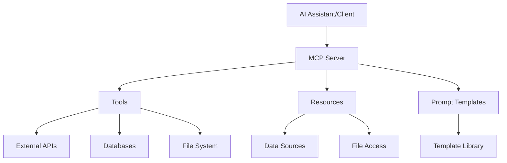

# LangChain MCP (Model Context Protocol) Server

## 5. MCP (Model Context Protocol) Server

The Model Context Protocol (MCP) is an open standard for connecting AI assistants to data sources and tools. LangChain provides MCP server capabilities to expose your chains and agents as standardized services.

### 5.1 What is MCP?

MCP enables:
- **Standardized Communication**: Common protocol for AI-data interactions
- **Tool Integration**: Expose LangChain tools as MCP tools
- **Resource Access**: Provide access to databases, APIs, and file systems
- **Prompt Templates**: Share reusable prompt templates
- **Interoperability**: Work with any MCP-compatible AI assistant

### 5.2 MCP Architecture



### 5.3 Setting Up MCP Server

#### Installation

```bash
pip install langchain-mcp
```

#### Basic MCP Server Setup

```python
from langchain_mcp import MCPServer
from langchain.tools import tool
from langchain.prompts import ChatPromptTemplate
import asyncio

# Create MCP server instance
server = MCPServer("my-langchain-server")

# Add tools
@tool
async def get_weather(city: str) -> str:
    """Get weather information for a city."""
    # Mock implementation
    return f"The weather in {city} is sunny, 72°F"

@tool  
async def calculate(expression: str) -> str:
    """Calculate a mathematical expression."""
    try:
        result = eval(expression)  # Note: Use safely in production
        return str(result)
    except Exception as e:
        return f"Error: {str(e)}"

# Register tools with server
server.add_tool(get_weather)
server.add_tool(calculate)

# Add prompt templates
weather_prompt = ChatPromptTemplate.from_template(
    "You are a weather assistant. Provide weather information for {city}. "
    "Be helpful and include any relevant details."
)

server.add_prompt("weather_assistant", weather_prompt)

# Start server
async def main():
    await server.start()
    print("MCP Server started on stdio")
    await server.wait_for_shutdown()

if __name__ == "__main__":
    asyncio.run(main())
```

### 5.4 Advanced MCP Features

#### Resource Management

```python
from langchain_mcp.resources import Resource

class FileResource(Resource):
    def __init__(self, file_path: str):
        self.file_path = file_path
        super().__init__(
            uri=f"file://{file_path}",
            name=f"File: {file_path}",
            description=f"Access to file {file_path}",
            mime_type="text/plain"
        )
    
    async def read(self) -> str:
        with open(self.file_path, 'r') as f:
            return f.read()

# Add resource to server
file_resource = FileResource("/path/to/data.txt")
server.add_resource(file_resource)
```

#### Database Integration

```python
import sqlite3
from langchain_mcp.tools import MCPTool

class DatabaseTool(MCPTool):
    def __init__(self, db_path: str):
        self.db_path = db_path
        super().__init__(
            name="query_database",
            description="Execute SQL queries on the database"
        )
    
    async def execute(self, query: str) -> str:
        """Execute SQL query and return results."""
        try:
            conn = sqlite3.connect(self.db_path)
            cursor = conn.cursor()
            cursor.execute(query)
            results = cursor.fetchall()
            conn.close()
            return str(results)
        except Exception as e:
            return f"Database error: {str(e)}"

# Add to server
db_tool = DatabaseTool("/path/to/database.db")
server.add_tool(db_tool)
```

### 5.5 LangChain Chain Integration

#### Exposing Chains as MCP Tools

```python
from langchain.chains import LLMChain
from langchain.llms import OpenAI
from langchain.prompts import PromptTemplate

# Create a chain
llm = OpenAI()
prompt = PromptTemplate(
    input_variables=["question"],
    template="Answer the following question: {question}"
)
chain = LLMChain(llm=llm, prompt=prompt)

# Wrap chain as MCP tool
@tool
async def answer_question(question: str) -> str:
    """Answer questions using the LLM chain."""
    result = await chain.arun(question=question)
    return result

server.add_tool(answer_question)
```

#### RAG Chain Integration

```python
from langchain.chains import RetrievalQA
from langchain.vectorstores import FAISS
from langchain.embeddings import OpenAIEmbeddings
from langchain.document_loaders import TextLoader

# Setup RAG chain
loader = TextLoader("documents.txt")
documents = loader.load()

embeddings = OpenAIEmbeddings()
vectorstore = FAISS.from_documents(documents, embeddings)

rag_chain = RetrievalQA.from_chain_type(
    llm=llm,
    chain_type="stuff",
    retriever=vectorstore.as_retriever()
)

@tool
async def rag_search(query: str) -> str:
    """Search documents using RAG."""
    result = await rag_chain.arun(query=query)
    return result

server.add_tool(rag_search)
```

### 5.6 Configuration and Security

#### Server Configuration

```python
from langchain_mcp import MCPServerConfig

config = MCPServerConfig(
    name="my-server",
    version="1.0.0",
    description="LangChain MCP Server",
    max_request_size=1024*1024,  # 1MB
    timeout=30.0,  # 30 seconds
    enable_logging=True
)

server = MCPServer(config=config)
```

#### Authentication and Authorization

```python
from langchain_mcp.auth import APIKeyAuth

# Simple API key authentication
auth = APIKeyAuth(api_keys=["your-secret-key"])
server.set_auth(auth)

# Custom authorization
def authorize_tool(tool_name: str, client_id: str) -> bool:
    # Custom authorization logic
    return True

server.set_authorization(authorize_tool)
```

### 5.7 Client Integration

#### Connecting to MCP Server

```python
from langchain_mcp.client import MCPClient

# Connect to MCP server
client = MCPClient("stdio")
await client.connect()

# List available tools
tools = await client.list_tools()
print("Available tools:", [tool.name for tool in tools])

# Use a tool
result = await client.call_tool("get_weather", {"city": "San Francisco"})
print("Weather result:", result)

# Get prompt template
prompt = await client.get_prompt("weather_assistant")
```

### 5.8 Deployment Patterns

#### Docker Deployment

```dockerfile
FROM python:3.11-slim

WORKDIR /app
COPY requirements.txt .
RUN pip install -r requirements.txt

COPY . .

CMD ["python", "mcp_server.py"]
```

#### Systemd Service

```ini
[Unit]
Description=LangChain MCP Server
After=network.target

[Service]
Type=simple
User=mcpserver
WorkingDirectory=/opt/mcp-server
ExecStart=/usr/bin/python3 mcp_server.py
Restart=always

[Install]
WantedBy=multi-user.target
```

### 5.9 Monitoring and Logging

#### Server Metrics

```python
from langchain_mcp.monitoring import MetricsCollector

metrics = MetricsCollector()
server.add_middleware(metrics)

# Custom metrics
@tool
async def monitored_tool(input_data: str) -> str:
    """Tool with monitoring."""
    metrics.increment_counter("tool_calls", {"tool": "monitored_tool"})
    
    start_time = time.time()
    try:
        result = process_input(input_data)
        metrics.record_histogram("tool_duration", time.time() - start_time)
        return result
    except Exception as e:
        metrics.increment_counter("tool_errors", {"tool": "monitored_tool"})
        raise
```

#### Structured Logging

```python
import logging
import json

class MCPFormatter(logging.Formatter):
    def format(self, record):
        log_data = {
            "timestamp": self.formatTime(record),
            "level": record.levelname,
            "message": record.getMessage(),
            "tool": getattr(record, 'tool', None),
            "client_id": getattr(record, 'client_id', None)
        }
        return json.dumps(log_data)

# Configure logging
handler = logging.StreamHandler()
handler.setFormatter(MCPFormatter())
logger = logging.getLogger("mcp_server")
logger.addHandler(handler)
logger.setLevel(logging.INFO)
```

### 5.10 Best Practices

1. **Tool Design**:
   - Keep tools focused and single-purpose
   - Provide clear descriptions and parameter documentation
   - Handle errors gracefully

2. **Security**:
   - Implement proper authentication
   - Validate all inputs
   - Use authorization for sensitive operations
   - Log security events

3. **Performance**:
   - Implement timeouts for long-running operations
   - Use async/await for I/O operations
   - Cache frequently accessed data
   - Monitor resource usage

4. **Reliability**:
   - Implement retry logic for external services
   - Use circuit breakers for failing dependencies
   - Provide fallback mechanisms
   - Monitor server health

5. **Documentation**:
   - Document all tools and their parameters
   - Provide usage examples
   - Maintain API documentation
   - Version your server API

This comprehensive MCP server implementation allows you to expose LangChain functionality as standardized services that can be consumed by any MCP-compatible AI assistant.