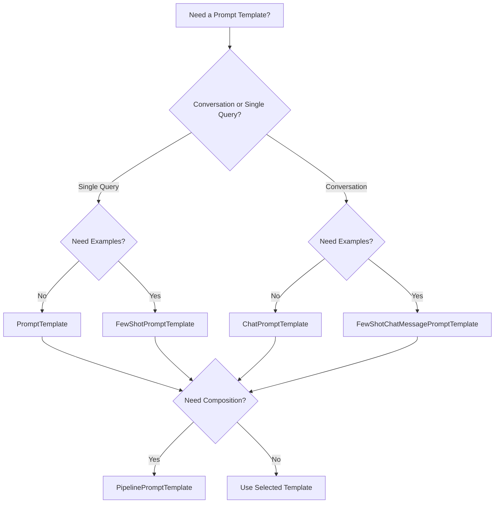

# LangChain Models and Prompts

## Table of Contents
1. [LLMs and Chat Models](#llms-and-chat-models)
2. [Prompts and Prompt Templates](#prompts-and-prompt-templates)
3. [Model Configuration](#model-configuration)
4. [Prompt Engineering Best Practices](#prompt-engineering-best-practices)

---

## LLMs and Chat Models

### LLMs (Large Language Models)
LLMs are models that take text input and generate text output.

```python
from langchain.llms import OpenAI

# Initialize an LLM
llm = OpenAI(temperature=0.7, model_name="gpt-3.5-turbo-instruct")

# Generate text
response = llm("What is the capital of France?")
print(response)
```

### Chat Models
Chat models are specialized for conversational interfaces, using message-based inputs.

```python
from langchain.chat_models import ChatOpenAI
from langchain.schema import HumanMessage, SystemMessage

# Initialize a chat model
chat = ChatOpenAI(temperature=0.7, model_name="gpt-4")

# Create messages
messages = [
    SystemMessage(content="You are a helpful assistant."),
    HumanMessage(content="What is the capital of France?")
]

# Get response
response = chat(messages)
print(response.content)
```

### Key Differences:
| Feature | LLMs | Chat Models |
|---------|------|-------------|
| Input Format | Plain text | Structured messages |
| Use Case | Text generation | Conversations |
| Context Handling | Limited | Better structured |

---

## Prompts and Prompt Templates

Prompts are the instructions given to LLMs. **Prompt Templates** make prompts reusable and dynamic.

### Simple Prompt Template

```python
from langchain.prompts import PromptTemplate

# Create a template
template = """
You are a {role} assistant.
Question: {question}
Answer:
"""

prompt = PromptTemplate(
    input_variables=["role", "question"],
    template=template
)

# Use the template
formatted_prompt = prompt.format(
    role="helpful",
    question="What is machine learning?"
)
```

### Chat Prompt Template

```python
from langchain.prompts import ChatPromptTemplate

# Create a chat prompt template
chat_template = ChatPromptTemplate.from_messages([
    ("system", "You are a {role} assistant."),
    ("human", "Hello!"),
    ("ai", "Hi! How can I help you today?"),
    ("human", "{user_input}")
])

# Format the template
messages = chat_template.format_messages(
    role="friendly",
    user_input="Tell me about LangChain"
)
```

### Few-Shot Prompts

```python
from langchain.prompts import FewShotPromptTemplate

# Define examples
examples = [
    {"word": "happy", "antonym": "sad"},
    {"word": "tall", "antonym": "short"}
]

# Create example template
example_template = """
Word: {word}
Antonym: {antonym}
"""

# Create few-shot template
few_shot_prompt = FewShotPromptTemplate(
    examples=examples,
    example_prompt=PromptTemplate(
        input_variables=["word", "antonym"],
        template=example_template
    ),
    prefix="Give the antonym of every word:",
    suffix="Word: {input}\nAntonym:",
    input_variables=["input"]
)
```

### Prompt Template Types Comparison

Here's a comprehensive comparison of different prompt template types in LangChain:

| Template Type | Best For | Input Format | Key Features | Complexity | Example Use Case |
|---------------|----------|--------------|--------------|------------|------------------|
| **PromptTemplate** | Simple text prompts | String variables | Basic variable substitution, easy to use | ⭐ Low | Product name generation, simple Q&A |
| **ChatPromptTemplate** | Conversational AI | Message objects (System, Human, AI) | Role-based messages, conversation structure | ⭐⭐ Medium | Chatbots, customer service agents |
| **FewShotPromptTemplate** | Learning from examples | Examples + query | Example-based learning, dynamic example selection | ⭐⭐⭐ Medium-High | Classification, pattern matching, style imitation |
| **FewShotChatMessagePromptTemplate** | Chat with examples | Chat examples + query | Combines few-shot with chat format | ⭐⭐⭐ High | Conversational style training, dialogue systems |
| **MessagesPlaceholder** | Dynamic message insertion | Variable-length message lists | Flexible message insertion, works with memory | ⭐⭐ Medium | Chat history, dynamic conversations |
| **PipelinePromptTemplate** | Multi-stage prompts | Nested templates | Compose multiple prompts, reusable components | ⭐⭐⭐⭐ High | Complex workflows, modular prompt design |

### Detailed Template Comparisons

#### 1. **Basic vs Chat Templates**

```python
# PromptTemplate (Basic)
from langchain.prompts import PromptTemplate

basic_prompt = PromptTemplate(
    input_variables=["topic"],
    template="Write a poem about {topic}"
)

# ChatPromptTemplate (Conversational)
from langchain.prompts import ChatPromptTemplate

chat_prompt = ChatPromptTemplate.from_messages([
    ("system", "You are a creative poet."),
    ("human", "Write a poem about {topic}")
])
```

**When to use:**
- **PromptTemplate**: Single-turn tasks, simple generation
- **ChatPromptTemplate**: Multi-turn conversations, role-based interactions

#### 2. **Few-Shot vs Regular Templates**

```python
# Regular Template (Zero-shot)
regular = PromptTemplate(
    template="Translate to French: {text}",
    input_variables=["text"]
)

# Few-Shot Template (With examples)
from langchain.prompts import FewShotPromptTemplate

examples = [
    {"english": "Hello", "french": "Bonjour"},
    {"english": "Goodbye", "french": "Au revoir"}
]

few_shot = FewShotPromptTemplate(
    examples=examples,
    example_prompt=PromptTemplate(
        template="English: {english}\nFrench: {french}",
        input_variables=["english", "french"]
    ),
    prefix="Translate English to French:",
    suffix="English: {text}\nFrench:",
    input_variables=["text"]
)
```

**When to use:**
- **Regular**: Well-known tasks, clear instructions sufficient
- **Few-Shot**: Complex patterns, style matching, domain-specific tasks

#### 3. **Pipeline Templates (Advanced Composition)**

```python
from langchain.prompts.pipeline import PipelinePromptTemplate

# Character template
character_template = PromptTemplate(
    input_variables=["character"],
    template="Character: {character}"
)

# Setting template
setting_template = PromptTemplate(
    input_variables=["setting"],
    template="Setting: {setting}"
)

# Final template combining both
final_template = PromptTemplate(
    input_variables=["character_info", "setting_info", "plot"],
    template="""{character_info}
{setting_info}

Plot: {plot}

Write a story based on the above."""
)

# Pipeline that composes all templates
pipeline = PipelinePromptTemplate(
    final_prompt=final_template,
    pipeline_prompts=[
        ("character_info", character_template),
        ("setting_info", setting_template)
    ]
)

# Use it
result = pipeline.format(
    character="a brave knight",
    setting="medieval castle",
    plot="a dragon appears"
)
```

**When to use:**
- Modular prompt design
- Reusable prompt components
- Complex, multi-part prompts

### Template Selection Decision Tree



---

## Model Configuration

### Temperature and Model Parameters

```python
from langchain.chat_models import ChatOpenAI

# Configure model parameters
llm = ChatOpenAI(
    model_name="gpt-4",
    temperature=0.7,        # Creativity level (0-1)
    max_tokens=500,         # Maximum response length
    top_p=1.0,             # Nucleus sampling
    frequency_penalty=0.0,  # Reduce repetition
    presence_penalty=0.0,   # Encourage new topics
    n=1,                   # Number of responses
    streaming=False,       # Enable streaming
    verbose=True          # Debug output
)
```

### Model Selection Guide

| Model | Best For | Cost | Speed | Context Length |
|-------|----------|------|-------|----------------|
| **GPT-4** | Complex reasoning, analysis | High | Slow | 8K/32K |
| **GPT-3.5-Turbo** | General tasks, conversations | Medium | Fast | 4K/16K |
| **Claude** | Long documents, safety | Medium | Medium | 100K |
| **Llama 2** | Open source, privacy | Free* | Medium | 4K |

### Multiple Model Usage

```python
from langchain.chat_models import ChatOpenAI
from langchain.llms import Ollama

# Use different models for different tasks
cheap_llm = ChatOpenAI(model="gpt-3.5-turbo", temperature=0)
smart_llm = ChatOpenAI(model="gpt-4", temperature=0)
local_llm = Ollama(model="llama2")

# Route based on complexity
def get_model(complexity: str):
    if complexity == "simple":
        return cheap_llm
    elif complexity == "complex":
        return smart_llm
    else:
        return local_llm
```

---

## Prompt Engineering Best Practices

### 1. Be Specific and Clear

```python
# ❌ BAD: Vague prompt
bad_prompt = "Write about AI"

# ✅ GOOD: Specific prompt
good_prompt = """
Write a 300-word article about the impact of AI on healthcare.
Include:
1. Current applications
2. Benefits for patients
3. Challenges for implementation
4. Future outlook

Target audience: Healthcare professionals
Tone: Professional but accessible
"""
```

### 2. Use Examples (Few-Shot Learning)

```python
# ✅ GOOD: Provide examples
few_shot_prompt = """
Extract the key information from these customer reviews:

Example 1:
Review: "Great product! Fast shipping, excellent quality. Love the blue color."
Output: {"sentiment": "positive", "aspects": ["shipping", "quality", "color"], "rating": 5}

Example 2:
Review: "Okay product, took forever to arrive. Color was different than expected."
Output: {"sentiment": "mixed", "aspects": ["shipping", "color"], "rating": 3}

Now extract from this review:
Review: "{review}"
Output:
"""
```

### 3. Structure Your Prompts

```python
# ✅ GOOD: Well-structured prompt
structured_prompt = """
ROLE: You are an expert financial advisor

TASK: Analyze the following investment portfolio and provide recommendations

CONTEXT: 
- Client is 35 years old
- Risk tolerance: Medium
- Investment horizon: 20 years
- Current portfolio: {portfolio}

OUTPUT FORMAT:
1. Portfolio Analysis
2. Risk Assessment
3. Recommendations (3-5 specific actions)
4. Expected Outcomes

CONSTRAINTS:
- Keep recommendations under 500 words
- Focus on actionable advice
- Avoid jargon

PORTFOLIO TO ANALYZE:
{portfolio}
"""
```

### 4. Chain of Thought Prompting

```python
# ✅ GOOD: Encourage step-by-step thinking
cot_prompt = """
Solve this step by step:

Problem: A company's revenue increased by 25% from 2022 to 2023. 
If the 2023 revenue was $1.5 million, what was the 2022 revenue?

Let me think through this step by step:
1. First, I need to understand what we know
2. Then, I'll set up the equation
3. Finally, I'll solve for the unknown

Step 1: [Let the model work through each step]
"""
```

### 5. Use System Messages for Context

```python
from langchain.prompts import ChatPromptTemplate

# ✅ GOOD: Clear system context
system_prompt = """
You are a professional code reviewer for a Python development team.

Your responsibilities:
- Review code for bugs, security issues, and performance problems
- Suggest improvements following PEP 8 standards
- Explain your reasoning clearly
- Be constructive and helpful in your feedback

Always format your response with:
1. Overall Assessment (Approve/Request Changes)
2. Specific Issues (if any)
3. Suggestions for Improvement
4. Positive Aspects
"""

chat_prompt = ChatPromptTemplate.from_messages([
    ("system", system_prompt),
    ("human", "Please review this Python function:\n\n{code}")
])
```

### 6. Handle Edge Cases

```python
# ✅ GOOD: Account for various scenarios
robust_prompt = """
Classify the following text as positive, negative, or neutral sentiment.

Special cases to consider:
- Sarcasm should be classified as negative
- Mixed reviews should be classified as neutral
- Questions without clear sentiment should be neutral
- If uncertain, explain your reasoning

Text to classify: "{text}"

Classification: [positive/negative/neutral]
Confidence: [high/medium/low]
Reasoning: [Your explanation]
"""
```

### 7. Iterative Prompt Development

```python
# Version 1: Basic prompt
v1_prompt = "Summarize this article"

# Version 2: Add constraints
v2_prompt = "Summarize this article in 100 words"

# Version 3: Add structure
v3_prompt = """
Summarize this article in exactly 100 words using this structure:
1. Main topic (20 words)
2. Key findings (60 words)  
3. Implications (20 words)
"""

# Version 4: Add examples and context
v4_prompt = """
You are a research assistant creating brief summaries for busy executives.

Summarize the following article in exactly 100 words using this structure:
1. Main topic (20 words)
2. Key findings (60 words)  
3. Implications (20 words)

Example output:
Main topic: Study examines impact of remote work on productivity across 500 companies during pandemic period.
Key findings: Remote workers showed 13% productivity increase, reduced sick days by 40%, but reported 25% more difficulty collaborating. Companies saved average $11,000 per remote employee annually. However, 68% of managers struggled with performance evaluation, and innovation metrics dropped 8% in fully remote teams.
Implications: Remote work offers significant benefits but requires new management approaches and collaboration tools for success.

Article to summarize:
{article}
"""
```

### 8. Prompt Testing Framework

```python
def test_prompt(prompt_template, test_cases, model):
    """Test prompt with multiple inputs to evaluate consistency"""
    results = []
    
    for test_case in test_cases:
        prompt = prompt_template.format(**test_case["input"])
        response = model(prompt)
        
        results.append({
            "input": test_case["input"],
            "output": response,
            "expected": test_case.get("expected"),
            "score": evaluate_response(response, test_case.get("expected"))
        })
    
    return results

# Example test cases
test_cases = [
    {
        "input": {"sentiment_text": "I love this product!"},
        "expected": "positive"
    },
    {
        "input": {"sentiment_text": "This is the worst thing ever."},
        "expected": "negative"
    },
    {
        "input": {"sentiment_text": "It's okay, I guess."},
        "expected": "neutral"
    }
]

results = test_prompt(sentiment_prompt, test_cases, llm)
```

### Common Prompt Patterns

#### 1. **Role-Task-Context Pattern**
```python
role_task_context = """
ROLE: You are a {role}
TASK: {task}
CONTEXT: {context}
OUTPUT: {output_format}

INPUT:
{input}
"""
```

#### 2. **Question-Answer-Explanation Pattern**
```python
qae_pattern = """
Question: {question}

Let me think through this step by step:

1. Understanding the question: [analysis]
2. Relevant information: [facts]
3. Reasoning: [logic]
4. Answer: [conclusion]

Therefore: [final answer]
"""
```

#### 3. **Template-Example-Task Pattern**
```python
tet_pattern = """
Here's the template for {task}:

Template:
{template}

Example:
Input: {example_input}
Output: {example_output}

Now apply this to:
Input: {actual_input}
Output:
"""
```

### Prompt Optimization Checklist

✅ **Clarity**
- [ ] Instructions are specific and unambiguous
- [ ] No conflicting requirements
- [ ] Clear success criteria defined

✅ **Context**
- [ ] Sufficient background information provided
- [ ] Role and audience clearly defined
- [ ] Constraints and limitations specified

✅ **Structure**
- [ ] Logical flow of information
- [ ] Clear sections and formatting
- [ ] Consistent style throughout

✅ **Examples**
- [ ] Representative examples provided
- [ ] Edge cases covered
- [ ] Good and bad examples shown

✅ **Testing**
- [ ] Tested with multiple inputs
- [ ] Edge cases validated
- [ ] Consistent outputs verified

✅ **Efficiency**
- [ ] No unnecessary verbosity
- [ ] Token usage optimized
- [ ] Response format specified

### Advanced Prompt Techniques

#### 1. **Meta-Prompting**
```python
meta_prompt = """
Create a prompt that will help an AI assistant write better product descriptions.

The prompt should:
1. Define the AI's role as a marketing copywriter
2. Specify the target audience and tone
3. Include a clear structure for the output
4. Provide an example of good product description
5. Include constraints (word count, key features to highlight)

Product type: {product_type}
Target audience: {audience}
Brand voice: {brand_voice}
"""
```

#### 2. **Chain of Thought with Self-Correction**
```python
self_correcting_prompt = """
Solve this problem step by step, then review your answer:

Problem: {problem}

Step 1: Understanding
[What is being asked?]

Step 2: Planning
[What approach will I take?]

Step 3: Execution
[Work through the solution]

Step 4: Review
[Check my work - are there any errors?]

Step 5: Final Answer
[Provide the corrected final answer]
"""
```

#### 3. **Prompt Chaining**
```python
# Prompt 1: Generate ideas
idea_prompt = "Generate 5 creative marketing ideas for {product}"

# Prompt 2: Evaluate ideas (using output from prompt 1)
evaluation_prompt = """
Evaluate these marketing ideas on a scale of 1-10 for:
1. Creativity
2. Feasibility  
3. Cost-effectiveness
4. Target audience appeal

Ideas: {ideas}
"""

# Prompt 3: Develop best idea (using output from prompt 2)
development_prompt = """
Take the highest-scoring idea and create a detailed implementation plan:

Best idea: {best_idea}

Plan should include:
1. Timeline
2. Budget estimate
3. Required resources
4. Success metrics
5. Risk mitigation
"""
```

This comprehensive guide covers the essential aspects of working with models and prompts in LangChain, from basic usage to advanced optimization techniques.