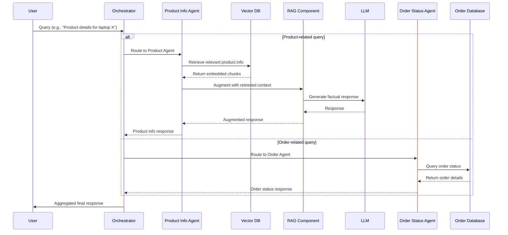
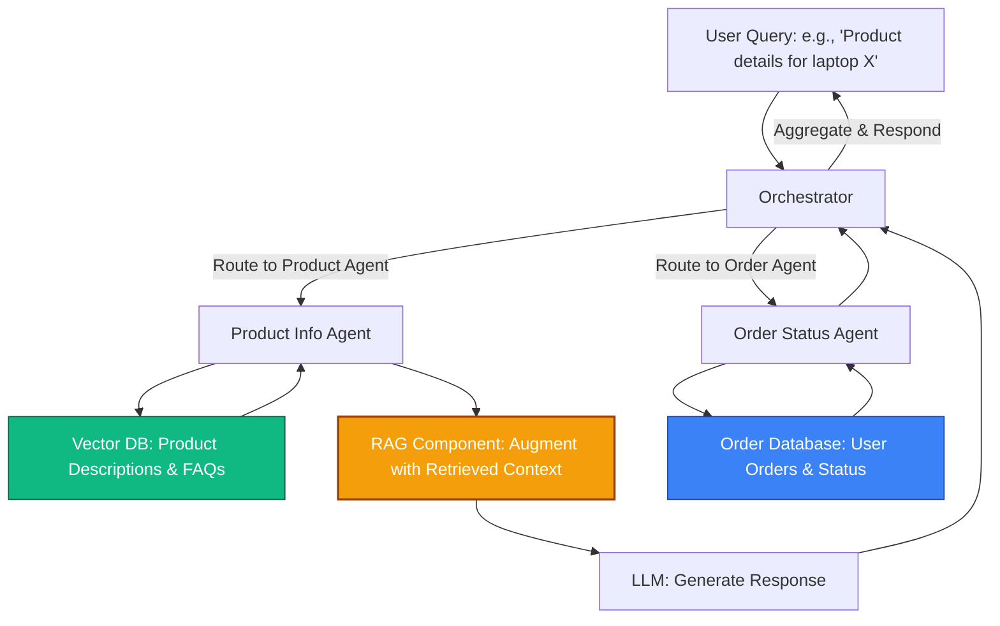

# RAG Multi-Agent System Architecture

## Overview

This document demonstrates how RAG integrates into a multi-agent system for e-commerce customer support. The system uses multiple specialized agents coordinated by an orchestrator to handle different types of queries.

## System Components

### 1. Orchestrator
The Orchestrator acts as the central coordinator that:
- Analyzes user queries
- Determines query intent (e.g., product info vs. order status)
- Routes queries to the appropriate agent
- Collects and aggregates agent responses
- Delivers the final answer to the user

### 2. Product Info Agent (RAG-enabled)
- Uses RAG to retrieve product details from a vector database
- Combines retrieval with LLM generation for accurate, up-to-date responses
- Handles product-related queries, FAQs, and specifications

### 3. Order Status Agent
- Queries order database directly
- Provides real-time order tracking information
- Handles shipping and delivery status

### 4. Vector Database
- Stores embedded product descriptions and FAQs
- Enables semantic search for relevant information
- Updated independently without retraining the model

## System Architecture Diagrams

### Sequence Diagram

**Scenario**: An e-commerce customer support chatbot handling product and order queries.

#### Diagram Explanation

This sequence diagram shows the ordered steps in a multi-agent system:

**Product Query Flow:**
User → Orchestrator → Product Agent → Vector DB (retrieval) → RAG (augmentation) → LLM (generation) → back to Orchestrator → User

**Order Query Flow:**
Orchestrator → Order Agent → Database → back to User

RAG integrates retrieval with generation for accurate, up-to-date information without retraining the LLM.

### Flowchart View

#### Flowchart Explanation

This top-down view shows the system components and their connections:
- The **Orchestrator** serves as the routing hub
- The **Product Agent** uses the Vector DB for retrieval, then RAG augments the LLM
- The **Order Agent** queries the database directly
- Arrows indicate data flow through the system

## Key Benefits of This Architecture

### 1. **Separation of Concerns**
- Each agent specializes in one domain
- Easy to maintain and update independently
- Clear responsibility boundaries

### 2. **Scalability**
- Add new agents without modifying existing ones
- Scale individual components based on load
- Horizontal scaling for high traffic

### 3. **Dynamic Knowledge Updates**
- Update Vector DB without retraining
- Add new products instantly
- Maintain current information

### 4. **Flexibility**
- Easy to add new data sources
- Can combine multiple retrieval strategies
- Adaptable to changing business needs

### 5. **Cost Efficiency**
- Only the Product Agent uses RAG (more expensive)
- Simple database queries for order status
- Optimized resource allocation

## Use Cases

This multi-agent RAG architecture is ideal for:

- **E-commerce**: Product information, order tracking, returns
- **Customer Support**: FAQ handling, ticket routing, knowledge base queries
- **Healthcare**: Patient information, medical records, appointment scheduling
- **Financial Services**: Account queries, transaction history, investment advice
- **Education**: Course information, enrollment, student records

## Notes

- RAG enables dynamic, up-to-date product information without retraining the LLM
- The Vector DB is key for efficient retrieval in knowledge-intensive tasks
- The Orchestrator ensures efficient task delegation and response synthesis
- This architecture can be extended with additional specialized agents as needed
